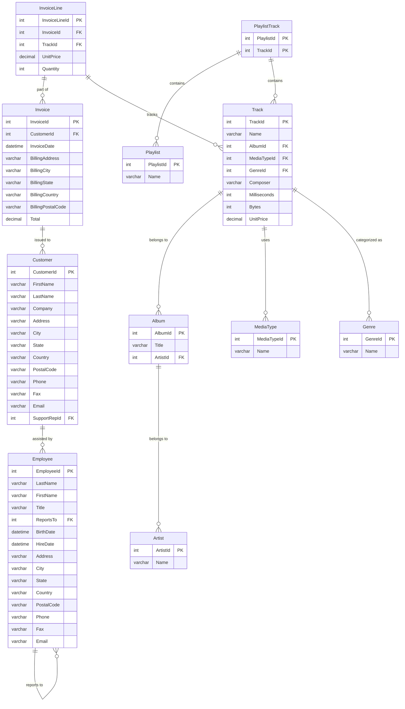

In the end of the last year I discoverd: 

[I commented the PDF one **here** →](/JAlcocerT/how-to-chat-with-pdfs)

[I commented the PDF one **here** →](/how-to-use-rags-with-python)

/how-to-use-pandasAI



  
  



## Chat with Your Database Using LangChain

[Learning **SQL**](https://jalcocert.github.io/JAlcocerT/sql-data-analytics/) can be challenging. 

But what if you could use **AI to simplify data analysis tasks**?

That's where **LangChain comes in**.

Bridging the gap between natural language and your database.


**Source Code** - RAG libraries to **[Chat over Data](https://github.com/JAlcocerT/Data-Chat)** 💻 


This post explores how to use **LangChain with Python** to chat with your database.


The complete, working code is available in my [data-chat repository](https://github.com/JAlcocerT/Data-Chat/tree/main/LangChain/ChatWithDB).


[](https://colab.research.google.com/github/JAlcocerT/Data-Chat/blob/main/LangChain/ChatWithDB/test_langchainChatDB.ipynb)

## Setting Up Your Database

This example uses **MySQL**, you can also try similarly, with SQLite.


  





```bash
sudo apt update
sudo apt install mysql-server -y
sudo systemctl start mysql
sudo systemctl status mysql
sudo systemctl enable mysql  # Start MySQL on boot

sudo mysql -u root -p
```

```bash
# mysql --version  # Output: mysql Ver 8.0.40-0ubuntu0.24.04.1 for Linux on x86_64 ((Ubuntu))
```



I would recommend to go with the **container way of installing the DB**:



Once, **Docker/Podman** are installed, just:

```sh

```

```sh
# mysql --version  # Output: mysql Ver 8.0.40-0ubuntu0.24.04.1 for Linux on x86_64 ((Ubuntu))
```



## Loading the Chinook Database

We'll use the **Chinook database as a sample**.



Be creative, you can apply it to other DB's! Like the one of [this project](https://jalcocert.github.io/RPi/posts/rpi-iot-dht1122-mongo/) 




You can download the Chinook database from its [GitHub releases](https://github.com/lerocha/chinook-database/releases).

```sql
CREATE DATABASE chinook;
USE chinook;
SOURCE Chinook_MySql.sql;  # Or the name of your SQL file

SHOW TABLES;
SELECT * FROM Album LIMIT 10;
DESCRIBE Artist;
```



Now that the database is loaded, let's explore its schema.

```sql
SELECT 
    TABLE_NAME AS `Table`, 
    COLUMN_NAME AS `Column`, 
    DATA_TYPE AS `Data Type`, 
    CHARACTER_MAXIMUM_LENGTH AS `Max Length`, 
    IS_NULLABLE AS `Nullable`, 
    COLUMN_KEY AS `Key`, 
    COLUMN_DEFAULT AS `Default Value`
FROM 
    INFORMATION_SCHEMA.COLUMNS
WHERE 
    TABLE_SCHEMA = 'chinook'
ORDER BY 
    TABLE_NAME, ORDINAL_POSITION;
```

Here's a MermaidJS Entity-Relationship (ER) diagram visualizing the **Chinook database schema**:



## LangChain Setup

Let's set up LangChain to interact with our database.

```bash
python3 -m venv datachat_venv  # Create the virtual environment (Linux)
# python -m venv datachat_venv  # Create the virtual environment (Windows)

# datachat_venv\Scripts\activate  # Activate the virtual environment (Windows)
source datachat_venv/bin/activate  # Activate the virtual environment (Linux)

pip install -r requirements.txt
```









```bash
source .env  # If you're using a .env file

# export OPENAI_API_KEY="your-api-key-here"  # Linux/macOS
# set OPENAI_API_KEY=your-api-key-here  # Windows
# $env:OPENAI_API_KEY="your-api-key-here" #Powershell

# echo $OPENAI_API_KEY  # Verify the key
```



## Integrating LangChain with the Database

I've successfully replicated the code, using:

*   Chinook database version 1.4.5
*   Python 3.12.3 (x86) and virtual environments
*   MySQL 8.0

For easier setup and deployment, you can use Docker.  Here's a sample `docker-compose.yml` file (available in the repository):

```yaml
# ... (docker-compose.yml content)
```

```bash
# Example commands for interacting with the MySQL container:
# docker exec -it mysql_db bash
# docker exec -it mysql_db mysql -u myuser -p chinook
```


For containerization, you'll need to have [Docker installed](https://jalcocert.github.io/JAlcocerT/docs/dev/dev-interesting-it-concepts/#containers).  This also prepares you for [self-hosting](https://jalcocert.github.io/Linux/docs/linux__cloud/selfhosting/).


---

## Frequently Asked Questions



*   [ChartDB](https://github.com/chartdb/chartdb) - Database diagram editor.
*   [SQLiteViz](https://github.com/lana-k/sqliteviz)
*   [SQLiteBrowser](https://github.com/sqlitebrowser/sqlitebrowser)




---

## FAQ

See other popular RAG frameworks, alternatives to Langchain:

[](https://star-history.com/#langchain-ai/langchain&run-llama/llama_index&deepset-ai/haystack&Sinaptik-AI/pandas-ai&type=Date)

### Preparing a Tech Talk with AI

1. Diagrams as a Code
2. PPT with LLMs


https://github.com/JAlcocerT/Data-Chat
https://github.com/JAlcocerT/Data-Chat/pkgs/container/data-chat

#### PPT as a Code


  
  


### Other Cool LangChain Features

<!-- https://www.youtube.com/watch?v=KerHlb8nuVc -->







<!-- https://www.youtube.com/watch?v=Xi9Ui-9qcPw -->






### LangChain vs LLamaIndex

* **LangChain:** A general-purpose framework for building LLM applications, with components for chains, agents, memory, prompts, and integrations.  It's more comprehensive than LlamaIndex.
* **LlamaIndex:** A specialized framework for connecting LLMs to data, with tools for indexing, querying, and building data-driven LLM applications.

Think of LangChain as the broader toolkit, and LlamaIndex as a specialized tool within that toolkit (specifically for data interaction).

You can even use LlamaIndex *within* LangChain to build applications that combine the strengths of both frameworks.

**How it's Similar to LlamaIndex (and Different):**

* **Focus:** Both frameworks aim to make it easier to build LLM applications.  LlamaIndex focuses specifically on connecting LLMs to data. LangChain has a broader focus, including data, agents, chains, and memory.
* **Components:** Both provide reusable components.  LlamaIndex has "LlamaPacks" for data integrations. LangChain has components for chains, agents, memory, and prompts.


### Exploring DB Content

To explore vector DBs we have Vector Admin, but for **regular DB's** we have **WhoDB**


  


> A lightweight next-gen **database explorer** - Postgres, MySQL, SQLite, MongoDB, Redis, MariaDB & Elastic Search

Welcome to WhoDB – a powerful, lightweight (~20Mi), and user-friendly database management tool that combines the simplicity of Adminer with superior UX and performance. WhoDB is written in GoLang!
