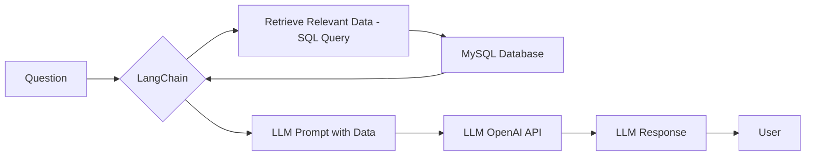
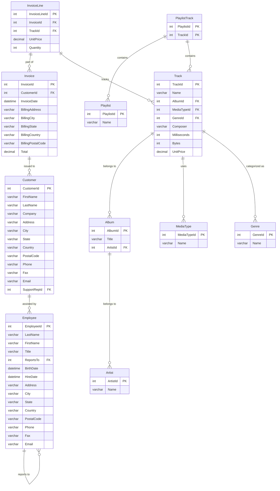

By tinkering with AI, I discoverd that it is possible to: 



  
    


[You can also try **PandasAI as RAG** →](/how-to-use-pandasAI)





  
  



## Chat with Your Database Using LangChain

[Learning **SQL**](https://jalcocert.github.io/JAlcocerT/sql-data-analytics/) can be challenging. 

But what if you could use **AI to simplify data analysis tasks**?

That's where **LangChain comes in**.

Bridging the gap between natural language and your database.


**Source Code** - RAG libraries to **[Chat over Data](https://github.com/JAlcocerT/Data-Chat)** 💻 


This post explores how to use **LangChain with Python** to chat with your database.


The complete, working code is available in my [data-chat repository](https://github.com/JAlcocerT/Data-Chat/tree/main/LangChain/ChatWithDB).


You can also open it with: [](https://colab.research.google.com/github/JAlcocerT/Data-Chat/blob/main/LangChain/ChatWithDB/LangChain_MySQL_DB_Chat.ipynb)

## Setting Up The Database

This example uses **MySQL**.

You can also try similarly, with SQLite.


### MySQL Installation

Install **MySQL RDBMS** in your computer.




If you want to install MySQL DB directly in your computer (with ubuntu):

```bash
sudo apt update
sudo apt install mysql-server -y
sudo systemctl start mysql
sudo systemctl status mysql
sudo systemctl enable mysql  # Start MySQL on boot

sudo mysql -u root -p
```

```bash
# mysql --version  # Output: mysql Ver 8.0.40-0ubuntu0.24.04.1 for Linux on x86_64 ((Ubuntu))
```

```sh
systemctl list-units --type=service #you will see mysql there
sudo systemctl stop mysql #if you stop it
lsof -i :3306 #this will be cleared
```



I would recommend to go with the **container way of installing the DB**:



[Why containers?](https://jalcocert.github.io/JAlcocerT/why-i-love-containers/)

```sh
sudo apt update
sudo apt install docker.io
sudo systemctl start docker
sudo systemctl enable docker
```

> The [setup is very quick](https://jalcocert.github.io/Linux/docs/linux__cloud/selfhosting/)!





Once, **Docker/Podman** are installed, just spin a mysql instance:

```sh
sudo docker exec -it mysql-db /bin/bash
```

Now, you can see that MySQL is installed, just inside the container:

```sh
# mysql --version  # Output: mysql Ver 8.0.40-0ubuntu0.24.04.1 for Linux on x86_64 ((Ubuntu))
```



We will download the `Chinook_MySQL.sql` file.

* https://github.com/lerocha/chinook-database
* https://github.com/lerocha/chinook-database/releases

```sh
curl -L -O https://github.com/lerocha/chinook-database/releases/download/v1.4.5/Chinook_MySql.sql
```

And place it in a local folder, that will be referenced by the docker compose file, like: `/home/jalcocert/Desktop/Data-Chat/LangChain/ChatWithDB`

```yml
services:
  db:
    image: mysql:8.0
    environment:
      - MYSQL_ROOT_PASSWORD=your_strong_root_password # Replace with a strong password
      - MYSQL_DATABASE=chinook # Set the default database (optional, but recommended)
      - MYSQL_USER=myuser
      - MYSQL_PASSWORD=mypassword
    ports:
      - "3306:3306"
    volumes:
      - mysql_data:/var/lib/mysql        # Named volume for data persistence
      - /home/jalcocert/Desktop/Data-Chat/LangChain/ChatWithDB:/docker-entrypoint-initdb.d # Mount the init scripts directory

volumes:
  mysql_data:
```

Now, verify that the **Chinok DB is available**:

```sh
mysql -u root -p
```

### Exploring the Sample DB

If you prefer to explore with a graphical interface, you can **setup Dbeaver**.

* https://dbeaver.io/download/

> Universal Database Manager and SQL Client


```sh
sudo snap install dbeaver-ce #https://flathub.org/apps/io.dbeaver.DBeaverCommunity
```


### Tweak MySQL

While being inside the container, access the **DB root user**:

```sh
sudo docker exec -it mysql-db /bin/bash
rootpassword

#sudo mysql -u root
#USE mysql;
#ALTER USER 'root'@'localhost' IDENTIFIED WITH mysql_native_password BY 'your_password';
#FLUSH PRIVILEGES;
#EXIT

#mysql -u root -p
```


### Loading the Chinook Database

We'll use the **Chinook database as a sample**.




You can download the Chinook database from its [GitHub releases](https://github.com/lerocha/chinook-database/releases).

```sql
CREATE DATABASE chinook;
USE chinook;
SOURCE Chinook_MySql.sql;  # Or the name of your SQL file

SHOW TABLES;
SELECT * FROM Album LIMIT 10;
DESCRIBE Artist;
```



Now that the database is loaded, let's **explore its schema**.

```sql
SELECT 
    TABLE_NAME AS `Table`, 
    COLUMN_NAME AS `Column`, 
    DATA_TYPE AS `Data Type`, 
    CHARACTER_MAXIMUM_LENGTH AS `Max Length`, 
    IS_NULLABLE AS `Nullable`, 
    COLUMN_KEY AS `Key`, 
    COLUMN_DEFAULT AS `Default Value`
FROM 
    INFORMATION_SCHEMA.COLUMNS
WHERE 
    TABLE_SCHEMA = 'chinook'
ORDER BY 
    TABLE_NAME, ORDINAL_POSITION;
```

Here's a [MermaidJS Entity-Relationship](https://mermaid.live/edit#pako:eNrVVk1v2zAM_SuGgd7aP5BbkzRb0W7Iluwy5MLYSiJMlgyJKual-e-TbMkfspxmx_lkkY_P1CNF-ZxmIifpLCVySeEoodjxxDyPbK-L5Nws7EM5NsbnPFm_dPY3kNkJZLKlyEgAl0gVGvzK4S-Ou7aPyD06xv4VCjLgWGiFoiAyZPH2CZ4VlQo7sr7rFaY8C1GUwKux4zHPJVEqEkExAt8gYJRec5QR_FooBLYw9Yn4ToJHzCv4PTY-FUDZUKaNLksh8Tspx-V5KkomKkJCab19Qtpp_a6IHukak5PJTG1Fm5d9ciMd0oIkcyrxtBwI2fo-U0mWUY3_v0q5YnwiXI4qURtvPSnP_E3QbMThzAFLcISiFXCRcaHnlDHKj5N6O39cduecUN-HThXB-WO1yElGC2DJVhhXTJ1XyqcUsq6ISp1-q8CzlZD9CsVzCfzgFNfSxA1Dvmng2EriUvtCcgrbqhwl1jpubYE1g4pFRq63_ytPvcMbyfqKrIeDJkoTYuMJhTdSWIO-RKHPn57VS3zUC0VkwGY7S5FM8FwNPfMKifqwzGa_zcvdnRlvDJAKrk60VP279v394UGc_eU4S3bpnjDBjypBsUv7inlkHXYDsGskC9bKZByDNaPGQjJz_o5C0j8kT6AFD6vvgtrWquMER6D8ekSziMH9pHLA9oq3WKqUNtl0O-wfXBfg4y2-BImJOFxBd3mgfWuzaD_rcO11aKGglNmPSWRfeXzrj-Flc5nVeaf3qaE1Ez43v1t115tPn4hp6dRCc3IAzdDSXgwUNIpNxbN0hlKT-1QKfTylswMwZVa6tOPY_bF5iPlJ-SmEW17-AiJABTs) **(ER) diagram** visualizing the **Chinook database schema**:




  



## LangChain Setup

Let's set up LangChain to interact with our database.

1. Make sure you have [Python](https://jalcocert.github.io/JAlcocerT/guide-python/#installing-python-) and [Docker/Podman Containers](https://jalcocert.github.io/JAlcocerT/why-i-love-containers/#docker-setup) installed.

2. Then, create a Python virtual environment

```bash
python3 -m venv datachat_venv  # Create the virtual environment (Linux)
# python -m venv datachat_venv  # Create the virtual environment (Windows)

# datachat_venv\Scripts\activate  # Activate the virtual environment (Windows)
source datachat_venv/bin/activate  # Activate the virtual environment (Linux)

pip install -r requirements.txt
```






3. Now, install the database engine

I will show you how to do it with MySQL and Docker.

You just need the [docker compose](https://github.com/JAlcocerT/Docker/blob/main/Dev/DBs/MySQL_docker-compose.yml)

* https://github.com/JAlcocerT/Docker/blob/main/Dev/DBs/MySQL_docker-compose.yml
* https://github.com/JAlcocerT/Docker/blob/main/Dev/DBs/MariaDB_docker-compose.yml

> Use Portainer for easier MySQL container management


4. Prepare your AI API Keys

We will need OpenAI Keys to interact with the DB: https://platform.openai.com/api-keys




```bash
source .env  # If you're using a .env file

# export OPENAI_API_KEY="your-api-key-here"  # Linux/macOS
# set OPENAI_API_KEY=your-api-key-here  # Windows
# $env:OPENAI_API_KEY="your-api-key-here" #Powershell

# echo $OPENAI_API_KEY  # Verify the key
```




## Integrating LangChain with the Database

I've successfully replicated the code, using:

*  Chinook database version 1.4.5
*  Python 3.12.3 (x86) and virtual environments
*  MySQL 8.0

For easier setup and deployment, you can use Docker.

 Here's a sample `docker-compose.yml` file (available in the repository):


```bash
# Example commands for interacting with the MySQL container:
# docker exec -it mysql_db bash
# docker exec -it mysql_db mysql -u myuser -p chinook
```


For containerization, you'll need to have [Docker installed](https://jalcocert.github.io/JAlcocerT/docs/dev/dev-interesting-it-concepts/#containers).  This also prepares you for [self-hosting](https://jalcocert.github.io/Linux/docs/linux__cloud/selfhosting/).


---

## Conclusions


Be creative, you can apply it to other DB's!

Like the one of [this project](https://jalcocert.github.io/RPi/posts/rpi-iot-dht1122-mongo/) 



---

## FAQ



*   [ChartDB](https://github.com/chartdb/chartdb) - Database diagram editor.
*   [SQLiteViz](https://github.com/lana-k/sqliteviz)
*   [SQLiteBrowser](https://github.com/sqlitebrowser/sqlitebrowser)




See **other popular RAG frameworks**, alternatives to Langchain:

[](https://star-history.com/#langchain-ai/langchain&run-llama/llama_index&deepset-ai/haystack&Sinaptik-AI/pandas-ai&type=Date)

### Preparing a Tech Talk with AI

1. Diagrams as a Code
2. PPT with LLMs
3. **Gemini** was great to create catchy images! (2048x2048!)

#### PPT as a Code


  
  


### Other Cool LangChain Features

<!-- https://www.youtube.com/watch?v=KerHlb8nuVc -->








<!-- https://www.youtube.com/watch?v=Xi9Ui-9qcPw -->






### LangChain vs LLamaIndex

* **LangChain:** A general-purpose framework for building LLM applications, with components for chains, agents, memory, prompts, and integrations.  It's more comprehensive than LlamaIndex.
* **LlamaIndex:** A specialized framework for connecting LLMs to data, with tools for indexing, querying, and building data-driven LLM applications.

Think of LangChain as the broader toolkit, and LlamaIndex as a specialized tool within that toolkit (specifically for data interaction).

You can even use LlamaIndex *within* LangChain to build applications that combine the strengths of both frameworks.

**How it's Similar to LlamaIndex (and Different):**

* **Focus:** Both frameworks aim to make it easier to build LLM applications.  LlamaIndex focuses specifically on connecting LLMs to data. LangChain has a broader focus, including data, agents, chains, and memory.
* **Components:** Both provide reusable components.  LlamaIndex has "LlamaPacks" for data integrations. LangChain has components for chains, agents, memory, and prompts.


### Exploring DB Content

To explore vector DBs we have Vector Admin, but for **regular DB's** we have:

1. **WhoDB**


  


> A lightweight next-gen **database explorer** - Postgres, MySQL, SQLite, MongoDB, Redis, MariaDB & Elastic Search

2. To explore SQlite, we have the CLI:


And as seen [here](https://jalcocert.github.io/JAlcocerT/how-to-chat-with-your-data/#faq), we also have...



* **ChartDB:** [ChartDB](https://github.com/chartdb/chartdb) is a database diagram editor that stands out because it lets you visualize and design your database schema using SQL queries.

Instead of dragging and dropping elements in a graphical interface, you describe your database structure in SQL, and ChartDB generates the diagram for you.  This approach can be very efficient, especially for complex databases.  It also makes it easier to version control and share your database designs.

* **SQLiteViz:** [SQLiteViz](https://github.com/lana-k/sqliteviz) is a lightweight and cross-platform tool for visualizing and exploring SQLite databases. It provides a user-friendly interface for browsing tables, executing queries, and viewing data. It's a good choice for quickly inspecting and working with SQLite databases.

* **SQLiteBrowser:** [SQLiteBrowser](https://github.com/sqlitebrowser/sqlitebrowser) (also known as DB Browser for SQLite) is another popular open-source tool for managing SQLite databases. It offers a more comprehensive set of features than SQLiteViz, including the ability to create and modify tables, indexes, and other database objects. It's a good all-around tool for SQLite database management.







* **DuckDB:** [DuckDB](https://github.com/duckdb/duckdb) is an embedded analytical database.  It's designed to be fast and efficient for Online Analytical Processing (OLAP) workloads.  DuckDB can be used directly from various programming languages (Python, R, etc.) and is often used for data analysis and exploration.  It's similar to SQLite in that it's file-based and embedded, but it's optimized for analytical queries.

* **Huey (UI for DuckDB):** [Huey](https://github.com/rpbouman/huey) provides a user interface specifically for DuckDB.  It simplifies the process of interacting with DuckDB databases by providing a visual environment for writing queries, exploring data, and visualizing results.

* **Hue (SQL Assistant):** [Hue](https://github.com/cloudera/hue) is a broader open-source SQL assistant for databases and data warehouses. While it *can* be used with DuckDB (as you noted with the Docker image), it's not DuckDB-specific.

Hue supports a wide variety of database systems and provides a rich interface for working with SQL, including query editors, data browsers, and visualization tools.  It's a more comprehensive tool than Huey (the DuckDB UI) and can be used with many different database backends.


