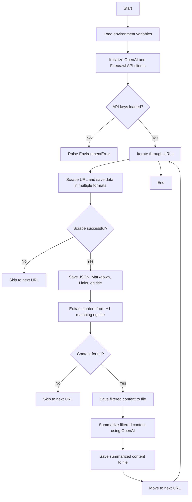

* **Some Alternatives to Selenium and BS4**:
  * https://github.com/ScrapeGraphAI/Scrapegraph-ai
  * https://github.com/mendableai/firecrawl
  * https://github.com/unclecode/crawl4ai

But first, some recap on the old school.


A post of what I learnt about **[Scrapping Tools](https://github.com/JAlcocerT/Scrap_Tools)** 💻




<!--  -->

## Old School Scrapping

Some time ago I was doing an interview and it was quite hard from them to see my CV.

But..if I always send pdf's, whats wrong?

It seems that there are some HR parsing systems that can interprete data.

Sometimes breaking totally the initial format.

Lesson learnt.

A CV must be cool for the human eye, and **understandable by machines**.

But first, I want to know how many offers are out there.

For sure there is some seasonality. Lets just have a daily look and see how is the market

Or even better, lets make a script to do that.


And Applied it for [**better CV** and job search](https://gitlab.com/fossengineer1/cv-check)


Is it a good moment to **look for a Job?**

Just have a look to **how many offers are available now** (and remote) vs the historical ones.



Within the [CV Check Project](https://gitlab.com/fossengineer1/cv-check) at the [folder `./Scrap_Pracuj`](https://gitlab.com/fossengineer1/cv-check/-/tree/main/Scrap_Pracuj?ref_type=heads)...


We are just pushing the **data to a sqlite DB**.

The data is extarcted with the known approach of beautiful soup. Where you need to **input the Web structure**.





If the Web Structure Changes - Codes needs to be [re-worked, as it happened here](https://gitlab.com/fossengineer1/py_vacations/-/tree/main/Z_Scrap_bs4?ref_type=heads)




After executing the script...

```sh
./run_pracuj.sh
#/home/reisipi/dirty_repositories/cv-check/Scrap_Pracuj/run_pracuj.sh

#just with python would do the same
#python3 pracuj_v3.py
```

we will have records:

```sh
sudo apt install sqlite3
sqlite3 --version

sqlite3 ./job_offers_v3.db
#sqlite3 /home/reisipi/dirty_repositories/cv-check/Scrap_Pracuj/job_offers_v3.db

#SELECT * FROM your_table_name ORDER BY your_primary_key_column DESC LIMIT 5;

#SELECT name FROM sqlite_master WHERE type='table';
#.tables

SELECT * FROM job_offers;
SELECT * FROM job_offers ORDER BY timestamp DESC LIMIT 5;

#.quit

```


You can make it **run every night** by setting **CRON task with [a script](https://gitlab.com/fossengineer1/cv-check/-/blob/main/Scrap_Pracuj/run_pracuj.sh?ref_type=heads)**.

And after few days...this is how the **job trend** looks like:

<!--  
<iframe src="/videos/combined_job_offers_plot_05-11-2024.html"
style="width: 100%; height: 450px;"></iframe>
 -->


Is it a **good moment to change the job**?

Up to you!



```sh
nano run_pracuj.sh
chmod +x /home/reisipi/dirty_repositories/cv-check/Scrap_Pracuj/run_pracuj.sh
./run_pracuj.sh

crontab -e
#0 0 * * * /path/to/your/run_pracuj.sh >> /path/to/your/logfile.log 2>&1
0 23 * * * /home/reisipi/dirty_repositories/cv-check/Scrap_Pracuj/run_pracuj.sh
crontab -l
#python3 pracuj_v3.py >> /home/reisipi/dirty_repositories/cv-check/Scrap_Pracuj/script_output.log 2>&1
```

Look if you have space, still:
```sh
df -h | awk '$2 ~ /G/ && $2+0 > 3' #if you set logs, careful with the disk space (see drives >3GB)
```




## Scrapping with AI

So, what can we do to make the code once, and scrap *forever*?

There are **few options**!

With these, you forget about inspecting web pages and look for the html tricks to make a systematic scrap.

### ScrapeGraph

**ScrapeGraph** is a Free [Python scraper based on AI](https://github.com/ScrapeGraphAI/Scrapegraph-ai) 

I was testing[ ScrapeGraph with Streamlit here](https://github.com/JAlcocerT/Streamlit-MultiChat/blob/main/Streamlit_Pages/Streamlit_ScrapeGraph.py)

With ScrapeGraph, you just need an **API for LLM** and just ask questions about the content of a website!

* Docs [ScrapeGraph + OpenAI](https://scrapegraph-ai.readthedocs.io/en/latest/getting_started/examples.html)


[ScrapeGraph **allows for open Models - via Ollama**](https://fossengineer.com/scrapping-with-llms/#scrapegraph-with-ollama) and also closed LLMs to work with it.


But if you are looking for a quick thing...

...with OpenAI is really quick. Plus you already have the API plugged in for any other purpuse.

Like summarizing the resulting `.json` file of the scrapt or any other workflow.

This is what I made with [this script - **combining ScrapeGraph with OpenAI API Call to summarize**](https://github.com/JAlcocerT/Scrap_Tools/blob/main/ScrapeGraph/sample6_sg_openai.py)

### FireCrawl

[FireCrawl](https://github.com/mendableai/firecrawl) makes it really easy to parse Web Info.

> "Ive got the Key for Success"


I mean, [FireCrawl **needs an API**](https://www.firecrawl.dev/app/usage) to work (there is free Tier)



  
  




  
  




  I used it for the [DocPlanner Migration](https://jalcocert.github.io/JAlcocerT/docplanner-web-migration/) - With [this repo](https://github.com/JAlcocerT/Scrap_Tools/tree/main/FireCrawl/Z_UseCase1-Nevin) and for [WPMigration](https://gitlab.com/fossengineer1/py_vacations/-/tree/main/Z_Scrap_firecrawl?ref_type=heads#other---jmodels-sample)


* Sample FireCrawl to get [Numbeo Data and pushes it to Sqlite](https://gitlab.com/fossengineer1/py_vacations/-/blob/main/Z_Scrap_firecrawl/firecrawl_testv5.py?ref_type=heads) using [openAI API](https://github.com/JAlcocerT/Streamlit-MultiChat/blob/main/Z_Tests/OpenAI/openai_neumkt.py)

#### Cool Thing to do With FireCrawl API



It can be a companion for web-check.xyz and to know which links, pictures we have in a given page.

Very useful for web migrations.




Firecrawl can serve as a tool to see whats referenced on a page - As per the extracted `linksonpage`

It can Give you the [content of a link directly in markdown](https://github.com/JAlcocerT/Scrap_Tools/blob/main/FireCrawl/Z_UseCase2-Articles/Scrap_LinkInfo_v2a.py) - [see the script](https://github.com/JAlcocerT/Scrap_Tools/blob/main/FireCrawl/Z_UseCase2-Articles/Scrap_LinkInfo_Sum_v3a.py). Which also summarizes it with OpenAI.





Now given an **article/github repository** - you can get a **summary** very fast and decide if its worth exploring further. [Here you have such **script**.](https://github.com/JAlcocerT/Scrap_Tools/tree/main/FireCrawl/Z_UseCase3-Artic%26GHRepos)



### Crawl4AI

- [**Crawl4AI** is an open-source Python library](https://fossengineer.com/crawl4ai-open-source-web-crawler/) designed to simplify web crawling and data extraction, particularly for large language models (LLMs) and AI applications.

See the [Crawl4AI code](https://github.com/unclecode/crawl4ai)

It offers a user-friendly interface and a range of features, including:
- **Ease of use:** Crawl4AI is designed to be easy to use, even for those new to web scraping.
- **Fast performance:** It is built for speed, outperforming many paid services.
- **LLM-friendly output:** It produces output formats that are easy for LLMs to process, such as JSON and cleaned HTML.
- **Asynchronous support:** It can crawl multiple URLs simultaneously, making it efficient for large-scale projects.
- **Media extraction:** It can extract and return all media tags, including images, audio, and video.

- Crawl4AI is available as a Python package and as a Docker image. It is a powerful tool for anyone who needs to extract data from the web for AI applications.

[](https://star-history.com/#ScrapeGraphAI/Scrapegraph-ai&unclecode/crawl4ai&mendableai/firecrawl&Date)

### Other Ways

FireCrawl is not giving me the juice of the offers, as [seen during Scrap-Tools Tests](https://github.com/JAlcocerT/Scrap_Tools/tree/main/FireCrawl/Z_Scrap_PracujOffer)

But... it can be done with  [**1) OpenAI+Pure parsed HTML**](https://gitlab.com/fossengineer1/cv-check/-/tree/main/Scrap_Pracuj_Offer?ref_type=heads)

Using [OpenAI API](https://github.com/openai/openai-python) seems to be a reliable way when the web structure is not changing too much.

<!-- 
https://github.com/openai/openai-python
https://github.com/wention/BeautifulSoup4

[](https://star-history.com/#openai/openai-python&unclecode/crawl4ai&wention/BeautifulSoup4&Date)
 -->


You could do similarly with other LLMs via their APIs

[](https://star-history.com/#openai/openai-python&Date)

And other library I saw, was **2) embedchain** (now included in the [mem0 repo](https://github.com/mem0ai/mem0))

With mem0/embedchain, we are going a little bit further than just scrapping.

> The Memory layer for your AI apps 

You can ofc use embedchain to ask questions about a web!


Or...use just **embedchain without API** - [Embed online resources **(web urls) and ask** questions about them with **this script**](https://github.com/JAlcocerT/Scrap_Tools/blob/main/EmbedChain/sample_scrap_qna2.py)


When you run the script, you will see that it is embedding content to a ChromaDB under the hood.




[Mem0](https://github.com/mem0ai/mem0/tree/main) is a memory layer that improves AI applications by enabling personalized user interactions through intelligent memory management. 

This project addresses the need for AI systems that can remember user preferences and evolve over time, enhancing fields like customer support and personalized learning.

- **Key Features:**
  1. Multi-level memory retention for users, sessions, and AI agents.
  2. Adaptive personalization that improves with user interactions.
  3. Developer-friendly API for seamless application integration.
  4. Cross-platform consistency for uniform behavior across devices.
  5. Managed service option for hassle-free hosting.

- **Pros:**
  - Elevates user experience with tailored interactions.
  - Versatile support for various AI applications and use cases.
  - Simplifies setup and integration with existing systems.

- **Cons:**
  - Requires a large language model (LLM), which may not suit all users.
  - Self-hosting may demand additional technical expertise.

- **Alternatives:**
  - OpenAI's memory management solutions.
  - Other AI memory frameworks like Rasa or Dialogflow.

Mem0 offers a promising solution for personalized AI interactions.




You will **need mem0 API**, or to [plug one of your favourite LLMs, as per the docs](https://docs.mem0.ai/components/llms/overview) to do other cool things with mem0.


[](https://star-history.com/#mem0ai/mem0&Date)

---

## WebScrap with Streamlit

**Time to create**. Something.


  
  


### WebScrap Features

1. Get summarized web content
2. Get Youtube Summaries - Enhanced [**PhiData** project](https://jalcocert.github.io/JAlcocerT/summarize-yt-videos/) & [my fork](https://github.com/JAlcocerT/phidata)
3. Get web search summarized - With [DuckDuckgo as per PhiData](https://docs.phidata.com/tools/duckduckgo#duckduckgo)


### Deploying WebScrap

Cloudflare Tunnels + Cloudflare Access Control

---

## Conclusions


Now you can try the app at:


**What can we do now?**


1. Cool CV Stuff
2. Understading Repositories Much better (and faster)
3. Github Quick Summaries!




* https://github.com/cmooredev/RepoReader
  * https://github.com/JAlcocerT/RepoReader

Summarize Github Readme (or actually any web).

And...create [posts **scheletons** based on that info](https://github.com/JAlcocerT/Scrap_Tools/tree/main/FireCrawl/Z_Scrap_GHRepo)




### Tweaking a CV as per Offer Info

Its not lying.

Its having a base CV and some instructions for the AI to tweak few details so that it resonates more with an offer.

> There are some AI Resume Builder out there - like `rezi.ai`

#### Reading CV Info

I tried with: Resume-Parser, Spacy (yes, the [NER](https://jalcocert.github.io/JAlcocerT/nlp-tools/#name-entity-recognition)!), ~~pyresparser~~ and pdfminer.

> [ResumeParser](https://gitlab.com/fossengineer1/cv-check/-/blob/main/Z_Tests/testing_resumeparser.py?ref_type=heads) & [PDFminer](https://gitlab.com/fossengineer1/cv-check/-/blob/main/Z_Tests/testing_pdfminer.py?ref_type=heads), gave me the best and **simplest results**


Sample [St Web App with PDFMiner](https://gitlab.com/fossengineer1/cv-check/-/blob/main/Z_Tests/z_st_pdfminer.py?ref_type=heads)


#### Exploring Job Offers with AI

I tried with FireCrawl, but the juice of the offer is not captured

i can imagine is due to some robots.txt info that it is blocking it

But how about feeding pure HTML to OpenAI?

And Using Other Scrappers like: Crawl4AI or ScrapeCraph?

**Lets Find out**

#### Creating Cv with Code

There are few alternatives [to create a curriculum with code](https://fossengineer.com/open-source-curriculum/)

And I was testing it Already [here](https://jalcocert.github.io/JAlcocerT/ai-useful-yet-simple/#cv-with-ai)


You can tweak it for other sites, like `nl.indeed.com`


### Summarize Github Readmes

Summarize Github Readme (or actually any web).

And...create [posts scheletons based on that info](https://github.com/JAlcocerT/Scrap_Tools/tree/main/FireCrawl/Z_Scrap_GHRepo)


--- 

## Resources

### Related Projects

* [Project YT2Doc](https://github.com/shun-liang/yt2doc) - YouTube, Apple Podcast (and more) to readable Markdown.

* [Project YT2MD](https://github.com/bryanfriedman/yt2md) - Turn a YouTube video or playlist into Markdown file(s) to add to SSG site

 

### Streamlit Related Stuff

#### How to use Streamlit with Containers



* https://github.com/JAlcocerT/Streamlit-MultiChat/tree/main/Z_DeployMe

```yml
version: '3'

services:
  streamlit-openaichatbot:
    image: youraiimage ##docker build -t youraiimage . OR WITH -> podman build -t youraiimage .
    container_name: youraiimage_bot
    volumes:
      - ai_aichatbot:/app
    working_dir: /app  # Set the working directory to /app
    command: /bin/sh -c "streamlit run streamlit_app.py"    
    #command: tail -f /dev/null #debug
    ports:
      - "8507:8501"    

volumes:
  ai_aichatbot:
```



#### How to Customize Streamlit Apps



* https://gist.github.com/Sven-Bo/1ad6efa04afc2e957717e5a5fc4320b8

```py
hide_st_style = """
            <style>
            #MainMenu {visibility: hidden;}
            footer {visibility: hidden;}
            header {visibility: hidden;}
            </style>
            """
st.markdown(hide_st_style, unsafe_allow_html=True)
```





https://github.com/naashonomics/pandas_templates/blob/master/login.py

```py

```

> https://github.com/JAlcocerT/Streamlit-MultiChat/blob/main/Streamlit_Pages/Auth_functions.py






* https://discuss.streamlit.io/t/adding-a-meta-description-to-your-streamlit-app/17847/5


