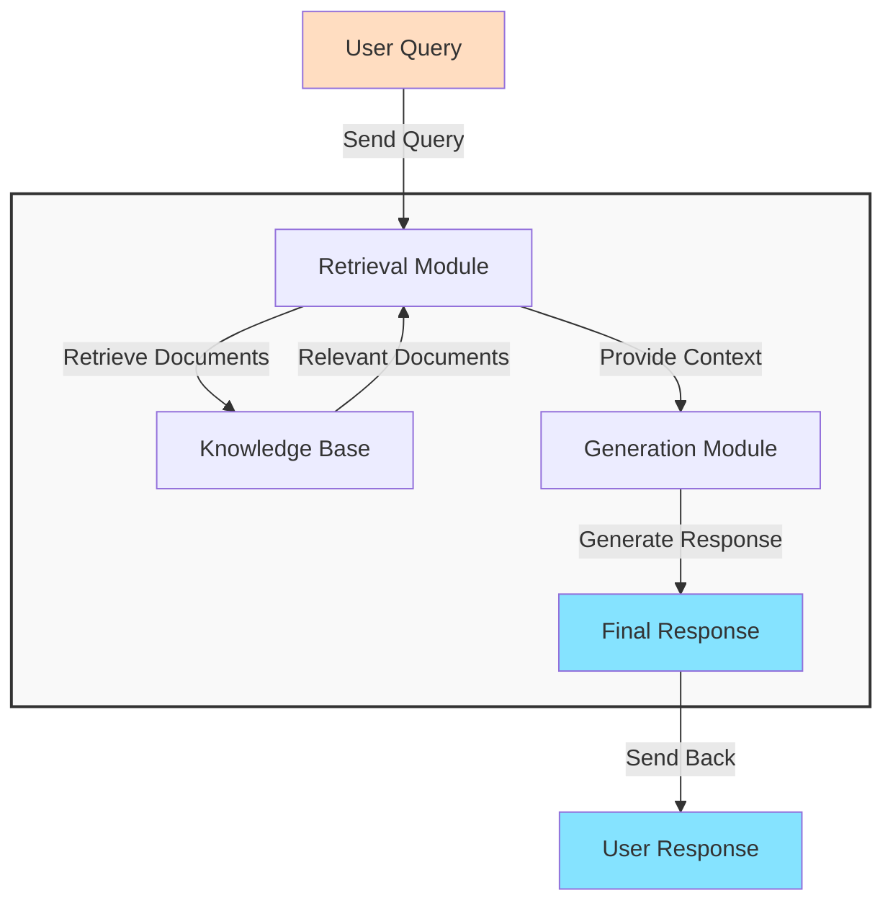


The **[Data-ChatBot](https://github.com/JAlcocerT/Data-Chat)**


## How to use RAGs

Previously this year, I got lucky enough to find these open source projects:


  
  


They both use [**LangChain** as RAG framework](#exploring-langchain)

We can build very interesting QnA over knowledge apps: https://github.com/langchain-ai/chat-langchain

### General RAG Architecture

This is the general idea of a RAG architecture:



And as you can imagine, there as few frameworks already out there.


Normally, you will see that RAG frameworks relate with: [VectorDBs](#vectordbs)


## RAG Frameworks

### ChatBot for Real Estate - LlamaIndex

LlamaIndex + **Mem0** does the trick.

How Exactly? See [this repo folder](https://github.com/JAlcocerT/Data-Chat/tree/main/LLamaIndex/With_Mem0)



For the [Real Estate Web Project](https://github.com/JAlcocerT/ScrewFastMoiRealEstate) commented in [this post](https://jalcocert.github.io/JAlcocerT/astro-web-setup/) I was asked to provide a QnA Bot


### Exploring LangChain

The [LangChain](https://github.com/langchain-ai/langchain) framework is amazing.



  
  



You might be interested to see also [LangGraph](https://github.com/langchain-ai/langgraph)


### Exploring PandasAI

I was using the [**PandasAI**](https://github.com/Sinaptik-AI/pandas-ai) project previously to `talk with dataframes` as covered on [this Post](https://jalcocert.github.io/JAlcocerT/how-to-use-pandasAI/)


  
  


### HayStack as RAG Framework

The [**Haystack**](https://github.com/deepset-ai/haystack) framework is completely now to me.

```sh
pip install haystack-ai
```


### EmbedChain - Mem0

It seems that the [embedchain project](https://fossengineer.com/embedchain-ai/) got absorbed into a bigger one. Im talking about the mem0 framework.


---

## Summing Up


[](https://star-history.com/langchain-ai/langchain&deepset-ai/haystack&Sinaptik-AI/pandas-ai&Date)

### Interesting API keys for LLMs

Other LLMs that I have not covered yet in posts

* Mistral AI
* https://openrouter.ai/modelsOpenRouter

> You can always use Ollama!

LLMs that have already appeared:

* OpenAI API - 
* ANthropic API - 
* GROQ APO - 

### Interesting RAG Resoures

#### VectorDBs

