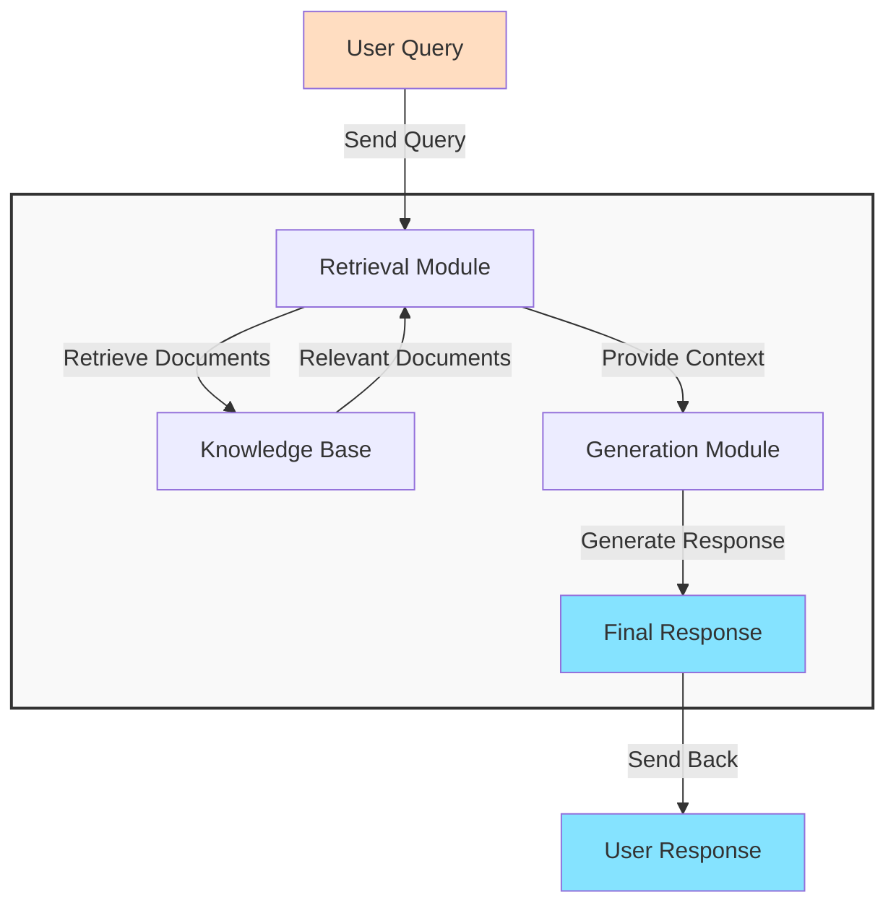


The **[Data-ChatBot](https://github.com/JAlcocerT/Data-Chat)** 💻 


## How to use RAGs

Previously this year, I got lucky enough to find these open source projects:


  
  


They both use [**LangChain** as RAG framework](#exploring-langchain)

We can build very interesting QnA over knowledge apps: https://github.com/langchain-ai/chat-langchain

### General RAG Architecture

This is the general idea of a **RAG architecture**:



And as you can imagine, there as few frameworks already out there.


Normally, you will see that [RAG frameworks relate](#interesting-rag-resoures) with: [VectorDBs](#vectordbs), Embedding Models and [LLMs](#interesting-api-keys-for-llms)


## RAG Frameworks

### ChatBot for Real Estate - LlamaIndex

**[LLamaIndex](https://github.com/run-llama/llama_index)** is awsome.

And for a real estate agent bot, LlamaIndex + **Mem0** does the trick.

How Exactly?

See [this repo folder](https://github.com/JAlcocerT/Data-Chat/tree/main/LLamaIndex/With_Mem0). You will need [OpenAI & Anthropic APIs](#interesting-api-keys-for-llms)



For the [Real Estate Web Project](https://github.com/JAlcocerT/ScrewFastMoiRealEstate) commented in [this post](https://jalcocert.github.io/JAlcocerT/astro-web-setup/) I was asked to provide a QnA Bot


### Exploring LangChain

The [**LangChain**](https://github.com/langchain-ai/langchain) framework is amazing.

* https://pypi.org/project/langchain/
* https://python.langchain.com/v0.2/docs/introduction/

It can helpful to:

1. Chat with PDFs
2. Even with CSV's...
3. ...or a Database!


  
  



You might be interested to see also [LangGraph](https://github.com/langchain-ai/langgraph)


#### LangChain PandasDF Chat


Kind of [PandasAI](#exploring-pandasai), but with LangChain


### Exploring PandasAI

I was using the [**PandasAI**](https://github.com/Sinaptik-AI/pandas-ai) project previously to `talk with dataframes` as covered on [this Post](https://jalcocert.github.io/JAlcocerT/how-to-use-pandasAI/)

* https://pypi.org/project/pandasai/
* https://platform.openai.com/


  
  


### HayStack as RAG Framework

The [**Haystack**](https://github.com/deepset-ai/haystack) framework is completely now to me.

```sh
pip install haystack-ai
```


### EmbedChain - Mem0

It seems that the [embedchain project](https://fossengineer.com/embedchain-ai/) got absorbed into a bigger one. Im talking about the **mem0 framework**.

### Llama-Index

You might Know Llama-Index because of its RAG capabilities.

* https://github.com/run-llama/llama_index
* https://docs.llamaindex.ai/en/stable/

> LlamaIndex is a framework for building context-augmented generative AI applications with LLMs including agents and workflows.


### PydanticAI

I was using Pydantic this year.

* https://github.com/pydantic/pydantic-ai
* https://ai.pydantic.dev/
* https://pypi.org/project/pydantic-ai/

> Agent Framework / shim to use Pydantic with LLMs. **MIT Licensed!**




Pydantic is a data validation and settings management library in Python. 

It’s widely used for validating data and ensuring that inputs conform to the expected types and formats.




---

## Summing Up

We have seen some interesting **RAG Frameworks working in Python**

[](https://star-history.com/#langchain-ai/langchain&run-llama/llama_index&deepset-ai/haystack&Sinaptik-AI/pandas-ai&type=Date)

Whats next from here?

Why not building something cool?


[](https://star-history.com/langchain-ai/langchain&deepset-ai/haystack&Sinaptik-AI/pandas-ai&Date)

### Interesting API keys for LLMs

Other LLMs that I have not covered yet in posts

* Mistral AI
* https://openrouter.ai/modelsOpenRouter

> You can always use Ollama!

LLMs that have already appeared:

* OpenAI API - 
* ANthropic API - 
* GROQ APO - 

### Running LLMs Locally

* [GPT4ALL Guide](https://fossengineer.com/genai-with-python-gpt4all/) - https://github.com/nomic-ai/gpt4all

### Interesting RAG Resoures

#### VectorDBs

* qdrant - https://fossengineer.com/selfhosting-vector-admin-docker/
* ChromaDB -  https://fossengineer.com/selfhosting-chromadb-docker/

## FAQ


### More Github Actions CI/CD

* https://github.com/nektos/act

```sh
#https://github.com/nektos/act/releases/tag/v0.2.70

wget https://github.com/nektos/act/releases/download/v0.2.70/act_Linux_x86_64.tar.gz

tar -xzf act_Linux_x86_64.tar.gz
sudo mv act /usr/local/bin/
sudo chmod +x /usr/local/bin/act

act --version
```

Then go to the repo folder (where `./github/workflows` are)

```sh
act
```