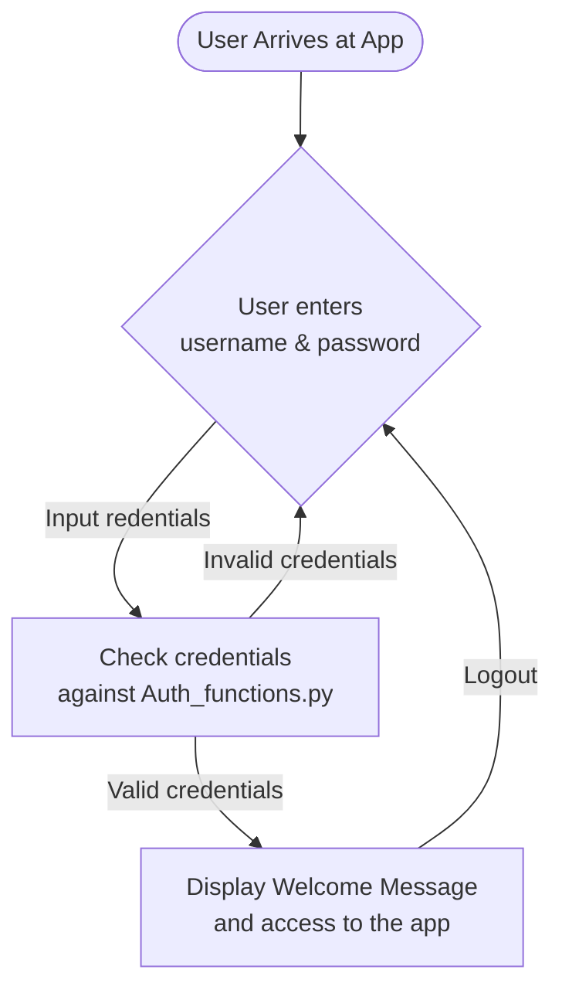

Some examples I have been testing with the [Streamlit MultiChat Summary](https://github.com/JAlcocerT/Streamlit-MultiChat).

But it was time to **[level up my Streamlit](https://jalcocert.github.io/JAlcocerT/ai-useful-yet-simple/#making-streamlit-better), again.**

* https://github.com/JAlcocerT/Streamlit-Speech
* https://github.com/JAlcocerT/Streamlit-MultiChat
* https://github.com/JAlcocerT/Py_RouteTracker

Lets make some **Business value driven projects!**

## A Neuromarketing Agent


* [Neuromarketing with openAI](https://github.com/JAlcocerT/Streamlit-MultiChat/blob/main/Z_Tests/OpenAI/openai_neumkt.py)




* CTA's
    * Quieres el premium? No, correre el riesgo!
    * You don’t have to miss out
    * They all laugh when…
    * What sounds better than privacy?
    * Is your Business performing at 100%? Here is the best/easiest way to find out
        * Measure, Check, Act



---

## Work Companion


Its all about the prompts, as we can see with **these use cases**


### Slides Creation Agent

[SliDev is an awsome project](https://fossengineer.com/how-to-use-slidev/) to generate PPT as code - **leveraging VueJS**.

I love the SliDev project so much, that [I forked it](https://github.com/JAlcocerT/slidev).


* [OpenAI PPT with **Slidev**](https://github.com/JAlcocerT/Streamlit-MultiChat/blob/main/Z_Tests/OpenAI/openai_slidev.py
)
* **SliDev PPT** for Streamlit Multichat - Deployed [here](https://jalcocert.github.io/Streamlit-MultiChat/1) using [GH Actions](https://github.com/JAlcocerT/Streamlit-MultiChat/blob/main/.github/workflows/SliDev_CICD.yml)
    * [Result](https://jalcocert.github.io/Streamlit-MultiChat/1)
    * [Code](https://github.com/JAlcocerT/Streamlit-MultiChat/tree/main/slidev)


> You can also create **PPTs from markdown** with [Marpit](https://github.com/marp-team/marpit)

### Diagrams with AI


* [OpenAI + mermaid](https://github.com/JAlcocerT/Streamlit-MultiChat/blob/main/Z_Tests/OpenAI/openai_mermaid.py)


### Ticket Creation with AI


* [Jira with OpenAI](https://github.com/JAlcocerT/Streamlit-MultiChat/blob/main/Z_Tests/OpenAI/openai_create_ticket.py)


### Email with Ai

---

## CV with AI

It all started with [CV with OpenAI](https://github.com/JAlcocerT/Streamlit-MultiChat/blob/main/Z_Tests/OpenAI/openai_cv.py)


And continued with [this repo](https://gitlab.com/fossengineer1/cv-check) with a Streamlit Web App


## Speech Rater with AI


[SpeechRater](https://github.com/JAlcocerT/streamlitspeechrater) and [StreamlitSpeech](https://github.com/JAlcocerT/Streamlit-Speech)


## Kindle Notes to AI

Kindle notes are saved into a .txt in the device.

I was storing notes for few years already and im really curious to see whats inside.

---

## Making Streamlit Better

### User Authentication

There will be some diagrams here, with Mermaid ofc.



* It just require a single additional file to your App
* [Example in Streamlit-Multichat](https://github.com/JAlcocerT/Streamlit-MultiChat/blob/main/Streamlit_Pages/Auth_functions.py) - A very simple one that allow certain user/passwords to access an app

> Thanks to Naashonomics and [the code](https://github.com/naashonomics/pandas_templates/blob/master/login.py)





* It just require a single additional file to your App
* [Example in Streamlit-Multichat](https://github.com/JAlcocerT/Streamlit-MultiChat/blob/main/Streamlit_Pages/Auth_functions.py) - A very simple one that allow certain user/passwords to access an app

> Thanks to Naashonomics and [the code](https://github.com/naashonomics/pandas_templates/blob/master/login.py)



* 

### Streamlit Github CI/CD

To use Github Actions to create automatic container images for your streamlit projects, you will need such [configuration file](https://github.com/JAlcocerT/Streamlit-MultiChat/actions/workflows/Streamlit_GHA_MultiArch.yml).

And to follow [these steps](https://fossengineer.com/docker-github-actions-cicd/).