```mermaid
flowchart TD
    Start([User Arrives at App 🙊]) --> DevModeCheck{Check DEV_MODE}
    
    DevModeCheck -->|DEV_MODE=True| MainOptions["App Features Access 😊 "]
    DevModeCheck -->|DEV_MODE=False| EmailEntry["Prompt user for email"]
    
    EmailEntry -->|Email Entered| SubscriptionCheck["Check email subscription with MailerLite API"]
    EmailEntry -->|No Email Entered| EndInfo["Show 'Please enter email' message"]

    SubscriptionCheck -->|Subscribed| SuccessWelcome["Welcome Message and Log Success"]
    SubscriptionCheck -->|Not Subscribed| Warning["Show warning: Email not subscribed and Log Failure"]

    SuccessWelcome --> MainOptions
    MainOptions --> OptionSelected{User selects an option}
    
    OptionSelected -->|Analyze CV Template| AnalyzeCV["Run Analyze CV function"]
    OptionSelected -->|CV To Offer| AdaptCV["Run Adapt CV to Offer function"]
    OptionSelected -->|Offer Overview| OfferOverview["Run Offer Overview function"]

    Warning --> Start
```

I started with streamlit with some sample apps for [route gpx tracking](https://github.com/JAlcocerT/Py_RouteTracker)

But this year I have been testing more features with the [Streamlit MultiChat Summary](https://github.com/JAlcocerT/Streamlit-MultiChat).

Anyways, it was time to **[level up my Streamlit](#making-streamlit-better), again.**



  
  



And why not doing it while making some **Business value driven projects!**


This is how [CV-Check // CVCreAItor](https://gitlab.com/fossengineer1/cv-check) and [AIssistant](https://github.com/JAlcocerT/Streamlit-AIssistant) were born


Looking at [Streamlit Roadmap](https://roadmap.streamlit.app/), more ideas will pop up

## For Entrepreneurs


To investigate this, was key - **[Scrapping Tools](https://github.com/JAlcocerT/Scrap_Tools)**


### A Neuromarketing Agent

It is hard to be a solo-preneur...

unless you have some help.

Like the help of **EntrepreAI**


* [Neuromarketing with openAI](https://github.com/JAlcocerT/Streamlit-MultiChat/blob/main/Z_Tests/OpenAI/openai_neumkt.py)




* CTA's
    * Quieres el premium? No, correre el riesgo!
    * You don’t have to miss out
    * They all laugh when…
    * What sounds better than privacy?
    * Is your Business performing at 100%? Here is the best/easiest way to find out
        * Measure, Check, Act




> Many of these were just [Tests during Streamlit-Multichat](https://github.com/JAlcocerT/Streamlit-MultiChat/tree/main/Z_Tests/OpenAI) few months ago

### Automatic Blog Creation

Using already a SSG for your websites?

If a LLM can write markdown...why not using it to create posts assisted with AI?

### YT Summarizer and More

There are great videos out there.

But there are hidden between...too much fluff.

But the PhiData team put together an awsome idea that I decided to Fork and bundle automatically in a Container for further reach...

...a **youtube AI summarization tool** which uses Groq for very fast inference.


My PhiData [YT Summarizer with Groq API Fork](https://github.com/JAlcocerT/phidata). 


I explained the process at [this blog post](https://jalcocert.github.io/JAlcocerT/summarize-yt-videos/)

And now have been testing a little bit more the GroqAPI.

Of course there are new models: LLaMa3.1's and LLaMa 3.2's



With [this code](https://github.com/JAlcocerT/Streamlit-AIssistant/blob/main/Z_Tests/Groq_API/groq_available_models.py) you can see all the models available at groqAPI.

And with [this sample streamlit app](https://github.com/JAlcocerT/Streamlit-AIssistant/blob/main/Z_Tests/Groq_API/st_groq_qq_v1.py) - you can query each available model.

> I was testing how each of them can perform to sample questions.




```sh
docker pull ghcr.io/jalcocert/phidata:yt-groq #https://github.com/users/JAlcocerT/packages/container/package/phidata
```



I called this my `z_aigen` stack in Portainer:

* The [Container Image](https://github.com/JAlcocerT/phidata/pkgs/container/phidata)
* This is my [AI-Gen docker Compose](https://github.com/JAlcocerT/Docker/blob/main/Z_Dockge/stacks/z_aigen/compose.yaml)

```yml
version: '3.8'

services:
  phidata_service:
    image: ghcr.io/jalcocert/phidata:yt-groq #phidata:yt_summary_groq
    container_name: phidata_yt_groq
    ports:
      - "8502:8501"    
    environment:
      - GROQ_API_KEY="gsk_dummy-groq-api" # your_api_key_here
    command: streamlit run cookbook/llms/groq/video_summary/app.py
    restart: always
    networks:
      - cloudflare_tunnel

  streamlit_multichat:
    image: ghcr.io/jalcocert/streamlit-multichat:latest
    container_name: streamlit_multichat
    volumes:
      - ai_streamlit_multichat:/app
    working_dir: /app
    command: /bin/sh -c "\
            mkdir -p /app/.streamlit && \
            echo 'OPENAI_API_KEY = "sk-dummy-openai-key"' > /app/.streamlit/secrets.toml && \
            echo 'GROQ_API_KEY = "dummy-groq-key"' >> /app/.streamlit/secrets.toml && \
            echo 'ANTHROPIC_API_KEY = "sk-dummy-anthropic-key"' >> /app/.streamlit/secrets.toml && \
            streamlit run Z_multichat_Auth.py
    ports:
      - "8501:8501"
    networks:
      - cloudflare_tunnel
    restart: always
      # - nginx_default   

  ollama:
    image: ollama/ollama
    container_name: ollama
    ports:
      - "11434:11434" #Ollama API
    volumes:
      #- ollama_data:/root/.ollama
      - /home/Docker/AI/Ollama:/root/.ollama
    networks:
      - ollama_network      

  ollama-webui:
    image: ghcr.io/ollama-webui/ollama-webui:main
    container_name: ollama-webui
    ports:
      - "3000:8080" # 3000 is the UI port
    environment:
      - OLLAMA_BASE_URL=http://192.168.3.200:11434
    # add-host:
    #   - "host.docker.internal:host-gateway"
    volumes:
      - /home/Docker/AI/OllamaWebUI:/app/backend/data
    restart: always          
    networks:
      - ollama_network    

networks:
  cloudflare_tunnel:
    external: true
  ollama_network:
    external: false
  # nginx_default:
  #   external: true

volumes:
  ai_streamlit_multichat:
```



But that is old school already.


I have created an improved agent that allows us not just to summarize the YT Video - but to <u>**chat with the YouTube video** content</u>.



It is part of the AIssistant. Right here.


And it can be used via the **groq API** too. 

* https://console.groq.com/docs/examples




* https://console.groq.com/docs/examples
* https://github.com/groq/groq-api-cookbook
* https://console.groq.com/playground

It has [Speech capabilities](https://console.groq.com/docs/speech-text) like transcriptions & Translations!

And ofc, [vision, with Llama 3.2 Vision](https://console.groq.com/docs/vision) at this moment.



* **Cool sample:** Ask questions with Groq + Function Calling + DuckDB SQl Queries- [Example](https://replit.com/t/groqcloud/repls/Execute-Verified-SQL-Queries-with-Function-Calling/view#README.md)


### Creating Audio for YT

Imagine that you have recorded some procedure that you want to share with the rest of the world.

But you want to automate the process of explaining it.

How about using AI to generate a .mp3 that will be explaining the video for you?

> And actually...that text could be also AI generated. Also the Youtube Video Description.


---

## Work Companion


Its all about the prompts, as we can see with **these use cases** that give life to the [**Streamlit-AIssistant**](https://github.com/JAlcocerT/Streamlit-AIssistant/tree/main)


### Slides Creation Agent

[SliDev is an awsome project](https://fossengineer.com/how-to-use-slidev/) to generate PPT as code - **leveraging VueJS**.

I love the SliDev project so much, that [I forked it](https://github.com/JAlcocerT/slidev).


* [OpenAI PPT with **Slidev**](https://github.com/JAlcocerT/Streamlit-MultiChat/blob/main/Z_Tests/OpenAI/openai_slidev.py
)
* **SliDev PPT** for Streamlit Multichat - Deployed [here](https://jalcocert.github.io/Streamlit-MultiChat/1) using [GH Actions](https://github.com/JAlcocerT/Streamlit-MultiChat/blob/main/.github/workflows/SliDev_CICD.yml)
    * [Result](https://jalcocert.github.io/Streamlit-MultiChat/1)
    * [Code](https://github.com/JAlcocerT/Streamlit-MultiChat/tree/main/slidev)


> You can also create **PPTs from markdown** with [Marp](https://github.com/marp-team/marpit) or with [RemarkJS](https://fossengineer.com/create-ppt-with-code/#remark)

### Diagrams with AI

Because [mermaidJS is so cool](https://fossengineer.com/free-diagram-tools/#mermaidjs) not to use it also with AI.


I made some test with [OpenAI + mermaid](https://github.com/JAlcocerT/Streamlit-MultiChat/blob/main/Z_Tests/OpenAI/openai_mermaid.py). Now, is one of the [Agents of AIssistant](https://github.com/JAlcocerT/Streamlit-AIssistant/blob/main/Z_AIgents/OpenAI_mermaid.py)


You can use those diagrams with SSG (like HUGO, Astro...) and also for Slides creation with SliDev

### Ticket Creation with AI


* [Jira with OpenAI](https://github.com/JAlcocerT/Streamlit-MultiChat/blob/main/Z_Tests/OpenAI/openai_create_ticket.py)


### Email with Ai


---

## CV with AI

It all started with [CV with OpenAI](https://github.com/JAlcocerT/Streamlit-MultiChat/blob/main/Z_Tests/OpenAI/openai_cv.py)

Thanks to this app I have been able to level up my Streamlit with many new features.


And continued with [the CV-Check repo](https://gitlab.com/fossengineer1/cv-check) with a Streamlit Web App.


## Speech Rater with AI


It all started with a friend doing public speaking courses.


[SpeechRater](https://github.com/JAlcocerT/streamlitspeechrater) and [StreamlitSpeech](https://github.com/JAlcocerT/Streamlit-Speech)


And since OpenAI can **transcribe (Audio to Text)**...






And Text can be summarized / be asked questions...







## Kindle Notes to AI

Kindle notes are saved into a `.txt` in the device.

I was storing notes for few years already and im really curious to see whats inside.

> I gave it a try with Google's NotebookLLM, but...custom is custom

---

## Conclusions

### Making Streamlit Better



For passing important variables (like API keys)

* We could do it via the `./streamlit/secrets.toml` [file](https://github.com/JAlcocerT/Streamlit-MultiChat/tree/main/.streamlit), with this kind of [**command** at the docker compose](https://github.com/JAlcocerT/Streamlit-MultiChat/blob/main/Z_DeployMe/Docker-Compose.yml)
* But, they can also be passed as **environment variables**, with this kind of [docker-compose](https://gitlab.com/fossengineer1/cv-check/-/blob/main/Z_DeployMe/Docker-Compose.yml?ref_type=heads)









#### User Authentication

There will be some diagrams here, with [Mermaid ofc](https://fossengineer.com/free-diagram-tools/#mermaidjs).



**Pros**
1. It just require a single additional file to bring Auth to the App
2. Completely Free and no dependencies with 3rd parties
**Cons**
1. Hardcoded values (~Okeish for a PoC)

* [Example in Streamlit-Multichat](https://github.com/JAlcocerT/Streamlit-MultiChat/blob/main/Streamlit_Pages/Auth_functions.py) - A very simple one that allow certain user/passwords to access an app


> Thanks to Naashonomics and [the code](https://github.com/naashonomics/pandas_templates/blob/master/login.py)






```mermaid
flowchart TD
    Start([User Arrives at App 🙊]) --> LoginPrompt{User enters<br>username & password}
    
    LoginPrompt -->|Input redentials| AuthCheck["Check credentials<br>against Auth_functions.py"]

    AuthCheck -->|Valid credentials| Welcome["Display Welcome Message<br>and access to the app"]
    AuthCheck -->|Invalid credentials| LoginPrompt

    Welcome -->|Logout| LoginPrompt
```

But to place real users fast into the features loop...

It is interesting at least to get them to provide the email in exchange for getting early access.




* **Pros** 
1. Integrated with MailerLite API
* With double opt-in, you will get just verified emails
2. No hardcoded values in the app
* **Cons** MailerLite Free Tier finishes at 1k subs
* [Example Code in CV-Check](https://gitlab.com/fossengineer1/cv-check/-/blob/main/Z_CVCheck_pdfmineropenAI_v3.py?ref_type=heads) - A very simple one that allow certain user/passwords to access an app








FormBricks is an open source Survey Platform.

You can make very interesting polls and embedd them or reference them with a link into your Apps. The Survey Type **Link Survey** was very helpful for this case.

It has very cool integrations, like with GSheets, which you can use:

* **Pros** 
1. Integrated with MailerLite API
* With MailerLite double opt-in, you will get just verified emails
* You can use Formbricks as another EmailWall with the GSheets integration
2. No hardcoded values in the app
* **Cons** MailerLite Free Tier finishes at 1k subs

> [Example Code here](https://gitlab.com/fossengineer1/cv-check/-/blob/main/Z_CVCheck_pdfmineropenAI_v3a.py). This module [for MailerLite](https://gitlab.com/fossengineer1/cv-check/-/blob/main/Z_Auth_Ways/Auth_Mailerlite.py?ref_type=heads) and this one for [FormBricks via GSheets](https://gitlab.com/fossengineer1/cv-check/-/blob/main/Z_Auth_Ways/Auth_FormBricks.py?ref_type=heads)





But...how about paywalls?

Some time ago I tried [this streamlit paywall simple example](https://github.com/parker84/streamlit-paywall-simple-example)

but it didnt quite work for me. 

It was the time to check [Stripe API together with Streamlit](https://gitlab.com/fossengineer1/cv-check/-/tree/main/Z_Tests/Stripe?ref_type=heads)



* **Pros** 
1. Integrated with Stripe API
2. No hardcoded values in the app, [get all the clients](https://docs.stripe.com/api/customers/list)
3. You can check if a certain [mail has any active/trialing subscription](https://gitlab.com/fossengineer1/cv-check/-/blob/main/Z_Tests/Stripe/stripe_check_customers_activesub_v1a.py?ref_type=heads)
4. Or if it has a specific subscription
* **Cons** 
* 3rd parties dependencies
* No email verification - but card verification
* No password verification for a given email

> [This module](https://gitlab.com/fossengineer1/cv-check/-/blob/main/Z_Auth_Ways/Auth_Stripe.py?ref_type=heads) checks if a given email has ever been a customer / have active subscription / have particular products_id subs




In the end, I made a EmailWall Module that combines the 3 checks, according to what the user wants to check agains in [the `.env` variable](https://gitlab.com/fossengineer1/cv-check/-/blob/main/.env.sample?ref_type=heads)




I read that it is a little bit tricky to implement.

Maybe they are not there yet?






Amazon simple email service...or what else?




Streamlit has very useful [sessions states](https://docs.streamlit.io/develop/api-reference/caching-and-state/st.session_state)


#### Streamlit New Features

Big **thanks to Fanilo Andrianasolo** for the great Streamlit Videos
* Keep up to date with the latest [streamlit utilities](https://docs.streamlit.io/develop/api-reference/utilities)
* And [streamlit components](https://streamlit.io/components)





[**Streamlit Roadmap**](https://github.com/streamlit/roadmap)

* https://github.com/kajarenc/stauthlib
    * Google Auth done easy?
* [Folium Maps Selections](https://github.com/streamlit/streamlit/issues/8653) with [pydeck_chart](https://docs.streamlit.io/develop/api-reference/charts/st.pydeck_chart) and apparently working with [streamlit-folium](https://github.com/randyzwitch/streamlit-folium) too
    * https://github.com/streamlit/streamlit/pull/9377
    * Sample in [the docs](https://github.com/streamlit/docs/blob/main/python/api-examples-source/charts.pydeck_event_state_selections.py), which i tried and it works with pydeck
* [Pure html to streamlit app](https://docs.streamlit.io/develop/api-reference/utilities/st.html) - Ready from v1.40.0
    * st.html content is not iframed. Executing JavaScript is not supported at this time.
* Charts Selections!!
* There are now [widgets](https://docs.streamlit.io/develop/api-reference/widgets) for both, [audio_input](https://docs.streamlit.io/develop/api-reference/widgets/st.audio_input) and camera_input
    * It resonates a lot with [Speech-Rater](#speech-rater-with-ai) and with [Computer Vision](https://jalcocert.github.io/JAlcocerT/dji-tello-python-programming/#dji-tello-python)


> https://github.com/streamlit/cookbook, I tried many of these during [the testing phase for AIssistant](https://github.com/JAlcocerT/Streamlit-AIssistant/tree/main/Z_Tests)



There is also [this video](https://www.youtube.com/watch?v=ZI7_INDzqbw)
explaining whats going to be released...now.







### What Ive learnt with this one



**A Trick** for seeing which packages have actually been installed from the ones at `requirements.txt`

```sh
#pip install -r requirements.txt

#pip freeze | grep -E '^(anthropic|streamlit)=='
#pip freeze | grep -Ff requirements.txt
pip freeze | grep -E "^($(paste -sd '|' requirements.txt))=="
```






```sh
source .env
#export GROQ_API_KEY="your-api-key-here"
#set GROQ_API_KEY=your-api-key-here
#$env:GROQ_API_KEY="your-api-key-here"
echo $GROQ_API_KEY $OPENAI_API_KEY $ANTHROPIC_API_KEY
```




---

## FAQ

### How to Query Different APIs

#### LLMs - OpenAI,Anthropic, Groq...

* https://console.anthropic.com/workbench/
* https://console.groq.com/keys
* https://platform.openai.com/api-keys



A sample **API call to OpenAI>1**, for example to [create tickets](https://github.com/JAlcocerT/Streamlit-MultiChat/blob/main/Z_Tests/OpenAI/openai_create_ticket.py)

But, the **user/system prompts can be better modularized** if we go with this approach of [the markdown summarizer](https://github.com/JAlcocerT/Streamlit-AIssistant/blob/main/Z_AIgents/OpenAI_MDSummarizer_v1.py)





Sample [Anthropic Claude Models API call](https://github.com/JAlcocerT/Streamlit-AIssistant/tree/main/Z_Tests/ST_Anthropic)

See their [docs for more examples](https://docs.anthropic.com/en/prompt-library/meeting-scribe)

> [Anthropic API calls first tested](https://github.com/JAlcocerT/Streamlit-MultiChat/blob/main/Z_Tests/streamlit_anthropic2.py) during StreamlitMultichat

* Opus models are the most powerful, but **Sonnet LLMs** are a balance between speed/cost/quality of the reply
* There is alrady Vision and Computer Use capabilities in beta...



Normally the latest **Anthropic (Claude Models)** are accesible very soon on **AWS Bedrock API** - As they invested a lot in the company



Sample [Groq Models API call](https://github.com/JAlcocerT/Streamlit-AIssistant/blob/main/Z_Tests/Groq_API/groq_api_query.py)

See [available models via groq API](https://github.com/JAlcocerT/Streamlit-AIssistant/blob/main/Z_Tests/Groq_API/groq_available_models.py)





1. [Setup Ollama](https://fossengineer.com/selfhosting-llms-ollama/)
2. Download a LLM via Ollama
3. Use this sample script to query the LLM via Ollama Python API

> [Ollama API calls first tested](https://github.com/JAlcocerT/Streamlit-MultiChat/blob/main/Z_Tests/ollama_chatbot.py) during StreamlitMultichat













[](https://star-history.com/#ScrapeGraphAI/Scrapegraph-ai&unclecode/crawl4ai&mendableai/firecrawl&Date)


[](https://star-history.com/#ollama/ollama-python&openai/openai-python&anthropic/anthropic-sdk-python&groq/groq-api-python&Date)


### Streamlit CI/CD

* With Github - using dockerx to get a multiarch (x86 & ARM64) Container Image

To use **Github Actions** to create automatic **container images** for your streamlit projects, you will need **such [configuration file](https://github.com/JAlcocerT/Streamlit-MultiChat/actions/workflows/Streamlit_GHA_MultiArch.yml)**.



Just follow [these steps](https://fossengineer.com/docker-github-actions-cicd/).


* You can also build the container image manually
  * Following [this sample steps](https://github.com/JAlcocerT/phidata/tree/main/Z_DeployMe)

### Deploying Streamlit

You can use Streamlit Cloud Services.

But you can also **host Streamlit with your own Domain**. And without paying extra.


You can use [Cloudflare tunnels](https://fossengineer.com/selfhosting-cloudflared-tunnel-docker/)



Remember to use: `container_name:container_port`