I started with streamlit with some sample apps for [route gpx tracking](https://github.com/JAlcocerT/Py_RouteTracker)

But this year I have been testing more features with the [Streamlit MultiChat Summary](https://github.com/JAlcocerT/Streamlit-MultiChat).

Anyways, it was time to **[level up my Streamlit](#making-streamlit-better), again.**


  
  


And why not doing it while making some **Business value driven projects!**

## A Neuromarketing Agent


* [Neuromarketing with openAI](https://github.com/JAlcocerT/Streamlit-MultiChat/blob/main/Z_Tests/OpenAI/openai_neumkt.py)




* CTA's
    * Quieres el premium? No, correre el riesgo!
    * You don’t have to miss out
    * They all laugh when…
    * What sounds better than privacy?
    * Is your Business performing at 100%? Here is the best/easiest way to find out
        * Measure, Check, Act



---

## Work Companion


Its all about the prompts, as we can see with **these use cases**


### Slides Creation Agent

[SliDev is an awsome project](https://fossengineer.com/how-to-use-slidev/) to generate PPT as code - **leveraging VueJS**.

I love the SliDev project so much, that [I forked it](https://github.com/JAlcocerT/slidev).


* [OpenAI PPT with **Slidev**](https://github.com/JAlcocerT/Streamlit-MultiChat/blob/main/Z_Tests/OpenAI/openai_slidev.py
)
* **SliDev PPT** for Streamlit Multichat - Deployed [here](https://jalcocert.github.io/Streamlit-MultiChat/1) using [GH Actions](https://github.com/JAlcocerT/Streamlit-MultiChat/blob/main/.github/workflows/SliDev_CICD.yml)
    * [Result](https://jalcocert.github.io/Streamlit-MultiChat/1)
    * [Code](https://github.com/JAlcocerT/Streamlit-MultiChat/tree/main/slidev)


> You can also create **PPTs from markdown** with [Marpit](https://github.com/marp-team/marpit)

### Diagrams with AI


* [OpenAI + mermaid](https://github.com/JAlcocerT/Streamlit-MultiChat/blob/main/Z_Tests/OpenAI/openai_mermaid.py)


### Ticket Creation with AI


* [Jira with OpenAI](https://github.com/JAlcocerT/Streamlit-MultiChat/blob/main/Z_Tests/OpenAI/openai_create_ticket.py)


### Email with Ai

---

## CV with AI

It all started with [CV with OpenAI](https://github.com/JAlcocerT/Streamlit-MultiChat/blob/main/Z_Tests/OpenAI/openai_cv.py)

Thanks to this app I have been able to level up my Streamlit with many new features.


And continued with [this repo](https://gitlab.com/fossengineer1/cv-check) with a Streamlit Web App


## Speech Rater with AI


[SpeechRater](https://github.com/JAlcocerT/streamlitspeechrater) and [StreamlitSpeech](https://github.com/JAlcocerT/Streamlit-Speech)


## Kindle Notes to AI

Kindle notes are saved into a .txt in the device.

I was storing notes for few years already and im really curious to see whats inside.

---

## Making Streamlit Better



* For passing important variables, we could do it via the `./streamlit/secrets.toml` [file](https://github.com/JAlcocerT/Streamlit-MultiChat/tree/main/.streamlit), with this kind of [command at the docker compose](https://github.com/JAlcocerT/Streamlit-MultiChat/blob/main/Z_DeployMe/Docker-Compose.yml)
* But, they can also be passed as environment variables, with this kind of [docker-compose](https://gitlab.com/fossengineer1/cv-check/-/blob/main/Z_DeployMe/Docker-Compose.yml?ref_type=heads)



### User Authentication

There will be some diagrams here, with [Mermaid ofc](https://fossengineer.com/free-diagram-tools/#mermaidjs).



**Pros**
1. It just require a single additional file to bring Auth to the App
2. Completely Free and no dependencies with 3rd parties
**Cons**
1. Hardcoded values (~Okeish for a PoC)

* [Example in Streamlit-Multichat](https://github.com/JAlcocerT/Streamlit-MultiChat/blob/main/Streamlit_Pages/Auth_functions.py) - A very simple one that allow certain user/passwords to access an app

> Thanks to Naashonomics and [the code](https://github.com/naashonomics/pandas_templates/blob/master/login.py)



But to place real users fast into the features loop...

It is interesting at least to get them to provide the email in exchange for getting early access.



* **Pros** 
1. Integrated with MailerLite API
* With double opt-in, you will get just verified emails
2. No hardcoded values in the app
* **Cons** MailerLite Free Tier finishes at 1k subs
* [Example Code in CV-Check](https://gitlab.com/fossengineer1/cv-check/-/blob/main/Z_CVCheck_pdfmineropenAI_v3.py?ref_type=heads) - A very simple one that allow certain user/passwords to access an app





* **Pros** 
1. Integrated with MailerLite API
* With MailerLite double opt-in, you will get just verified emails
2. No hardcoded values in the app
* **Cons** MailerLite Free Tier finishes at 1k subs

> [Example Code here](https://gitlab.com/fossengineer1/cv-check/-/blob/main/Z_CVCheck_pdfmineropenAI_v3a.py). This module [for MailerLite](https://gitlab.com/fossengineer1/cv-check/-/blob/main/Z_Auth_Ways/Auth_Mailerlite.py?ref_type=heads) and this one for [FormBricks via GSheets](https://gitlab.com/fossengineer1/cv-check/-/blob/main/Z_Auth_Ways/Auth_FormBricks.py?ref_type=heads)



```mermaid
flowchart TD
    Start([User Arrives at App 🙊]) --> DevModeCheck{BackEnd Checks DEV_MODE}
    
    DevModeCheck -->|DEV_MODE=True| MainOptions["App Features Access 😍"]
    DevModeCheck -->|DEV_MODE=False| EmailEntry["Prompt user for email"]
    
    EmailEntry -->|Email Entered| SubscriptionCheck
    EmailEntry -->|No Email Entered| EndInfo["Show 'Please enter email' message"]

    %% Subscription checks surrounded in a box
    subgraph BackendElements [BE Subscription Logic]
        SubscriptionCheck["Check email subscription with MailerLite API"]
        SubscriptionCheck -->|Subscribed via MailerLite| SuccessWelcome["Welcome Message and Log Success"]
        SubscriptionCheck -->|Not in MailerLite| FormBricksCheck["Check email in FormBricks Google Sheet"]
        
        FormBricksCheck -->|Subscribed in FormBricks| SuccessWelcome
        FormBricksCheck -->|Not Subscribed in Either| Warning["Show warning: Email not subscribed and Log Failure"]
    end

    SuccessWelcome --> MainOptions
    MainOptions --> OptionSelected{User selects an option}
    
    OptionSelected -->|Analyze CV Template| AnalyzeCV["Run Analyze CV function"]
    OptionSelected -->|CV To Offer| AdaptCV["Run Adapt CV to Offer function"]
    OptionSelected -->|Offer Overview| OfferOverview["Run Offer Overview function"]

    Warning --> Start
```

But...how about paywalls?

Some time ago I tried [this streamlit paywall simple example](https://github.com/parker84/streamlit-paywall-simple-example)

but it didnt quite work for me. 

It was the time to check [Stripe API together with Streamlit](https://gitlab.com/fossengineer1/cv-check/-/tree/main/Z_Tests/Stripe?ref_type=heads)



* **Pros** 
1. Integrated with Stripe API
2. No hardcoded values in the app, [get all the clients](https://docs.stripe.com/api/customers/list)
3. You can check if a certain [mail has any active/trialing subscription](https://gitlab.com/fossengineer1/cv-check/-/blob/main/Z_Tests/Stripe/stripe_check_customers_activesub_v1a.py?ref_type=heads)
4. Or if it has a specific subscription
* **Cons** 
* 3rd parties dependencies
* No email verification - but card verification
* No password verification for a given email

> [This module](https://gitlab.com/fossengineer1/cv-check/-/blob/main/Z_Auth_Ways/Auth_Stripe.py?ref_type=heads) checks if a given email has ever been a customer / have active subscription / have particular products_id subs



In the end, I made a EmailWall Module that combines the 3 checks, according to what the user wants to check agains in [the `.env` variable](https://gitlab.com/fossengineer1/cv-check/-/blob/main/.env.sample?ref_type=heads)


Streamlit has very useful [sessions states](https://docs.streamlit.io/develop/api-reference/caching-and-state/st.session_state)


Big **thanks to Fanilo Andrianasolo** for the great Streamlit Videos
* Keep up to date with the latest [streamlit utilities](https://docs.streamlit.io/develop/api-reference/utilities)
* And [streamlit components](https://streamlit.io/components)





[**Streamlit Roadmap**](https://github.com/streamlit/roadmap)

* https://github.com/kajarenc/stauthlib
    * Google Auth done easy?
* [Folium Maps Selections](https://github.com/streamlit/streamlit/issues/8653)
    * https://github.com/streamlit/streamlit/pull/9377
* [Pure html to streamlit app](https://docs.streamlit.io/develop/api-reference/utilities/st.html) - Ready from v1.40.0
    * st.html content is not iframed. Executing JavaScript is not supported at this time.

> https://github.com/streamlit/cookbook



### Streamlit Github CI/CD

To use **Github Actions** to create automatic **container images** for your streamlit projects, you will need such [configuration file](https://github.com/JAlcocerT/Streamlit-MultiChat/actions/workflows/Streamlit_GHA_MultiArch.yml).


Just follow [these steps](https://fossengineer.com/docker-github-actions-cicd/).
