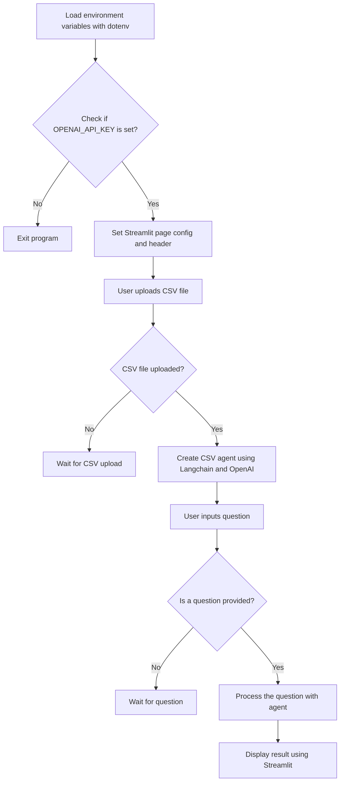
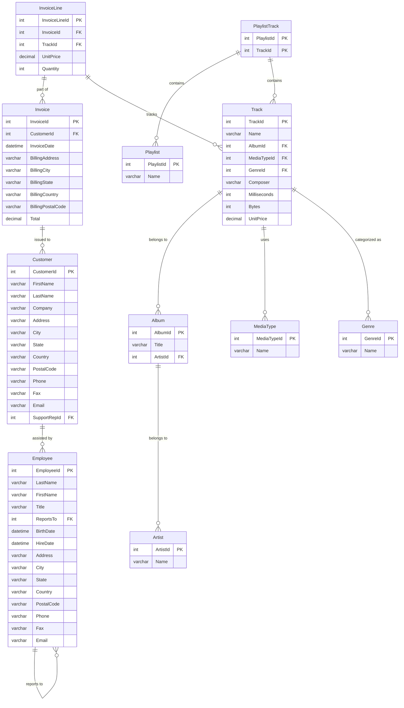

As [commented earlier this year](https://jalcocert.github.io/JAlcocerT/how-to-chat-with-pdfs/), I was inspired by **Alejandro AO** and its **Python AI projects**.


[I commented the PDF one **here** →](/JAlcocerT/how-to-chat-with-pdfs)

But today, it is the **time for [CSV's](#chat-with-csv-with-langchain)** and with **[Databases](#chat-with-a-db-with-langchain)**!

You guessed it.

We will be using **LangChain** as RAG framework to provide the **CSV context to the LLM**.


  
  



[LangChain is an alternative](https://jalcocert.github.io/JAlcocerT/how-to-use-pandasAI/#other-foss-ways-to-chat-with-your-data) to [PandasAI](https://jalcocert.github.io/JAlcocerT/how-to-use-pandasAI/).



I am creating a public repo with all sort if interesting RAG libraries to **[Chat over Data](https://github.com/JAlcocerT/Data-Chat)** 💻 


## Chat with CSV with LangChain

You will need to have:

* [Python installed](https://jalcocert.github.io/JAlcocerT/guide-python/#installing-python-) and a [virtual environment](https://jalcocert.github.io/JAlcocerT/useful-python-stuff/) ready.
* The OpenAI API keys - https://platform.openai.com/api-keys



See the modified working code [here](https://github.com/JAlcocerT/langchain-ask-csv) 💻


These are the libraries you will need:

```sh
pip install langchain python-dotenv streamlit openai
```


But that way will install the latest version of each.



Which may cause incompatibilities in the future.

Thats why the original Alejandro AO Project has the `requirements.txt` file specifying the version.

```sh
pip install -r requirements.txt
#pip install langchain==0.0.208 python-dotenv==1.0.0 streamlit==1.25.0 openai==0.27.0 transformers==4.28.1 sentence_transformers==2.2.2 torch==2.0.1 tensorflow==2.12.0
```

I just removed most of them as the original file seemed to have many more than required.

Remember to place your OpenAI API key in the `.env` file.

And run the Streamlit App:

```sh
streamlit run main.py
```

### Understanding CSV with LangChain App

This is the general workflow of the Python app:




## Chat with a DB with LangChain

It's not that SQL is impossible to learn.

But why not using AI as leverage to help us with D&A tasks?

And it is possible thanks to LangChain with [Python](https://jalcocert.github.io/JAlcocerT/useful-python-stuff/) and the great work of AlejandroAO


One more time, thanks to AlejandroAO this have been possible. The working code is on my [data-chat repo](https://github.com/JAlcocerT/langchain-ask-csv) 💻 as it was not provided an original one.





* [ChartDB](https://github.com/chartdb/chartdb) - Database diagrams editor that allows you to visualize and design your DB with a single query.
* [SQLiteViz](https://github.com/lana-k/sqliteviz)
* [SQliteBrowser](https://github.com/sqlitebrowser/sqlitebrowser)




You can see that the **DB is loaded** and we can see its **Schema**.

Actually, we can make already a **MermaidJS ER diagram** to represent it:



---

## FAQ

Other Tools to **Chat over custom data** (and locally~) is [PrivateGPT](https://fossengineer.com/selfhosting-privateGPT/)



You can also try:

* [PandasAI](https://jalcocert.github.io/JAlcocerT/how-to-use-pandasAI/) which I covered
* LlamaIndex


* https://console.anthropic.com/settings/keys
    * https://docs.anthropic.com/en/docs/about-claude/models
* https://platform.openai.com/api-keys