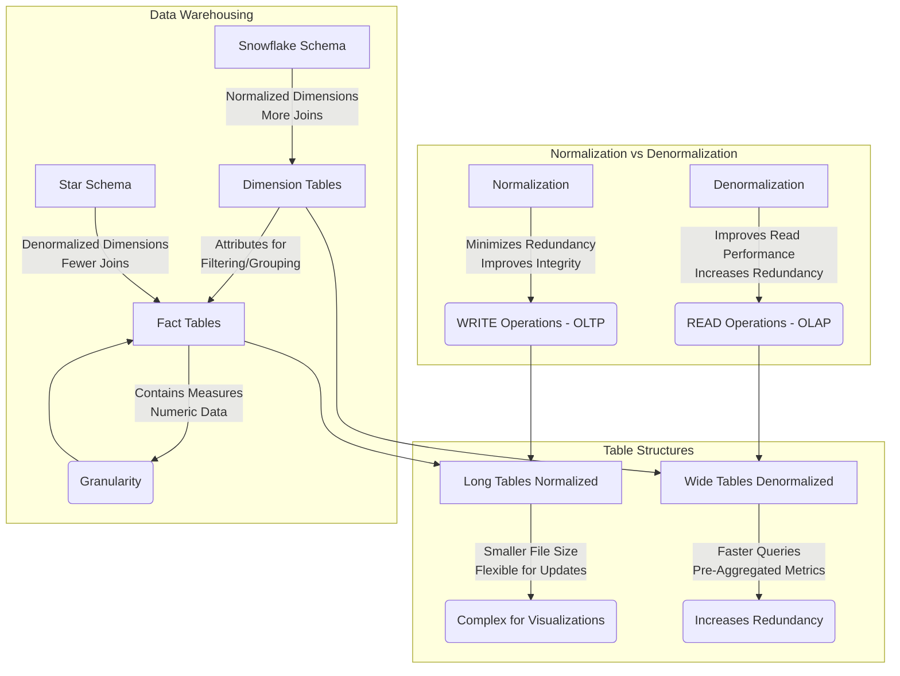


This Post is **WIP**


Long ago, I was covering [the analytical stack](https://jalcocert.github.io/JAlcocerT/self-taught-career-guide-for-data-analytics/#the-analytical-stack) and the most popular [concepts for a data analytics journey](https://jalcocert.github.io/JAlcocerT/data-basics-for-data-analytics/).

It is time to make **a recap**.

## Concepts for Data Analytics



**What is Normalization?**  





**What is Normalization?**  













**What is Normalization?**  





**What is Normalization?**  





**What is Normalization?**  

https://jalcocert.github.io/JAlcocerT/data-basics-for-data-analytics/#data-modelling-techniques





**What is s3?**  

MinIO - These are open s3 compatible buckets.

* https://github.com/jmlcas/minio



## Tools

### SQL

You will see it with different names. But **its just [SQL](https://jalcocert.github.io/JAlcocerT/sql-data-analytics)**

TrinoSQL, MySQL,...

Name it as you want it.

Just control the basics and know that there will be some *ad-ons*.



**What is Normalization?**  
Normalization is a process of organizing data in a database to **minimize redundancy and dependency**.  
- **Redundancy**: Avoid storing the same data in multiple places to prevent inconsistencies and wasted space.  
- **Dependency**: Ensure that one piece of data doesn't overly depend on another to maintain data integrity.  
- **Key Benefits**:  
  - Reduces redundancy by breaking data into smaller, related tables.  
  - Improves data integrity and accuracy.  
  - Makes database maintenance easier.  
  - Follows structured rules (normal forms).  
  - Ideal for **WRITE-heavy operations** (**OLTP**).  

---

**What is Denormalization?**  
Denormalization combines normalized tables to improve **read performance**, often used in **data warehousing** and reporting scenarios.  
- **Key Benefits**:  
  - Increases redundancy to reduce the number of joins.  
  - Improves read performance with faster query response times.  
  - Sacrifices write efficiency as updates may need replication across tables.  
  - Ideal for **READ-heavy operations** (**OLAP**).  

---

**When to Use Long Tables vs. Wide Tables?**  
- **Long Tables (Normalized)**:  
  - Smaller file size and reduced data duplication.  
  - Flexible for adding new data points (e.g., new categories).  
  - Complexity for some visualizations due to required joins.  
  - Best for **WRITE-heavy workflows**.  
- **Wide Tables (Denormalized)**:  
  - Simpler for visualizations with pre-aggregated metrics in columns.  
  - Faster performance for querying in BI tools.  
  - Increases redundancy and file size.  
  - Best for **READ-heavy workflows**.  

---

**What Are Dimension Tables and Fact Tables in Data Warehousing?**  
- **Dimension Tables**:  
  - Contain descriptive attributes (e.g., customers, products, time, geography).  
  - Provide context for the measures stored in fact tables.  
  - Used for filtering, grouping, and labeling data in queries.  
- **Fact Tables**:  
  - Store measurable, numeric data (e.g., revenue, quantity).  
  - Contain foreign keys linking to dimension tables.  
  - Define granularity (e.g., daily sales, monthly sales).  

**Star Schema vs. Snowflake Schema**:  
- **Star Schema**: Dimension tables are **denormalized**, simplifying queries and improving performance.  
- **Snowflake Schema**: Dimension tables are **normalized** into sub-dimensions, reducing redundancy but requiring more complex queries.  

---

**What Are Primary Keys, Foreign Keys, and Indexes?**  
- **Primary Key**: A column(s) that uniquely identifies each row, enforcing data integrity.  
- **Foreign Key**: A column(s) in one table referencing the primary key of another table, establishing relationships.  
- **Indexes**: Improve data retrieval speed by providing a fast path to locate rows, often created on frequently searched columns.  




You can now have [conversations with a DB via LLMs as described **here**](https://jalcocert.github.io/JAlcocerT/how-to-chat-with-your-data/#chat-with-a-db-with-langchain) with **LangChain**




* [ChartDB](https://github.com/chartdb/chartdb) - Database diagrams editor that allows you to visualize and design your DB with a single query.
* [SQLiteViz](https://github.com/lana-k/sqliteviz)
* [SQliteBrowser](https://github.com/sqlitebrowser/sqlitebrowser)

* [DuckDB](https://github.com/duckdb/duckdb) ~ OLAP
  * [Huey](https://github.com/rpbouman/huey) an UI for DuckDB
  * GetHue - https://hub.docker.com/r/gethue/hue/tags - Hue is an open source SQL Assistant for Database & Data Warehouses. - https://github.com/cloudera/hue

* [ChartDB](https://github.com/chartdb/chartdb) - Database diagrams editor that allows you to visualize and design your DB with a single query.
* [SQLiteViz](https://github.com/lana-k/sqliteviz)
* [SQliteBrowser](https://github.com/sqlitebrowser/sqlitebrowser)



#### Snowflake

It is a data warehouse.

You can (or not) design it to have a **bronze/silver/gold** architecture (aka **MEDALLION** architecture).


  


### PySpark

A wrapper in [Python](https://jalcocert.github.io/JAlcocerT/guide-python/) for Spark. [**PySpark**](https://jalcocert.github.io/JAlcocerT/guide-python-PySpark/).

Or Python for the distributed computing/storage era.

This is great for IoT Stuff, like we might have in [Telecom](https://jalcocert.github.io/JAlcocerT/telecom-concepts-101/).



**Why is PySpark called lazy?**  
PySpark is considered "lazy" because it does not execute any code until it absolutely has to.  
- When you call a transformation on a PySpark DataFrame or RDD, it does not compute the result until you call an action.  
- This allows Spark to **optimize the execution plan** by analyzing all transformations and determining the most efficient way to execute them.  

> It also delays execution until the result is actually needed, rather than executing each transformation as soon as it's specified.  

---

**What to use, Spark or Pandas? What's the difference?**  
The choice depends on the type and size of your data:  
- **Pandas**: Better for small datasets, with an intuitive and user-friendly interface.  
- **Spark**: Superior for large datasets due to better performance and scalability.  
Spark also offers features like **distributed processing, in-memory computing, streaming, and machine learning algorithms**.  

> Key difference: Pandas works with tabular data, while Spark supports both structured and unstructured data.  

---

**What is data redistributable?**  
Data redistribution is the **process of transferring data** between systems or locations to:  
- Improve performance  
- Enhance scalability  
- Reduce costs  

It’s often used for tasks like moving data between production and test systems or balancing loads across servers/clusters.

---

**What is a partition?**  
Partitions in Spark are **logical divisions of data** stored on a cluster node.  
- They split large datasets into smaller, manageable chunks for parallel processing.  
- Default: **Hash Partitioning**, using a hash function to assign data to partitions.  
- Alternative: **Range Partitioning**, which divides data into partitions based on a range of values.  

---

**What does GroupBy before partitioning do?**  
Grouping data before partitioning organizes it for more efficient processing.  
- Example: Summing values in a column can be optimized by grouping by that column first, ensuring each group’s sum is calculated only once.

---

- **Comprehending the 5V's of Big Data**
- Grasping various Big Data use cases (e.g., IoT, social media analysis, machine learning models, log analytics, etc.)
- Understanding the concept of a Data Lake
- Recognizing the key architectural layers and their roles:
  - Sources
  - Ingestion
  - Storage
  - Processing
  - Presentation
  - Security
  - Governance

- Understanding the CAP Theorem and Distributed Database Management Systems
- Grasping the concept of NoSQL Databases (e.g., Cassandra, HBase, MongoDB)
- Understanding the Ingestion and Processing layers:
  - Concepts: batch vs streaming, ETL vs ELT
  - Core tools: Hive, Spark, Kafka, Sqoop, MapReduce
- Understanding Storage layer concepts:
  - Bronze/Silver/Gold
  - Columnar vs row file formats
  - Partitioning and bucketing
  - Object storage and distributed file systems
  - Core tools: HDFS, S3, Azure Blob



#### DataBricks

[Databricks](https://jalcocert.github.io/JAlcocerT/data-basics-for-data-analytics/#databricks) is a **cloud-based unified analytics platform** for data engineering, data science, and machine learning, built around **Apache Spark**.  

It offers a managed Spark environment along with a collaborative workspace and various integrated tools.

Think of databricks essentially like a very cool jupyter notebooks `.ipynb` which can use pyspark, sql, R...



**Advantages of Databricks:**

* **Managed Spark Environment:** Databricks handles the complexities of setting up, configuring, and managing a Spark cluster.  You don't have to worry about installing Spark, configuring memory, or dealing with cluster failures.  This significantly reduces the operational overhead.
* **Scalability and Elasticity:**  Scaling your Spark cluster up or down is incredibly easy in Databricks. You can quickly provision more resources when needed for large jobs and then scale back down to save costs when the job is finished.  This elasticity is much harder to achieve with a local cluster.
* **Collaboration:** Databricks provides a collaborative workspace where multiple users can work on the same notebooks, share data, and collaborate on projects.  This is a major advantage for teams working on data science or machine learning projects.
* **Integrated Tools and Services:** Databricks integrates with various cloud storage services (AWS S3, Azure Blob Storage, Google Cloud Storage), data lakes, and other data sources.  It also provides built-in tools for data visualization, machine learning (MLflow), and job scheduling.  This streamlined integration simplifies the data workflow.
* **Performance Optimization:** Databricks optimizes the performance of Spark jobs through various techniques, such as caching, query optimization, and intelligent task scheduling.  This can lead to faster execution times compared to a locally managed cluster.
* **Serverless Options:** Databricks offers serverless compute options (like Photon) that further simplify cluster management and optimize cost by automatically scaling resources based on workload demands.
* **Security:** Databricks provides robust security features, including access control, data encryption, and compliance certifications.  Managing security on a local cluster can be more challenging.
* **Auto-termination:** You can configure clusters to automatically terminate after a period of inactivity, saving you money on compute costs.
* **Support:** Databricks provides support for its platform, which can be invaluable when you encounter issues.

**Advantages of a Local PySpark Cluster:**

* **Cost Control (Initially):**  Setting up a local cluster might seem cheaper initially, as you're not directly paying for a cloud service.  However, you need to factor in the costs of hardware, maintenance, electricity, and your own time for setup and administration.
* **Data Locality (Potentially):** If your data is already stored locally, accessing it from a local cluster can be faster than transferring it to the cloud. However, cloud storage solutions are becoming increasingly fast, and Databricks offers optimized ways to access data.
* **Control:** You have complete control over your local cluster environment. You can customize it exactly to your needs.  However, this also means you're responsible for everything.

**When to Choose Which:**

* **Choose Databricks if:**
    * You need to scale your Spark workloads easily.
    * You need a collaborative environment for your team.
    * You want to reduce the operational overhead of managing a Spark cluster.
    * You need access to integrated tools and services for data science and machine learning.
    * You prioritize performance and security.
    * You don't want to manage infrastructure.
* **Choose a Local PySpark Cluster if:**
    * You have very limited budget and your workloads are small and infrequent.
    * You need very specific customization options that aren't available in Databricks.
    * Your data is extremely sensitive and cannot be moved to the cloud (though Databricks offers various security measures).
    * You have the expertise to manage and maintain a Spark cluster.



For most data science and data engineering teams working with Spark, Databricks offers a more efficient, scalable, and collaborative environment compared to managing a local cluster.

While a local cluster might seem cheaper initially, the long-term costs and complexities of management often make Databricks a more cost-effective and productive solution.


I made a project with a **Raspberry Pi with [Mongo & DataBricks CE](https://jalcocert.github.io/RPi/posts/rpi-iot-mongodatabricks/)**. [Data Modelling](https://jalcocert.github.io/JAlcocerT/data-basics-for-data-analytics/#databricks) is always an important part!




You're right to think of Google BigQuery as a competitor to Databricks, but it's important to understand that they approach the data problem from slightly different angles. Here's a breakdown:

**BigQuery:**

* **Focus:** A fully-managed, serverless data warehouse designed for analytical queries and business intelligence.
* **Strengths:**
    * **Serverless:** You don't manage any infrastructure. Google handles everything.
    * **Scalability:** Handles massive datasets with ease.
    * **Speed:** Optimized for fast SQL queries using Dremel technology.
    * **Ease of use:** Relatively easy to learn and use, especially if you're familiar with SQL.
    * **Integration:** Tightly integrated with the Google Cloud ecosystem.
* **Use Cases:**
    * Business intelligence and reporting
    * Data warehousing
    * Ad-hoc analysis
    * Building dashboards
    * Some machine learning with BigQuery ML

**Databricks:**

* **Focus:** A unified analytics platform built around Apache Spark, designed for data engineering, data science, and machine learning.
* **Strengths:**
    * **Flexibility:** Supports a wide range of data processing tasks, including ETL, streaming, and machine learning.
    * **Scalability:** Scales horizontally using Spark's distributed computing model.
    * **Collaboration:** Provides a collaborative workspace for teams.
    * **Openness:** Works with various cloud providers (AWS, Azure, GCP) and integrates with many data sources.
    * **Advanced ML:** Offers advanced machine learning capabilities with MLflow and integrations with popular ML frameworks.
* **Use Cases:**
    * Large-scale data engineering
    * Complex data transformations
    * Machine learning model training and deployment
    * Real-time analytics
    * Data science exploration

**Key Differences:**

* **Architecture:** BigQuery is a data warehouse with a columnar storage format and a query engine (Dremel). Databricks is a platform for data and AI, built on Spark, which is a distributed computing framework.
* **Ease of Use:** BigQuery is generally considered easier to use, especially for those familiar with SQL. Databricks has a steeper learning curve, particularly for data engineering tasks.
* **Infrastructure:** BigQuery is completely serverless. You don't manage any infrastructure. Databricks offers managed Spark clusters, but you still have some level of cluster configuration and management.
* **Machine Learning:** Both platforms support machine learning, but Databricks is generally preferred for more complex and advanced ML workloads.
* **Data Engineering:** Databricks excels in data engineering tasks due to its Spark foundation. BigQuery is less suited for complex data transformations.

**In Summary:**

* If your primary need is to perform fast analytical queries on large datasets for business intelligence and reporting, BigQuery is a great choice.
* If you need a more flexible and powerful platform for data engineering, data science, and machine learning, especially if you're working with Spark, Databricks is a better fit.

There's also some overlap in functionality. For example, you can perform some machine learning tasks in BigQuery using BigQuery ML.

And Databricks offers Databricks SQL, which provides a SQL interface for querying data in your data lake.

You're hitting on a key point about Databricks' architecture! Here's why it needs integration with other cloud providers:

**1. Storage:**

* **Data Lakehouse:** Databricks promotes the concept of a "data lakehouse," which combines the best of data lakes (raw, unstructured data) and data warehouses (structured, processed data). Cloud storage services like AWS S3, Azure Blob Storage, and Google Cloud Storage are the foundation of these data lakehouses. Databricks doesn't typically store the data itself; it leverages these cloud storage services.
* **Cost-effectiveness:** Cloud storage is generally more cost-effective for storing large volumes of data compared to storing it within Databricks itself.
* **Scalability and Durability:** Cloud storage providers offer highly scalable and durable storage solutions, ensuring your data is safe and accessible.

**2. Compute Resources:**

* **Spark Clusters:** Databricks runs on Apache Spark, which requires compute resources to process data. These resources are provided by the cloud provider in the form of virtual machines (VMs). Databricks provisions and manages these VMs to create your Spark clusters.
* **Variety of Instance Types:** Cloud providers offer a wide variety of VM instance types optimized for different workloads (e.g., compute-intensive, memory-intensive). Databricks allows you to choose the appropriate instance types for your Spark clusters.

**3. Ecosystem Integration:**

* **Cloud Services:** Cloud providers offer a rich ecosystem of services, including data ingestion tools, data transformation services, databases, machine learning platforms, and more. Databricks integrates with these services to provide a comprehensive data and AI platform.
* **Managed Services:** Databricks often integrates with managed services offered by cloud providers. For example, it might integrate with a managed Kafka service for real-time data streaming or a managed database service for accessing structured data.

**4. Deployment and Management:**

* **Infrastructure Management:** Databricks relies on the cloud provider's infrastructure for deploying and managing its platform. This includes networking, security, and access control.
* **Simplified Operations:** By integrating with cloud providers, Databricks can simplify the operations of its platform. For example, it can leverage the cloud provider's identity and access management (IAM) services for user authentication and authorization.

* **Databricks integrates with cloud providers primarily for storage, compute resources, ecosystem integration, and simplified deployment and management.**
* **Databricks generally does not store the data itself.** It analyzes the data that resides in cloud storage. However, there are some exceptions:
    * **Delta Lake:** Databricks is the creator of Delta Lake, an open-source storage layer that brings reliability to data lakes. Delta Lake files are typically stored in cloud storage, but Databricks plays a key role in managing and optimizing these files.
    * **Temporary Storage:** Databricks might use temporary storage for caching data during processing, but this is not meant for persistent data storage.



In essence, Databricks leverages the infrastructure and services of cloud providers to deliver its platform.

This allows Databricks to focus on its core strengths: providing a **unified analytics platform** for data engineering, data science, and machine learning, built around the power of Apache Spark.

### Data Engineering Tools


If you are preparing a Data Engineering Interview, make sure to check [this](https://wetrustindata.com/ace_your_technical_interview_practical/) and [this post](https://wetrustindata.com/ace_your_technical_interview_theory/)


#### Airflow


  
  






#### DBT

DBT can help us to make automatization the model/table creation in SQL.

Its very handy to have the tag section, so that you can create the logic of the table involving different CTEs (each of them defined in a different file).

DBT can also help us make tests (schema, rows, aggregations test) thanks to the [package **dbt_expectatitions**](https://hub.getdbt.com/calogica/dbt_expectations/latest/).

The test are configured with a `.yml` file

> Does it remind to **python [great expectations](https://docs.greatexpectations.io/docs/core/introduction/try_gx/)**? data profiling/validation, anybody? :)

<!-- 
 https://greatexpectations.io/expectations/
 https://greatexpectations.io/blog/what-is-data-profiling
  -->

<!-- pydantic -->


  






<!-- 
Airflow?? -->

<!-- 
Elastic Search and kibana -->

<!-- 
Apache Kafka 
https://openfaas.com/
-->

#### ADF

Talend is like Azure data factory.

I mean, a data integration tool.not a big data tool

You can plug input sources from places like APIs or SAP and direct it towards your DWH, like snowflake

**Azure Data Factory (ADF)** is a **data engineering tool** within the Azure ecosystem, designed for **orchestrating workflows** and **managing ETL/ELT processes**.
 
It shares similarities with **Airflow** for workflow orchestration and **dbt** for transformations, but with key differences:  

- **Compared to Airflow**:  ADF is a fully managed service that focuses on data pipelines, whereas Airflow is a general-purpose workflow orchestrator with more flexibility and customization but requires setup and maintenance.  

- **Compared to DBT**:  ADF focuses on end-to-end data movement and transformation (extract, load, transform), while dbt specializes in the "T" (transform) within the data warehouse. ADF can trigger dbt jobs as part of a pipeline.  


  
  


A escalable, low-code solution for **integrating and preparing data** for analytics.

### DSc Tools

There wont be any good data science work if the **data modelling** part is not done right.


  
  


With AI/ML you can do very cool stuff, from **AB Testing** to test new strategies, to sentiment analysis or PII detection:


  
  




**1. Solidify Your Technical Skills**

* **Machine Learning Fundamentals:**
    * **Supervised Learning:** Regression, Classification (Logistic Regression, SVM, Decision Trees, Random Forests)
    * **Unsupervised Learning:** Clustering (K-Means, DBSCAN), Dimensionality Reduction (PCA)
    * **Deep Learning:** Neural Networks, Convolutional Neural Networks (CNNs), Recurrent Neural Networks (RNNs)
    * **Reinforcement Learning:** (Basic understanding)
* **Python Proficiency:**
    * **Data Manipulation:** Pandas (Series, DataFrames, groupby, merge, etc.)
    * **ML Libraries:** Scikit-learn (model implementations, preprocessing, evaluation metrics), TensorFlow/PyTorch (for deep learning), Detoxify
    * **Data Visualization:** Matplotlib, Seaborn (for exploratory data analysis and model interpretation)
* **SQL Expertise:**
    * **Data Retrieval:** Joins, Subqueries, Aggregations
    * **Data Manipulation:** Window functions, Common Table Expressions (CTEs)
    * **Performance Optimization:** Indexing, Query Planning
* **Data Engineering Concepts:**
    * **Feature Engineering:** Techniques like one-hot encoding, scaling, feature selection
    * **Model Pipelines:** Building automated workflows for data processing, model training, and evaluation

**2. Project-Based Preparation**

* **Personal Projects:**
    * **Build a portfolio of projects:** Showcase your skills with a few well-documented projects on GitHub or a similar platform.
    * **Focus on projects related to xyz's business:** If possible, try to find datasets or scenarios related to CCC's industry (e.g., retail, supply chain) and build projects around them. 
    * **Example projects:**
        * **Predicting customer churn:** Using historical data to identify customers likely to leave.
        * **Product recommendation:** Building a recommendation system for CCC products.
        * **Fraud detection:** Developing a model to detect fraudulent transactions.
        * **Supply chain optimization:** Using ML to optimize inventory levels or delivery routes.
* **Kaggle Competitions:** Participate in Kaggle competitions to gain practical experience and improve your skills.

**3. Practice Data Science Interview Questions**

* **Technical Questions:**
    * **Explain the bias-variance tradeoff.**
    * **How do you handle imbalanced datasets?**
    * **What are the different types of cross-validation?**
    * **How do you evaluate the performance of a classification model?**
    * **Explain the concept of overfitting and how to prevent it.**
    * **Walk me through your approach to a specific machine learning problem.**
* **Behavioral Questions:**
    * **Tell me about a time you had to deal with a challenging technical problem.**
    * **Describe your experience working on a team project.**
    * **How do you stay up-to-date with the latest advancements in machine learning?**
    * **Why are you interested in working for xyz?**

**4. Prepare for the xyz-Specific Questions**

* **Research xyz:** Understand their business, values, and recent news/initiatives.
* **Align your skills and experience:** Think about how your skills and experience can contribute to CCC's goals.
* **Prepare questions to ask the interviewer:** This shows your interest and engagement. For example:
    * "What are the biggest challenges in using machine learning at xyz?"
    * "What are the opportunities for professional development within the data science team?"
    * "How does the data science team collaborate with other departments at xyz?"

**5. Communication and Presentation**

* **Practice clear and concise communication:** Explain your technical concepts in a way that is easy for non-technical people to understand.
* **Prepare a data science portfolio or presentation:** This will help you showcase your projects and skills effectively.
* **Mock interviews:** Practice your interview skills with a friend or mentor to get feedback and build confidence.



### T-Shape Tools

**[Diagrams](https://jalcocert.github.io/JAlcocerT/how-to-use-mermaid-diagrams/)**. I should write it in capital letters.

> And you can do [diagrams with AI](https://jalcocert.github.io/JAlcocerT/ai-useful-yet-simple/#diagrams-with-ai)

---

## Conclusions

Tools are great.

But we need to keep improving the way we use them as well.



[Time Management](https://jalcocert.github.io/JAlcocerT/time-management-data-analytics/) is definitely one of the skills i find most valuable.



Together with [effective meetings](https://jalcocert.github.io/JAlcocerT/effective-meetings-data-analytics/), RACI Matrix & [Project Charter](https://github.com/Azure/Azure-TDSP-ProjectTemplate/blob/master/Docs/Project/Charter.md)

> Always keeping in mind [Pareto Principle](https://jalcocert.github.io/JAlcocerT/chaos-theory-and-the-double-pendulum-with-python/#the-pareto-principle-8020-and-chaos)

## FAQ

<!-- ### How to make better EDA?

If you are using PySpark, you are probably interested in making better **Exploratory Data Analysis**

#noise
#predictably irrational
#black swans -->



Initially, I had this one for Telecom







## BI Tools Data Analytic Projects

Specially if you like SelfHosting: Superset, metabase and redash

#### SuperSet

> Superset works perfectly with Trino SQL!

#### MetaBase

#### Redash

For the IoT Fans out there: Grafana, Kibana and Chronogaph

#### Grafana

There are many Grafana stacks, like LGTM: **L**oki, **G**rafana, **T**empo and Pro**m**etheus


<!--
 https://www.youtube.com/watch?v=1X3dV3D5EJg
 -->



Ever wondered how programmers build software? If builders built houses the way programmers build software, the first woodpecker to come along would destroy civilization.

In this video, Fireship, a popular YouTube creator, takes us on a journey to instrument, collect, and visualize telemetry data from our server using open telemetry and the **LGTM stack**.

The **LGTM stack** consists of five technologies: 
- **Open Telemetry**: An industry-standard framework that collects telemetry data from software.
- **Grafana**: The frontend UI for visualizing data.
- **Prometheus**: A time-series database for storing metrics.
- **Tempo**: A database for storing traces.
- **Loki**: A database for storing logs.

Setting Up the LGTM Stack

To get started:
1. **Server Setup**: Fireship recommends using Hostinger, which offers a variety of hosting services, including a Linux virtual private server (VPS) suitable for this project.
2. **Deploying LGTM Backend**: The LGTM backend can be deployed using a Docker image provided by Graphon.
3. **Server Access**: After setting up your server on Hostinger, you can access the management dashboard and connect via SSH.

Running Grafana

1. **Verify Docker**: Use a Docker command to confirm the Docker daemon is running.
2. **Run Docker Image**: Pull the Docker image for OTel LGTM from the cloud, which may take a minute.
3. **Access Grafana**: Open the browser and navigate to the IP address on port 3000 to log into Grafana as admin.

Connecting to a Data Source

Grafana alone is not useful unless connected to a data source. Fireship demonstrates how to connect **Loki**, **Prometheus**, and **Tempo**, and then populate them with data using a sample application built with **Dino**, a framework with built-in telemetry support.

Analyzing Data with Grafana

With the LGTM stack up and running:
- Use Grafana to explore logs, metrics, and traces.
- Use **Prometheus' query language** to analyze and dive deeper into your data to identify errors and anomalies.

Takeaways

- The **LGTM stack** provides a holistic approach to software observability, enabling you to instrument, collect, and visualize telemetry data from your server.
- With the right tools, you can identify errors and anomalies in your application, allowing for data-driven decisions to improve your software.
- **Security** is crucial when deploying a telemetry backend. Services like Hostinger offer built-in protections against harmful traffic and threats.



#### Kibana

#### Chronograph

Works together with InfluxDB!

Chronograf allows you to quickly see the data that you have stored in InfluxDB so you can build robust queries and alerts. 

It is simple to use and includes templates and libraries to allow you to rapidly build dashboards with real-time visualizations of your data.

#### Node-Red

### Custom BI Tools

**For the Devs out there**

#### Python DASH

#### Python STREAMLIT
    
* https://ploomber.io/blog/streamlit_exe/

##### Streamlit + AI



* https://github.com/dataprofessor/builder

##### Dynamic Maps with Streamlit

* Streamlit **+ LeafMap**:

https://github.com/opengeos/streamlit-map-template
https://github.com/opengeos/streamlit-geospatial -->> https://huggingface.co/spaces/giswqs/Streamlit

* What it is based on? https://github.com/opengeos/leafmap
    * https://pypi.org/project/leafmap/

> A Python package for interactive mapping and geospatial analysis with minimal coding in a Jupyter environment



With a Very Interesting Marker cluster Page and a Page to upload your Vector Data (.geojson) and be able to visualize it.

* Streamlit **+ Folium**



* Streamlit **Reacting to clicks on a Leaflet Map** - Also with Folium

https://github.com/clint-kristopher-morris/Tutorials/tree/main/streamlit-part-1



#### Python Shiny

#### FlexDashboards with R