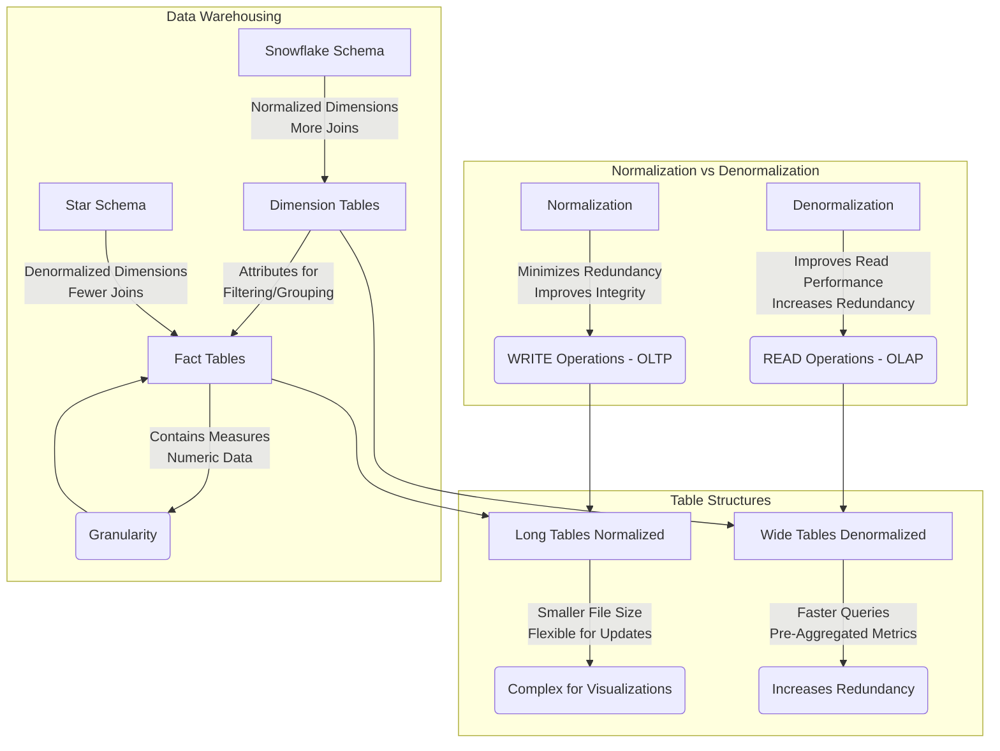

Long ago, I was covering [the analytical stack](https://jalcocert.github.io/JAlcocerT/self-taught-career-guide-for-data-analytics/#the-analytical-stack) and the most popular [concepts for a data analytics journey](https://jalcocert.github.io/JAlcocerT/data-basics-for-data-analytics/).

It is time to make a recap.

## Tools

### SQL

You will see it with different names. But **its just [SQL](https://jalcocert.github.io/JAlcocerT/sql-data-analytics)**

TrinoSQL, MySQL,...

Name it as you want it.

Just control the basics and know that there will be some *ad-ons*.



**What is Normalization?**  
Normalization is a process of organizing data in a database to **minimize redundancy and dependency**.  
- **Redundancy**: Avoid storing the same data in multiple places to prevent inconsistencies and wasted space.  
- **Dependency**: Ensure that one piece of data doesn't overly depend on another to maintain data integrity.  
- **Key Benefits**:  
  - Reduces redundancy by breaking data into smaller, related tables.  
  - Improves data integrity and accuracy.  
  - Makes database maintenance easier.  
  - Follows structured rules (normal forms).  
  - Ideal for **WRITE-heavy operations** (**OLTP**).  

---

**What is Denormalization?**  
Denormalization combines normalized tables to improve **read performance**, often used in **data warehousing** and reporting scenarios.  
- **Key Benefits**:  
  - Increases redundancy to reduce the number of joins.  
  - Improves read performance with faster query response times.  
  - Sacrifices write efficiency as updates may need replication across tables.  
  - Ideal for **READ-heavy operations** (**OLAP**).  

---

**When to Use Long Tables vs. Wide Tables?**  
- **Long Tables (Normalized)**:  
  - Smaller file size and reduced data duplication.  
  - Flexible for adding new data points (e.g., new categories).  
  - Complexity for some visualizations due to required joins.  
  - Best for **WRITE-heavy workflows**.  
- **Wide Tables (Denormalized)**:  
  - Simpler for visualizations with pre-aggregated metrics in columns.  
  - Faster performance for querying in BI tools.  
  - Increases redundancy and file size.  
  - Best for **READ-heavy workflows**.  

---

**What Are Dimension Tables and Fact Tables in Data Warehousing?**  
- **Dimension Tables**:  
  - Contain descriptive attributes (e.g., customers, products, time, geography).  
  - Provide context for the measures stored in fact tables.  
  - Used for filtering, grouping, and labeling data in queries.  
- **Fact Tables**:  
  - Store measurable, numeric data (e.g., revenue, quantity).  
  - Contain foreign keys linking to dimension tables.  
  - Define granularity (e.g., daily sales, monthly sales).  

**Star Schema vs. Snowflake Schema**:  
- **Star Schema**: Dimension tables are **denormalized**, simplifying queries and improving performance.  
- **Snowflake Schema**: Dimension tables are **normalized** into sub-dimensions, reducing redundancy but requiring more complex queries.  

---

**What Are Primary Keys, Foreign Keys, and Indexes?**  
- **Primary Key**: A column(s) that uniquely identifies each row, enforcing data integrity.  
- **Foreign Key**: A column(s) in one table referencing the primary key of another table, establishing relationships.  
- **Indexes**: Improve data retrieval speed by providing a fast path to locate rows, often created on frequently searched columns.  




You can now have conversations with a DB via LLMs as described here with LangChain




* [ChartDB](https://github.com/chartdb/chartdb) - Database diagrams editor that allows you to visualize and design your DB with a single query.
* [SQLiteViz](https://github.com/lana-k/sqliteviz)
* [SQliteBrowser](https://github.com/sqlitebrowser/sqlitebrowser)

* [DuckDB](https://github.com/duckdb/duckdb) ~ OLAP
  * [Huey](https://github.com/rpbouman/huey) an UI for DuckDB
  * GetHue - https://hub.docker.com/r/gethue/hue/tags - Hue is an open source SQL Assistant for Database & Data Warehouses. - https://github.com/cloudera/hue

* [ChartDB](https://github.com/chartdb/chartdb) - Database diagrams editor that allows you to visualize and design your DB with a single query.
* [SQLiteViz](https://github.com/lana-k/sqliteviz)
* [SQliteBrowser](https://github.com/sqlitebrowser/sqlitebrowser)



#### Snowflake


  


### PySpark

A wrapper in [Python](https://jalcocert.github.io/JAlcocerT/guide-python/) for Spark. [**PySpark**](https://jalcocert.github.io/JAlcocerT/guide-python-PySpark/).

Or Python for the distributed computing/storage era.

This is great for IoT Stuff, like we might have in [Telecom](https://jalcocert.github.io/JAlcocerT/telecom-concepts-101/).



**Why is PySpark called lazy?**  
PySpark is considered "lazy" because it does not execute any code until it absolutely has to.  
- When you call a transformation on a PySpark DataFrame or RDD, it does not compute the result until you call an action.  
- This allows Spark to **optimize the execution plan** by analyzing all transformations and determining the most efficient way to execute them.  
> It also delays execution until the result is actually needed, rather than executing each transformation as soon as it's specified.  

---

**What to use, Spark or Pandas? What's the difference?**  
The choice depends on the type and size of your data:  
- **Pandas**: Better for small datasets, with an intuitive and user-friendly interface.  
- **Spark**: Superior for large datasets due to better performance and scalability.  
Spark also offers features like **distributed processing, in-memory computing, streaming, and machine learning algorithms**.  

> Key difference: Pandas works with tabular data, while Spark supports both structured and unstructured data.  

---

**What is data redistributable?**  
Data redistribution is the **process of transferring data** between systems or locations to:  
- Improve performance  
- Enhance scalability  
- Reduce costs  

It’s often used for tasks like moving data between production and test systems or balancing loads across servers/clusters.

---

**What is a partition?**  
Partitions in Spark are **logical divisions of data** stored on a cluster node.  
- They split large datasets into smaller, manageable chunks for parallel processing.  
- Default: **Hash Partitioning**, using a hash function to assign data to partitions.  
- Alternative: **Range Partitioning**, which divides data into partitions based on a range of values.  

---

**What does GroupBy before partitioning do?**  
Grouping data before partitioning organizes it for more efficient processing.  
- Example: Summing values in a column can be optimized by grouping by that column first, ensuring each group’s sum is calculated only once.



#### DataBricks


I made a project with a **Raspberry Pi with Mongo&DataBricks** - [here](https://jalcocert.github.io/RPi/posts/rpi-iot-mongodatabricks/)


### Data Engineering Tools


If you are preparing a Data Engineering Interview, make sure to check [this](https://wetrustindata.com/ace_your_technical_interview_practical/) and [this post](https://wetrustindata.com/ace_your_technical_interview_theory/)


#### Airflow


  
  


#### DBT


  


#### ADF

 **Azure Data Factory (ADF)** is a **data engineering tool** within the Azure ecosystem, designed for **orchestrating workflows** and **managing ETL/ELT processes**.
 
 It shares similarities with **Airflow** for workflow orchestration and **dbt** for transformations, but with key differences:  

- **Compared to Airflow**:  ADF is a fully managed service that focuses on data pipelines, whereas Airflow is a general-purpose workflow orchestrator with more flexibility and customization but requires setup and maintenance.  

- **Compared to DBT**:  ADF focuses on end-to-end data movement and transformation (extract, load, transform), while dbt specializes in the "T" (transform) within the data warehouse. ADF can trigger dbt jobs as part of a pipeline.  


  
  


A escalable, low-code solution for **integrating and preparing data** for analytics.

### DSc Tools

There wont be any good data science work if the data modelling part is not done right.

* https://jalcocert.github.io/JAlcocerT/machine-learning-data-analytics/
* ROC - https://jalcocert.github.io/JAlcocerT/machine-learning-the-roc-curve-in-detail/
* https://jalcocert.github.io/JAlcocerT/AB-Testing-for-data-analytics/

### T-Shape Tools

**[Diagrams](https://jalcocert.github.io/JAlcocerT/how-to-use-mermaid-diagrams/)**. I should write it in capital letters.

> And you can do [diagrams with AI](https://jalcocert.github.io/JAlcocerT/ai-useful-yet-simple/#diagrams-with-ai)

---

## Conclusions

Tools are great.

But we need to keep improving the way we use them as well.

[Time Management](https://jalcocert.github.io/JAlcocerT/time-management-data-analytics/) is definitely one of the skills i find most valuable.

Together with [effective meetings](https://jalcocert.github.io/JAlcocerT/effective-meetings-data-analytics/), RACI Matrix & [Project Charter](https://github.com/Azure/Azure-TDSP-ProjectTemplate/blob/master/Docs/Project/Charter.md)

> Always keeping in mind [Pareto Principle](https://jalcocert.github.io/JAlcocerT/chaos-theory-and-the-double-pendulum-with-python/#the-pareto-principle-8020-and-chaos)

