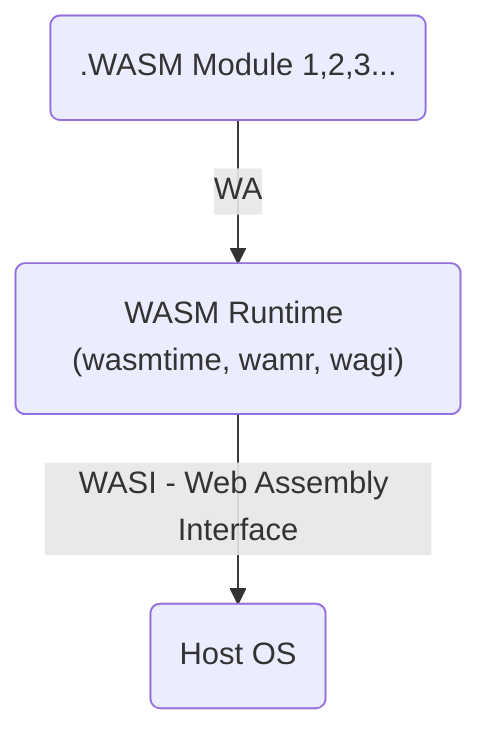

### What about Web Assembly?

With WASM we can run Apps coded in other language (other than web language like js) in our browsers.

WASM allow us to compiled code and run it in various environments (for example browsers) - Regardless of OS and even architecture ARM/X86/RISC-V...

With Docker we have (generally) bigger Images than WASM. Wasm follows both OCI and w3c standards.

* You can get more ideas at [awesome-WASM](https://github.com/mbasso/awesome-wasm)



> Thanks to [DevOps Toolkit](https://www.youtube.com/watch?v=uZ8xI26sno8)

{}

Install emcc: 

```sh
git clone https://github.com/emscripten-core/emsdk.git
cd emsdk
./emsdk install latest

./emsdk activate latest
source ./emsdk_env.sh
```

This compiles the C to ---> html, js, wasm (this is our WASM Module)
```sh
#emcc helloworld.c -o helloworld.html
emcc -o hello.html hello.c
```

See what was created:

```sh
python3 -m http.server 8080 #choose any port
```

To run wasm inside docker: you need to enable it as Beta feature at this time of writing

```sh
sudo apt-get install ./docker-desktop-4.27.2-amd64.deb
#settings -> features in development -> Enable WASM
```

Now instead of compiling the html or js app, we will just compile the .wasm module:

```sh
emcc -o hello.wasm hello.c

#ll hello.wasm
#file hello.wasm
```

Create your DockerfileWasm

```Dockerfile
FROM scratch

COPY helloworld.wasm /helloworld.wasm
ENTRYPOINT [ "/helloworld.wasm" ]
```

Build your WASM Image
```sh
docker buildx build --platform wasi/wasm -t fossengineer/helloworld-wasm -f DockerfileWasm .
#docker image ls | head
```

Run WASM with Docker:

```sh
docker run --platform wasi/wasm --runtime io.containerd.wasmedge.v1 fossengineer/helloworld-wasm
```

Run an already created [WASM (as standalone)](https://wasmedge.org/docs/start/getting-started/quick_start_docker/#run-a-standalone-wasm-app) with docker:

```sh
docker run --rm --runtime=io.containerd.wasmedge.v1 --platform=wasi/wasm secondstate/rust-example-hello:latest
```
{}