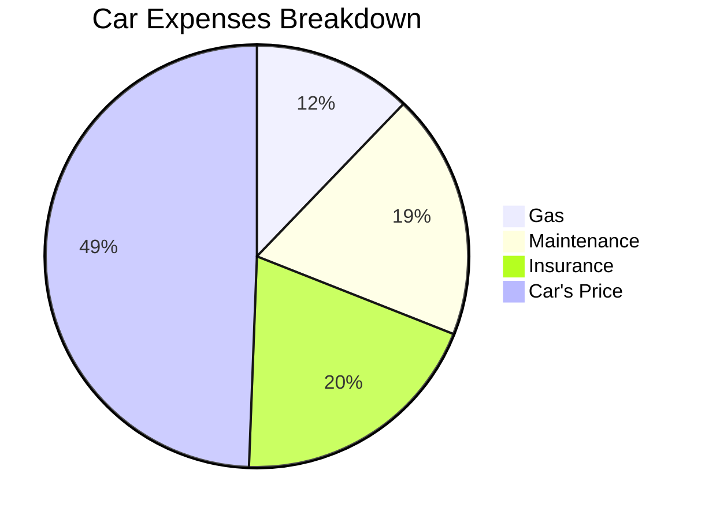

> NA / In Line 4 cilinders / 1.4L

## Car Costs Analytics

```mermaid
pie title Car Expenses Breakdown
         "Gas" : 537
         "Maintenance" : 831
         "Insurance" : 865
         "Car's Price" : 2180
```

### New Car vs Used Car

---

## How to buy a Car in Germany

steps...