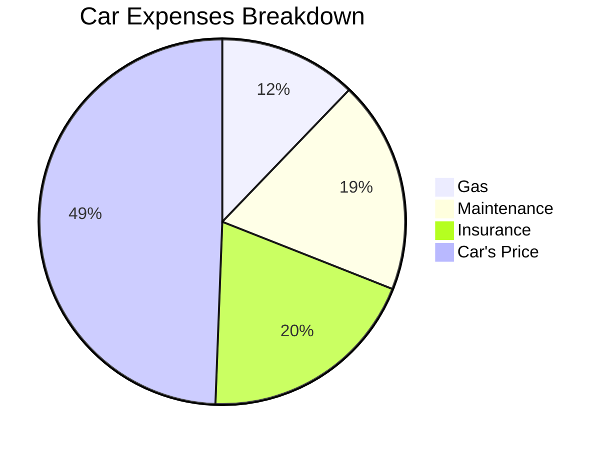

* 6% taxes + 3-5k notario + 0.5/1k/m2 repairs/setup

## Car Costs Analytics

```mermaid
pie title Car Expenses Breakdown
         "Gas" : 537
         "Maintenance" : 831
         "Insurance" : 865
         "Car's Price" : 2180
```

### New Car vs Used Car

---

## How to buy a Car in Germany

Steps...