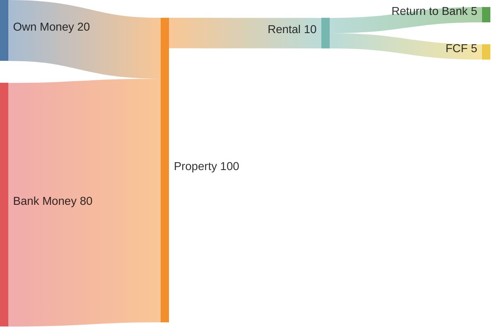
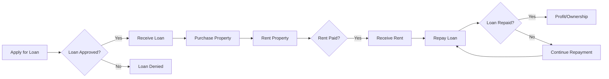
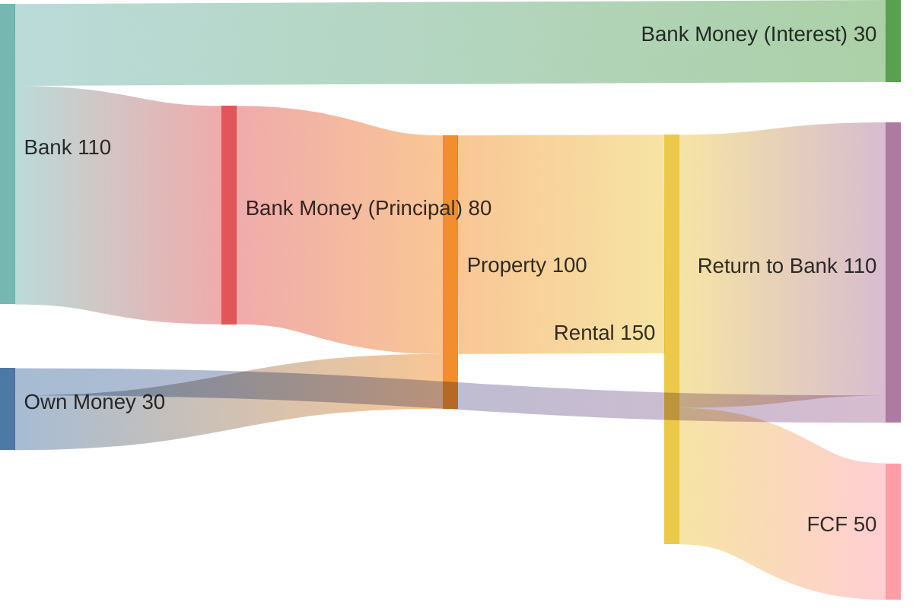

A friend asked me about some **add-on for his real estate project**.

He wanted to know how profitable can be real estate, compared with a dividend investing strategy.

After thinking about it for a while, we can see the following pattern:

1. Stock value can be seen as property value
2. Stock dividend yield as the renting price of the property
3. Most **significant difference**: we dont take loans for dividend investing, but people normally do for real estate

This arise the question: *what it is the **return** on the money that ive given **from my pocket**?*

Apparently, finance people call that the **ROIC** (without leverage on a loan, ROI=ROIC)

But its all about few mathematical ways to represent very logical financial concepts.


**No information exposed on this post can be taken as financial recommendations** 
These are just my notes on how Python can be used to create a calculator app.


There are out there cool calculators - https://tecalculo.com/en/mortgage-calculator

and this one for salaries - https://tecalculo.com/en/spanish-net-salary-calculator

## Understanding Loans

When we get a mortage, our **net total assets today are reduced**, as we have some interests to pay (liabilities):


### French Amortization 101


<!-- This $\sigma(z) = \frac{1}{1 + e^{-z}}$ is inline.

$$F(\omega) = \int_{-\infty}^{\infty} f(t) e^{-j\omega t} \, dt$$ -->


This is the French amortization formula: $M = P \times \frac{r(1 + r)^n}{(1 + r)^n - 1}$.




To calculate the French amortization schedule in Python, you need to use a formula that generates a fixed monthly payment throughout the loan term, and then gradually allocates it to both interest and principal.

The formula for calculating the **fixed monthly payment** is:

\[
M = P \times \frac{r(1 + r)^n}{(1 + r)^n - 1}
\]

Where:
- \(M\) is the monthly payment
- \(P\) is the **principal** amount
- \(r\) is the monthly **interest rate** (annual interest rate divided by 12)
- \(n\) is the number of payments (loan term in years multiplied by 12)

Each month, the interest portion of the payment decreases, and the principal portion increases.


**Understanding French Amortization**

French amortization is a loan repayment method where you make equal periodic payments (usually monthly) over a fixed term. Each payment consists of two parts:

1. **Interest payment:** Calculated on the outstanding loan balance.
2. **Principal repayment:** The portion of the payment that reduces the outstanding loan balance.

**Key Characteristics:**

* **Equal periodic payments:** The total amount you pay each period remains constant.
* **Declining interest:** As the loan balance decreases, the interest portion of your payment also decreases.
* **Increasing principal repayment:** Since the total payment is fixed, the portion allocated to principal repayment increases over time.

**Excel Parameters for French Amortization:**

To create an amortization schedule in Excel, you'll need the following parameters:

1. **Loan amount (principal):** The initial amount borrowed.
2. **Interest rate:** The annual interest rate on the loan.
3. **Loan term:** The total number of periods (usually months or years) over which the loan will be repaid.

> See [these functions](https://support.google.com/docs/answer/3093185?hl=en)

* **PMT(rate, nper, pv):** Calculates the periodic payment amount.
  * `rate`: The periodic interest rate (annual rate divided by the number of periods per year).
  * `nper`: The total number of payment periods.
  * `pv`: The present value of the loan (the amount borrowed).
  * It does not care about the period, as the key about this amortization is that all are the same!

* **IPMT(rate, per, nper, pv, [fv], [type]):** Calculates the interest portion of a specific payment.
  * `rate`, `nper`, `pv`: Same as in the PMT function.
  * `per`: The period for which you want to calculate the interest.
  * `fv`: The future value of the loan (usually 0).
  * `type`: Specifies when payments are due (0 for end of period, 1 for beginning of period).

* **PPMT(rate, per, nper, pv, [fv], [type]):** Calculates the principal portion of a specific payment.
  * Parameters are the same as for IPMT.



How does **french amortization** looks like **in practice**?

As mentioned, you will have constant payments (given constant interest rate) and **you start by paying mostly interests**.

 

There you have a **sample split evolution** of how much you are paying on interest and on principal return to the bank.

**In this case** it starts with ~85% of what you pay, being interests.

As per the french amortization behaviour, it goes down to 0% in the last payment.

This means, that if you return principal earlier and yo keep the monthly payments constant, you will finish the operation earlier, leading to a save on the last interests you had to pay.

As you can imagine, the more you advance payments, the more % of interest you are saving versus the amount given.


Also, you can save more interests than the advanced principal, if you return enough and early enough to avoid montly payments where the interes to principal was >50%  


And overall, it would be ~54,4%.

> Again, all with this sample figures.

The shape of the **curve depends on the parameters** you set:

* Interest Rate
* Years of Return

As you can imagine, the higher those 2 are, the higher interest you pay in value and also in relation with the principal you got the loan for.

That's right, it **can be 50%, but** the interest you pay back **does not have to be a 50/50 split** with the pincipal.

> I mean in total.

Because if you understood previous graph, you already now that **the split varies month per month**.

This below, is just **the full picture** (end to end) of the operation with the lender:


If you have high interest and high period onf years to return, you end into the red zone (more interest returned than principal) 


Ive also covered **mortage with python** as part of the [EDA of pystocks](https://gitlab.com/fossengineer1/py_stocks/-/tree/main/EDA_Mortage?ref_type=heads) and ofc created a streamlit app.


### Net assets

So in the beginning of *'the game'*, these are your cards:

* The lender owns the principal, but you can use it. At least until you keep paying as per payment schedule
* You have extra liabilities to pay now, the interests

Basically, your net assets at the moment of the operation are going from something, to less of that something.

And your **net assets** at the initial moment **could be** less than zero.


{}

Whether or not you include the *future* interest payments in your net asset value (NAV) calculation depends on your specific purpose and how you define "net asset value." 

There are different perspectives and conventions, so it's essential to be clear about your approach.

Breakdown of the common approaches and their implications:

**1. Excluding Future Interest (Most Common for NAV):**

* **Logic:**  Net asset value typically represents the current value of your assets *minus* your current liabilities.  Future interest payments are not yet liabilities. They are contingent on you continuing the loan and are calculated over time.  Therefore, they are not usually included in a standard NAV calculation.
* **Interpretation:** This approach gives you a snapshot of your current financial position: "If I were to sell the asset today and pay off my existing debts, this is what I would have left."
* **Your Code's Current Behavior:** Your existing code follows this approach. It calculates NAV as: `Asset Value - Principal Remaining`. This is generally the most common and accepted way to represent NAV for loan scenarios.

**2. Including Future Interest (More Complex and Less Common):**

* **Logic:** You *could* argue that future interest payments are a future liability and should be considered.  This would involve calculating the total future interest payments over the remaining loan term and discounting them back to their present value.  This is a more complex calculation.
* **Interpretation:** This approach attempts to estimate the total cost of the loan, including all future interest payments.  It's useful for understanding the overall financial impact of the loan but is less common for "net asset value" calculations. It is more in line with what a *total cost of ownership* calculation would consider.
* **Pros and Cons:**

    * **Pro:** More comprehensive view of the loan's cost.
    * **Con:** More complex to calculate, subjective discounting rate, might not be relevant to day-to-day NAV.

**3.  Important Considerations:**

* **Purpose of the Calculation:**  If you're calculating NAV for financial reporting or investment purposes, excluding future interest (approach 1) is the standard and generally accepted method.  If you want to understand the total cost of borrowing, including the interest (approach 2), then a more advanced method will give the *total cost of ownership*.

**Recommendation:**

For your Streamlit app, the current approach of *excluding* future interest from the NAV calculation is perfectly fine and is the most common and accepted way of calculating NAV.  It provides a **clear picture of your current equity in the asset**.


{}

This is an example, where in the NAV the interests to be paid are not included, but visible in a separated line:


How much into the deep could this operation make me be?

Well, that depends ofc of:

1. Interest rates
2. Years to Pay
3. LTV - How much you ask, versus how much you got initially

Makes sense right?

But why would someone make its net assets negative?

Lets see.

## Dividend Growth vs Rent Growth

Having a look to the growth of the dividends of a real estate stock, like `NYSE:O`.

```sh
#https://www.nasdaq.com/market-activity/stocks/o/dividend-history
=(importxml("https://www.nasdaq.com/market-activity/stocks/o/dividend-history";$AJ$28))
```

First div of 2025 has been 0.264 and first of 2024 was 0.2565, or a **~2.92% growth**.

But some years are better than others, right?

Lets see the **CAGR for dividend growth**

## Dividend Growth

The important fact here is, that we dont get a loan for dividend investing (do we?)

In these examples, for dividends:

1. Higher initial yield ~5,8% and lower Div Growth ~2,7%
2. Lower initial yield ~2,5% and Higher Div Growth ~7,2%

What's better?

As always, it depends, faster growing divs, also tend to imply higher stock value growth rate.

**Parameters to Track**
1. DCA or all in approach?
2. Value of the stock and yield on cost
3. **Estimations of**: value growth and dividend (it could also be decrease!)


## Rent Growth

In this case, we are receiving rental income (dividend income) also from the borrowed amount!

This can (or not) help to pay mortage interests.

So the costs from your pocket of this one are: Initial payment + Mortage Payment - Net Rent 

**Parameters to Track**
1. Interest Rate & Years
2. Value of the property and % the bank loaned
3. **Estimations of**: property value growth and rental growth (it could also be decrease!)

 



Im **assuming** that the property gets its dividends (rental) **reinvested** since its bought


What's going on here?

1. You are earning 'dividends' on the full property
2. But you *only* invested initially a part of the full property value

As you can imagine, **if real life** goes like this, you have earned a lot by using debt.

You were using the rental price to pay the mortage (and you got a surplus later on)

And also the property most likely increased the value on a 25 years horizon since you bought it.

Those 2 factors, while you 'just' put from your pocket the orange part of the graph.

This is an **example on how ROIC >> ROI**.

$$ Annualized\ ROI = \left( \frac{Ending\ Value}{Beginning\ Value} \right)^{\frac{1}{n}} - 1 $$


### Rent Price vs Property Price

There are some **interesting dynamics** between these 2, the [price2rent ratio](https://tradingeconomics.com/country-list/price-to-rent-ratio).

<!-- 
https://www.youtube.com/watch?v=6whiAFXk3IU 
-->



People trying to leverage loans, tend to look for **low property price to rent price ratios**.

Also using low interest rates and long horizons to pay back the debt, so that very quickly the rental prices exceed the mortage amount, which provides them with **Free Cash Flow very early** (using loaned money and exposed to other risks, ofc).

What? here you have a **Sankey** [diagram](https://mermaid.live/edit#pako:eNptj0FLxEAMhf_KkHMLKggyR5W9iaLgQXKJbbYt2yZlmmEpy_53MxUXEW_ve-8l8E7QaMsQoa5rlEZlP3QRJYSF5MDrJh16Pb7TmHmJwVJmlK2O8t2qP9moIMLzUcKTCq8IFcJL0pmTFbi5KvG99__P77b8l4HwymI0urzesgsWaTlJMA3loVu3fwq7h11xoYKJ00RD6wtPZQuC9TwxQnTZUvJjlLP3KJu-rdJALAMrSJq7HuKexsUpzy0ZPw7UJZou7kzyofrD5y_5vG7k)




And the workflow would be something like:



And during the full period of the operation, it **could be** as follows:



You might need to put some more money in the initial stages of the process, despite having later on FCF available.

What exactly? We need to make some **zoom in** on the previous **cash flow graph**:

 

The break even point is much later on, but see how initially you might have some configuration of parameters that will make you place **additional money from your pocket** (in addition to the one you give initially, together with the bank to get the property).

That will assist the initially lower rental price to pay back all the liabilities.


Depending on the situation, it could also be that:
* You have FCF from the very first month (higher rental than renturns of the loan)
* To never have FCF, in fact, if interest rises so much there **could be** a extreme situation that rent+your salary could not pay the monthly mortage payment. A lot of troubles on such horizon.


<!--
https://www.youtube.com/watch?v=x2629yXfwQw&pp=ygUYcGFzY3VhbCBhcmnDsW8gZGUgMCBhIDE1
 -->
<!-- https://youtu.be/x2629yXfwQw -->


This of course has **several risks** involved:

1. How consistent is the rental? Any damages? Occupancy ratio? Whats the rental growth if any?
2. What will be the interest rate evolution during the loan period? 

If interest rise enough, you can go from FCF to be unable to pay to the bank, hence potentially loosing the house (and more).

Those situations where people lost it all, happened not so long ago, in ~2008.

People buying it very high prices, then interest went up, making the property value go down (which was
their biggest asset) and when you cant pay and all you have lost 50% of its value...you stay with nothing.

To avoid such situations to happen again (in theory), there are rules that wont let you take too much credit in comparison with what you earn.

**For example**: Max credit monthly payment < 0.35*(Net Salary + Other Net Income)

> Imo, even with such formulas to see **how solvent you are**, there are risk, but...what do I know about finances!

**What if** you get it right?

Depending in the economical cycle, where you look... these ratios will be different.

But this ratio can be seen as the **PER** on stocks.

> If you got an initial yield of 10% (PER 10) on the total property value (more on your invested capital), it will be very hard to a stock to a [dividend stock to catch up](#how-many-years-to)!

But those values are just a snapshot and in real life all those values are floating: interest, rental price (yield), property value,...

## Real Estate Data

First thing I thought was **airbnb data**.

* https://insideairbnb.com/get-the-data/
  * https://insideairbnb.com/valencia/

But I also heard about **idealista:**

* https://www.idealista.com/data/
* https://www.idealista.com/labs/blog/?p=4207
  * https://www.idealista.com/labs/blog/?p=4207
  * https://paezha.github.io/idealista18/


* https://www.idealista.com/sala-de-prensa/informes-precio-vivienda/alquiler/
* https://www.idealista.com/sala-de-prensa/informes-precio-vivienda/venta/

* https://www.idealista.com/sala-de-prensa/informes-precio-vivienda/alquiler/andalucia/sevilla-provincia/dos-hermanas/
* https://www.idealista.com/sala-de-prensa/informes-precio-vivienda/venta/andalucia/sevilla-provincia/dos-hermanas/


> They even create a [R Package `paezha/idealista18`](https://github.com/paezha/idealista18) for this, with 2018 data!

**Credits to both platforms** for sharing such interesting data!

### Modelling Bull and Bear Markets

If you have a look at the data, its clear that the trend (at least the nominal value), tends to be upwards.

But there are moments where the price and rental price dont grow, or **even decrease**.

It also happens with interest rates!

I thought about **2 very simple ways** to model this:

1. Constant growth, whatever you decide, ignoring the big ups and downs, which should be more or less precise on the long run (if you get right the rates, ofc)
2. To make something cooler, how about:
* The general trend is upwards, but there will be sin functions applied as well
* The initial/final values will be the same
* Just in between, thanks to the periodic functions we will have ups and downs


How much up and down? As this is just a python data exercise, I will say
* +-20% every 7 years for buying price and +-10% for the rental one
* interest rates will be +-50%, but will peak 1 year before the peak on buy/rental


How does it looks like?

 

Which could be summarized as: 

> '**Change is the only constant**'
>> And in the meantime, nominal prices tend to go up

You can also expect for interest rates to fluctuate (if you did not chose a fixed interest loan).

Which could also be modelled similarly to these.

---

## Conclusions

See some crazy rates and you will be soon rich?

**Calm down :)**

Those are **nominal growth** values, dont forget to take into consideration [inflation](https://tradingeconomics.com/poland/inflation-cpi), which is part of those figures.

[More **about inflation**](https://jalcocert.github.io/JAlcocerT/r-dashboard-shinyapps/) and how it can hurt (or benefit?)



  
  


<!-- https://socialify.git.ci/jalcocert/jalcocert/image?description=1&name=1&theme=Auto
 -->


Retirements facts, the inflation shiny app [repo](https://github.com/JAlcocerT/R_is_Great/tree/main/ShinyApps)


Taking **inflation** into consideration is **very important**.

I was talking with a friend recently, who bought a flat in 2020 and she told me 'now it's wort more than 50% what she paid for'.

> Remember to have a broader look to these kind of conversations.

Providing that return is true, that's the **nominal one**.

And as you understand what it is [CAGR](#cagr), you know that x1.5 in 5 years is a ~8% compund yearly return.

Is it much? Is it low?

> Here is where most people disconnect, **please continue reasoning**

Well, on the same period, the inflation level has been ~8% a year.

So now you now that in real value, flats are as expensive or as cheap as they were in 2020 compared with the rest of prices.

Was it a good decision? a bad one?

As always, **depends how you look at it**.

My friend is not renting the apartment (hence doing the automatic reinvestment of the property yield).

But, she is not paying an increasingly high rent (which actually in this period grew more than the flat price).

In the end it all comes down to your personal situation.

Make sure to analyze yourself the figures and check with a professional, as there are several ways to get your ideas funded, and they will provide different conditions, as examples:


* https://www.caixabank.es/particular/hipotecas.html
* https://www.openbank.es/hipoteca-fija
* https://www.bancosantander.es/particulares/hipotecas/no-residentes
* https://www.ing.pl/indywidualni/kredyty-i-pozyczki/kredyt-hipoteczny/kalkulator-kredytowy

Its interesting to see options, like freezing your shares while you are returning the loan with a reduced interest rate.



**TIN (Tipo de Interés Nominal)**

*   Es el precio que pagas por el dinero que te prestan, expresado como un porcentaje.
*   No incluye ningún otro gasto adicional, como comisiones o seguros.
*   Es un indicador del interés básico del préstamo, pero no refleja el coste total real.

**TAE (Tasa Anual Equivalente)**

*   Es el coste total del préstamo, expresado como un porcentaje anual.
*   Incluye el TIN más todos los demás gastos asociados al préstamo, como comisiones, seguros y otros cargos.
*   Es un indicador más preciso del coste real del préstamo, ya que refleja todos los pagos que tendrás que hacer.

**En resumen:**

*   El TIN es solo el interés básico del préstamo.
*   La TAE es el interés básico **más todos los demás gastos**.

**Ejemplo:**

Imagina un préstamo de 1000€ con un TIN del 5% y una comisión de apertura del 1%.

*   El TIN sería del 5%.
*   La TAE sería superior al 5%, ya que incluiría la comisión de apertura.

**¿Por qué es importante conocer la TAE?**

La TAE te permite comparar diferentes préstamos de manera más precisa, ya que refleja el **coste total real** de cada uno. Al comparar préstamos, es fundamental fijarse en la TAE y no solo en el TIN, para elegir la opción más económica.

**Recursos adicionales:**

*   **Banco de España:** Dispone de un simulador para calcular la TAE de un préstamo: [https://app.bde.es/asb_www/es/tae.html](https://app.bde.es/asb_www/es/tae.html)
*   **Santander:** Explica la diferencia entre TIN y TAE: [https://www.bbva.com/es/salud-financiera/tin-que-es-diferencias-tae/](https://www.bbva.com/es/salud-financiera/tin-que-es-diferencias-tae/)
*   **BBVA:** Define qué es el TIN y sus diferencias con la TAE: [https://www.bbva.com/es/salud-financiera/tin-que-es-diferencias-tae/](https://www.bbva.com/es/salud-financiera/tin-que-es-diferencias-tae/)
*   **MicroBank:** Ofrece una visión más profunda del coste total de un producto financiero: [https://www.bbva.com/es/salud-financiera/tin-que-es-diferencias-tae/](https://www.bbva.com/es/salud-financiera/tin-que-es-diferencias-tae/).





### Real Estate Tech


  
  





```sh
#ssh -T git@gitlab.com
#git clone git@gitlab.com:fossengineer1/py_stocks.git
git clone https://gitlab.com/fossengineer1/py_stocks
```

```sh
cd EDA_Mortage

python3 -m venv amortization_venv
source amortization_venv/bin/activate
```

```sh
pip install -r requirements.txt
streamlit run mortage_v4.py #streamlit app
```

```sh
docker image build -t py_mortage:v4 .

docker run -d \
    --name py_mortage \
    -p 8509:8501 \
    -w /app \
    --restart always \
    py_mortage:v4 \
    streamlit run py_mortage_v4.py

#ifconfig eth0 | grep "inet " | awk '{ print $2 }' #if ETH Connected - SEE THE LOCAL IP
```




### Useful Concepts

#### CAGR

The **CAGR formula** is just: $CAGR = \left( \frac{V_f}{V_i} \right)^{\frac{1}{t}} - 1$.

Where:
- \( V_f \) is the final value
- \( V_i \) is the initial value
- \( t \) is the time period (usually in years)

In the example, as per [NASDAQ O Data](https://www.nasdaq.com/market-activity/stocks/o/dividend-history),
the first div of 2020 was 0.2325$, thats a x1.135, but in 5 years.

So...can we have some kind of constant growth rate over that period?

<!--
$$
CAGR = \left( \frac{0,264}0,2325} \right)^{\frac{1}{5}} - 1 = 2,57
$$
 -->

$$
CAGR = \left( \frac{0.264}{0.2325} \right)^{\frac{1}{5}} - 1 \approx 0.0257
$$

So its an equivalent of **2,57% of dividend growth**, each year, during the last 5 years.

This is a 'virtual' number, some years was more, some less, buts **thats the compound rate**

And it ofc depends in your stock investment, same as your potential property investment.

Other example with [MCD](https://www.nasdaq.com/market-activity/stocks/mcd/dividend-history):
<!-- 
$$
CAGR = \left( \frac{1.77}1.25} \right)^{\frac{1}{5}} - 1 = 7,2
$$
 -->

$$
CAGR = \left( \frac{1.77}{1.25} \right)^{\frac{1}{5}} - 1 \approx 0.072
$$

Or 'just' a ~7,2% every year.

And now, the logical question appears: *when will (if ever) catch up with the higher initial yield one?*

#### How many years to...

1. The `72 rule`: The "Rule of 72" is a simple way to estimate the number of **years it takes for an investment to double**, based on a fixed annual rate of return (interest or growth rate).



It’s called the "Rule of 72" because you divide 72 by the annual rate of return to get a rough estimate of how many years it will take for your investment to double in value.

The reason it works is because of logarithmic math, specifically from the compound interest formula. 

If you start with the compound interest formula for growth:

\[
A = P(1 + r)^t
\]

Where:
- \( A \) is the final amount
- \( P \) is the initial principal
- \( r \) is the annual growth rate (expressed as a decimal)
- \( t \) is the time in years

For doubling, we set \( A = 2P \) (because we want the value to double), so the equation becomes:

\[
2P = P(1 + r)^t
\]

Simplifying:

\[
2 = (1 + r)^t
\]

Taking the natural logarithm of both sides:

\[
\ln(2) = t \ln(1 + r)
\]

Solving for \( t \):

\[
t = \frac{\ln(2)}{\ln(1 + r)}
\]

Now, \(\ln(2) \approx 0.693\). For small rates of return (say, 5% or 10%), the natural logarithm of \( (1 + r) \) is roughly equal to \( r \). So for small \( r \), we can approximate:

\[
t \approx \frac{0.693}{r}
\]

And since \( \frac{0.693}{0.01} \approx 69.3 \), the approximation uses 72 for simplicity, as it’s close enough for most practical purposes.

**Why 72?**
72 is used because it’s a simple, convenient number that works well with typical interest rates.



It's an **easy-to-remember approximation** that gives results that are accurate enough for most financial calculations (especially with rates between 6% and 10%).

If you divide 72 by the interest rate in percentage terms, you get a good **estimate for the doubling time**.

For example:
- At a 6% return: \( 72 \div 6 = 12 \) years to double.
- At a 9% return: \( 72 \div 9 = 8 \) years to double.


2. With proper math:

The **exact formula** to find the time to **double** is $t = \frac{\ln(2)}{\ln(1 + r)}$.


3. The formula to find the **time to grow by a general factor** of XYZ is $t = \frac{\ln(XYZ)}{\ln(1 + r)}$.

With this one, we can see when MCD will *potentially* catch up with NYSE:O (while O also grows, but to a slower rate):

$$
t = \frac{\ln(5.8/2.5)}{\ln(1 + (7.2-2.7))}=17.8
$$

And with those rates, the yield of that stock you are buying today, catch up in ~17.8 years!


<!-- https://github.com/JAlcocerT/R_is_Great/tree/main/ShinyApps -->

### What if the interest change?

Maybe, you will get a fixed interest for the first 5Y, then, an **estimation** of what you will have to pay.

Im sure some of you have created an excel, which needs such interest value.

Probably with some condition on the month, to consider the initial or the changed interest.

But...what would that *virtual, future* interest be **potentially**?



Again - POTENTIALLY BE. 

Not for sure.

```py
# #cd EDA_Mortage
# #source mortage_venv/bin/activate #(linux)
# #python3 given_

import numpy_financial as npf

def calculate_interest_rate(loan_amount, monthly_payment, loan_term_months):
    """Calculates the annual interest rate.

    Args:
        loan_amount: The principal loan amount.
        monthly_payment: The monthly payment amount (should be negative).
        loan_term_months: The total number of months in the loan term.

    Returns:
        The annual interest rate (as a decimal), or None if an error occurs.
    """
    try:
        monthly_rate = npf.rate(loan_term_months, monthly_payment, loan_amount, fv=0) # fv=0 added
        annual_rate = monthly_rate * 12
        return annual_rate
    except Exception as e:
        print(f"Error calculating interest rate: {e}")
        return None

# Example usage:
loan_amount = 630000
monthly_payment = -3274
loan_term_months = 360

annual_interest_rate = calculate_interest_rate(loan_amount, monthly_payment, loan_term_months)

if annual_interest_rate is not None:
    percentage_rate = annual_interest_rate * 100
    print(f"The annual interest rate is approximately: {percentage_rate:.2f}%")

# Example of calculating monthly payment
def calculate_monthly_payment(loan_amount, annual_interest_rate, loan_term_months):
  try:
    monthly_rate = annual_interest_rate / 12
    monthly_payment = npf.pmt(monthly_rate, loan_term_months, loan_amount)
    return monthly_payment
  except Exception as e:
    print(f"Error calculating monthly payment: {e}")
    return None

loan_amount = 630000
annual_interest_rate = 0.08 # 8%
loan_term_months = 360

monthly_payment = calculate_monthly_payment(loan_amount, annual_interest_rate, loan_term_months)

if monthly_payment is not None:
  print(f"The monthly payment is approximately: {monthly_payment:.2f}")
```



 

---

## Thanks To

Thanks to airbnb and idealista for the historical data figures!

* Interesting Financial realted **Posts**:
  * https://estudinero.substack.com/
  * https://estudinero.substack.com/p/la-inflacion-el-impuesto-invisible
  * https://wtfhappenedin1971.com/

* Thanks to [HUGO Hextra Theme and katex](https://imfing.github.io/hextra/docs/guide/latex/)!

### Getting Better at RE

* https://notebooklm.google.com/notebook/




Sí, las preguntas que has enumerado son muy buenas y cubren una amplia gama de aspectos importantes a considerar al visitar un piso para comprar, especialmente si tu objetivo es la inversión.

Aquí te doy algunas observaciones y sugerencias adicionales:

**Sobre la finca y el entorno**

*   **¿Qué tal es la finca? ¿Quién vive allí? ¿Cómo son los vecinos?** Esta pregunta es crucial para entender la calidad de vida en el edificio y si hay problemas de convivencia.
*   **¿Qué ambiente hay de noche? ¿Cómo es la calle?** Esto te dará una idea de si la zona es segura y tranquila.
*   **¿Cuánto se paga de comunidad?** Este es un gasto fijo importante que debes tener en cuenta.
*   **¿Y cuánto de IBI?** Este impuesto anual también es un gasto importante.
*   **¿Hay algún problema en el edificio (bajantes, cubierta, fachada)? ¿Alguna derrama o previsión?** Conocer el estado del edificio y si hay derramas previstas te evitará sorpresas desagradables.
*   **¿Se puede poner ascensor en el edificio?** Si el edificio no tiene ascensor, esta pregunta es relevante si lo consideras importante para futuros inquilinos o para ti mismo.

**Sobre el piso**

*   **En este piso, ¿qué harías tú antes de alquilarlo (pintar, amueblar, reformar)?** Esta pregunta te dará una idea de la opinión del agente sobre el estado del piso y qué mejoras podrían ser necesarias.
*   **¿Qué opinas de la distribución de esta vivienda?** La distribución es un factor importante a considerar.
*   **¿Por cuánto está publicado el piso? (Importante recalcar: en cuánto está PUBLICADO).** Esta pregunta te dará una idea del precio de salida del piso.
*   **¿Por cuánto crees tú que se vende hoy mismo? Es decir, ¿qué oferta mínima aceptaría el vendedor?** Esta pregunta te ayudará a saber cuánto margen de negociación hay.
*   **En tu experiencia, ¿qué hace que un piso se alquile bien y otro mal?** Esta pregunta te dará información valiosa sobre el mercado de alquiler local.

**Sobre el agente inmobiliario**

*   **¿También te dedicas al alquiler de pisos?** Esta pregunta es importante si planeas alquilar el piso y quieres saber si el agente puede ayudarte con ello.
*   **Si compro el piso y te lo dejo para que me lo alquiles, ¿por cuánto se alquila, sin problemas, es decir, siendo conservador (precio atractivo)?** Esta pregunta te dará una idea de la rentabilidad potencial del piso.
*   **¿Llevas mucho tiempo en el mundo inmobiliario?** La experiencia del agente es un factor importante a considerar.
*   **En el momento de mayor crisis, ¿por cuánto se alquilaba este piso?** Conocer el peor escenario te ayudará a evaluar el riesgo de la inversión.
*   **¿Vienes mucho a este piso? ¿Lo visita mucha gente?** Esto te dará una idea del interés que genera el piso.
*   **¿Qué perfil de inquilino entraría aquí?** Esta pregunta te ayudará a entender el tipo de inquilinos que podrías atraer.
*   **¿Cuál es tu comisión?** Es importante conocer la comisión del agente para tenerla en cuenta en tus cálculos.

**Sobre el propietario**

*   **¿Quién es el propietario? ¿Por qué vende?** Conocer la motivación del vendedor puede darte información valiosa para la negociación.

**Tus objetivos**

*   **Yo busco pisos para invertir: compra y alquiler. Busco una rentabilidad del X%. ¿Tienes más pisos para enseñarme? En cualquier caso, guarda mi teléfono por si te sale alguno.** Es importante comunicar claramente tus objetivos al agente y establecer una relación para futuras oportunidades.

**Sugerencias adicionales**

*   **Pregunta sobre los servicios de la zona:** supermercados, transporte público, escuelas, etc.
*   **Pregunta sobre el estado de las instalaciones:** fontanería, electricidad, calefacción, etc.
*   **Pide ver los planos del piso:** Esto te ayudará a entender mejor la distribución y las posibilidades de reforma.
*   **Visita el piso a diferentes horas del día:** Esto te permitirá evaluar el ruido y la luminosidad.
*   **No te sientas presionado a tomar una decisión:** Tómate tu tiempo para evaluar todas las opciones.


**More**

1. Na którą stone wychodzą okna? 
2. Kiedy był ostatni remont?
3. Jaki jest stan instalacji? (Wodno-kanalizacyjna, gazowa, elektryczna)
4. Jakie są miesięczne opłaty? Co wchodzi w czynsz?
5. Czy jest wspólnota mieszkaniowa? Jakie są spory w wspólnocie? I jakie są plany wspólnoty?
6. Dlaczego sprzedajecie mieszkanie?
7. Jak długo w nim mieszkacie?
8. Jak długo jest ono na rynku? 
9. Jeszcze raz, co zostaje w mieszkaniu po sprzedaży?
10. Kiedy lokal może zostać wydany do mojego użytku?
11. Opłata za media ile wynosi? 
12. Jak wygląda sytuacja z internetem? Czy jest światłowód?
13. Księga wieczysta czy istnieje i czy mogę prosić o numer?
14. Najbliższy paczkomat? Sprawdzić

* https://hipoteczny.expert/

