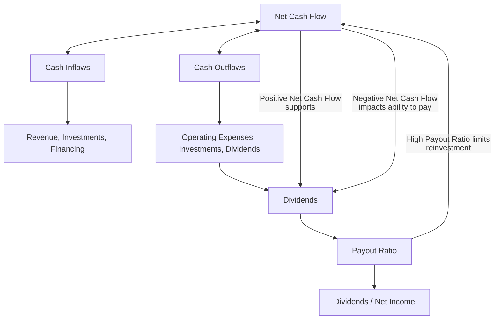
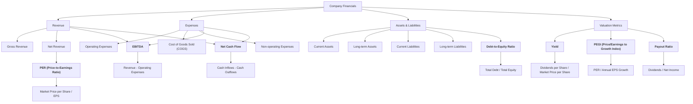

**TradFi** - Traditional Finances as I saw recently on redit.



After [Weather Planning](https://jalcocert.github.io/JAlcocerT/trip-planner-with-weather/), there is also the **financial aspects of travelling**




The project [**source code**](https://gitlab.com/fossengineer1/py_stocks) - PyStocks 💻 


If all of this sounds familiar.

It is because it is actually familiar.


Sometime ago I was doing similar Project in **R Shiny** - [R/Stocks](https://jalcocert.github.io/JAlcocerT/R-Stocks/) 💻 and documenting it [here](https://jalcocert.github.io/JAlcocerT/R-Stocks/) 




* [PriceR](https://jalcocert.github.io/JAlcocerT/r-priceR-package-guide/#what-is-pricer-about)
* [QuantDL](https://jalcocert.github.io/JAlcocerT/r-quandl-package-guide/#how-to-use-the-quandl-package) - [API](https://docs.data.nasdaq.com/v1.0/docs/getting-started) required
* [QuantMod](https://jalcocert.github.io/JAlcocerT/r-Quantmod-package-guide/#how-to-use-the-quantmod-package)
* [yfR - yahoo finance in R](https://jalcocert.github.io/JAlcocerT/r-yfR-package-guide/#the-yfr-package)



## PyStocks

For user authentication: clear/supabase/logto...

* https://clerk.com/docs
* https://github.com/clerk/clerk-sdk-python/blob/main/README.md
* https://www.reddit.com/r/Supabase/comments/1dvabn6/what_is_the_best_solution_to_use_supabase_auth/
* https://www.reddit.com/r/nextjs/comments/1bvda9r/officially_hate_supabase_auth/?rdt=40537
* https://www.reddit.com/r/Supabase/comments/xaxecr/authentication_with_supabase_is_easy_almost/



  
    
    
      
      
      
        
        
      
    
    
      
      
    
  


```
content
├── _index.md // <- /
├── docs
│   ├── _index.md // <- /docs/
│   ├── getting-started.md // <- /docs/getting-started/
│   └── guide
│       ├── _index.md // <- /docs/guide/
│       └── organize-files.md // <- /docs/guide/organize-files/
└── blog
    ├── _index.md // <- /blog/
    └── post-1.md // <- /blog/post-1/
```

### AI Features for PyStocks

Chat with the pulled financial data thanks to [LangChain](https://jalcocert.github.io/JAlcocerT/how-to-use-rags-with-python/#exploring-langchain).



I was exploring on [this post](https://jalcocert.github.io/JAlcocerT/how-to-chat-with-your-data/#chat-with-a-db-with-langchain) and [related repo](https://github.com/JAlcocerT/Data-Chat/tree/main/LangChain), how to use **LangChain as RAG with OpenAI API so that given a DB**, we can use Natural Language to interact with it.



Chat with a DB applied for finance - <https://github.com/JAlcocerT/Data-Chat/tree/main/LangChain/PyStocksDB>


## Conclusions

This goes one step further than the previous [project RStocks](https://jalcocert.github.io/JAlcocerT/R-Stocks/).

And definitely much more than [FlexDashboards](https://jalcocert.github.io/JAlcocerT/guide-r-flexdashboards-in-github-pages/) in R.

### Stock Questions - Answered

* Stocks overperforming SP500 in xyz period / last xyz months
* YoC when I stopped investing at a certain point of time (Dave van Knapp made a all in approach, but it can serve to see what happens after a DCA strategy)

In the meantime, I got to understand [how **French amortization** works](https://jalcocert.github.io/JAlcocerT/python-real-estate-mortage-calculator/) (typical for mortage payments).


I also got time to compare **different SP500 ETFS performance**:

* `LON:SPY5` ([SPY5.L](https://finance.yahoo.com/quote/SPY5.L/)) dist usd 0.09% IE00B6YX5C33 [Link to JustETF profile](https://www.justetf.com/es/etf-profile.html?isin=IE00B6YX5C33#dividendos)
* `LON:VUAA`, acc usd 0.07% IE00BFMXXD54 [Link to JustETF profile](https://www.justetf.com/es/etf-profile.html?isin=IE00BFMXXD54#bolsa-de-valores)
* In GSheets, you have the SP500 index under the name `INDEXSP:.INX`


### Interesting Pkgs I got to learn

* Data Load Tool - https://github.com/dlt-hub/dlt

> the open-source Python library for data loading

* How to inspect a SQL DB with AI (without knowing much about it...)
  * https://github.com/alex-wolf-ps/dbchatpro/tree/main
  * https://www.youtube.com/watch?v=REw3y_Jv3Ig&t=0s
  * Paid alternative - https://www.outerbase.com/

---

## FAQ



Revenue:

- **Gross Revenue**: Total income from sales.
- **Net Revenue**: Gross revenue minus returns and discounts.

Expenses:

- **Operating Expenses**: Costs incurred during normal business operations.
- **COGS (Cost of Goods Sold)**: Direct costs of producing goods.
- **Non-operating Expenses**: Costs not related to core operations (e.g., interest payments).

Assets & Liabilities:

- **Current Assets**: Cash or items convertible to cash within a year.
- **Long-term Assets**: Assets held for more than a year (e.g., machinery).
- **Current Liabilities**: Debts due within a year.
- **Long-term Liabilities**: Debts payable over a longer period.

Valuation Metrics:

- **EBITDA (Earnings Before Interest, Taxes, Depreciation, and Amortization)**: Indicates operational profitability.
- **Net Cash Flow**: Difference between cash inflows and outflows.
- **Debt-to-Equity Ratio**: Indicates the level of financial leverage.

- **Yield**: Dividend return relative to share price; calculated as `Dividends per Share / Market Price per Share`.
- **Payout Ratio**: Proportion of earnings paid out as dividends; calculated as `Dividends / Net Income`.

- **PER (Price-to-Earnings Ratio)**: A valuation measure comparing share price to earnings per share.
- **PEGI (Price/Earnings to Growth Index)**: PER adjusted for expected earnings growth; calculated as `PER / Annual EPS Growth`.
- **PEGY (Price/Earnings to Growth and Yield)**: PER adjusted for both expected earnings growth and dividend yield; calculated as `PER / (Annual EPS Growth + Dividend Yield)`.








**Net Income** is not the same as **Net Cash Flow**.

They are related but measure different aspects of a company's financial health:

**Net Income**:
- Represents a company's **profit or loss** during a specific period.
- Found on the **income statement**.
- Includes both **cash and non-cash items**:
  - Revenues minus all expenses, including non-cash expenses like depreciation and amortization.
  - Accrual-based (recognizes income/expenses when they are earned/incurred, not when cash changes hands).

**Net Cash Flow**:
- Measures the **actual cash movement** into and out of the company during a specific period.
- Found on the **cash flow statement**.
- Focuses on **cash inflows and outflows**, ignoring non-cash items!.
- Composed of three parts:
  1. **Operating Cash Flow**: Cash generated from core business activities.
  2. **Investing Cash Flow**: Cash used in or generated by investments in assets.
  3. **Financing Cash Flow**: Cash used for or received from debt, equity, and dividends.


| **Aspect**          | **Net Income**                                   | **Net Cash Flow**                                |
|----------------------|--------------------------------------------------|-------------------------------------------------|
| **Definition**       | Profit or loss from operations (accounting basis)| Actual cash generated or used (cash basis)      |
| **Non-cash items**   | Includes non-cash items (e.g., depreciation)     | Excludes non-cash items, tracks cash only       |
| **Timing**           | Accrual-based accounting                        | Tracks when cash is received or spent           |
| **Use**              | Measures profitability                          | Measures liquidity and financial flexibility    |

---

**Relationship**:
Net Income is often the starting point for calculating **Operating Cash Flow**.

Adjustments are made to add back non-cash expenses and account for changes in working capital. 


Both metrics are important:
- **Net Income**: Indicates profitability.
- **Net Cash Flow**: Shows the company's ability to generate cash and stay solvent. 



A diagram is worth more than xyz words, right?



### How to use AI LLM Agents to get posts with this program as Source


I was testing Automatic [Posts creation with AIssistant here](https://jalcocert.github.io/JAlcocerT/scrap-and-chat-with-the-web/#summarize-github-readmes) and with this related repo.


### Interesting Software for Finances


`Financial Freedom` is an open-source financial management tool.

* https://github.com/serversideup/financial-freedom
* It serves as an alternative to commercial apps like Mint and YNAB.



This project addresses privacy concerns by allowing users to **self-host their financial data**.

Users can run the application on any device with Docker support, enhancing control over their financial information.

Key features:

- **Supports any bank**: Integrate with various banking institutions.
- **Private synchronization**: Ensures data privacy during synchronization.
- **Self-hosting**: Run on AWS, Digital Ocean, or even Raspberry Pi.
- **Budgeting tools**: Helps in managing cash flow and setting budgets.
- **Global currency support**: Manages finances in multiple currencies.

The project is actively being developed, inviting community involvement through contributions.

> `Financial Freedom` empowers users to manage finances privately and securely.




Similar projects include **Firefly III** and **GnuCash**.

### Interesting Financial Stories

* https://dividendsandincome.com/author/dave-van-knapp/
* https://dividendsandincome.com/2024/04/08/how-my-dividend-growth-portfolios-income-keeps-expanding/

* https://engineeredportfolio.com/

* https://wtfhappenedin1971.com/
* https://whycryptocurrencies.com/



You can create an [ebook like this](https://www.amazon.es/stores/Marco-Garrido/author/B0BW46JD83?ref=ap_rdr&isDramIntegrated=true&shoppingPortalEnabled=true) one with AI. How? with an [**AIssistant**](https://jalcocert.github.io/JAlcocerT/ai-useful-yet-simple/#kindle-notes-to-ai) 


* https://www.visualcapitalist.com/top-sp-500-stocks-return/

### Interesting Financial Data WebSites

* https://www.multpl.com/
  * it has Sp500 PE Ratios, 10y treausry rates...

* https://www.wallstreetmojo.com/trailing-pe-vs-forward-pe/

* https://uk.finance.yahoo.com/quote/RIO.L/
  * https://finance.yahoo.com/sectors/basic-materials/
  * https://es.finance.yahoo.com/quote/0P00012PP6.F

* https://www.digrin.com/stocks/detail/IDUS.L/

- https://stockanalysis.com/ esta es buena para stocks, etfs no
  - https://stockanalysis.com/stocks/rio/dividend/

- https://www.justetf.com/uk/ esta es un screener de ETFs muy bueno, además están todas las variantes monetarias de cada ETF

- https://www.digrin.com/stocks/detail/IDUS.L/

- https://divvydiary.com/en/?via=elisa&gad_source=1&gclid=Cj0KCQiA0fu5BhDQARIsAMXUBOIN8XXGkoEZZbfhufMr55Y2kSIuAGXDP4Lb1LYgLlRMnezpTUl2tkAaAp2kEALw_wcB esta la encontré el otro día, ofrece datos históricos de stocks y algún ETF (FUSD te lo da pero IDUS no), pero mola que me da el ISIN rápido, entonces veo rápidamente en qué país cotiza
- https://tools.mhinvest.com/mhichart una web app que tiene una idea muy parecida a la que pensamos en su momento, pero no considera seguir metiendo gasolina, parte de una cantidad inicial y listo.

* https://www.marketbeat.com/
  * https://www.marketbeat.com/stocks/NYSE/CVX/dividend/

* https://www.nasdaq.com/market-activity/stocks/mcd/price-earnings-peg-ratios

* 

* https://www.cazadividendos.com/

* https://www.gurufocus.com/
* https://www.morningstar.com/stocks/xnys/pg/quote

* https://ycharts.com/companies/
  * https://ycharts.com/companies/INTC/profit_margin
  
* https://www.investopedia.com/terms/p/pegyratio.asp

#### Financial Data Apps

* https://stockevents.app/en
* https://stockle.app/


### GSheets Tricks

You can have a simple, yet useful **Google Sheets with Stocks** info:

```sh
=GoogleFinance(S35;"eps") #S35 can reference some ticket, like NYSE:KO
=GoogleFinance(S35;"pe")
=GoogleFinance("INDEXSP:.INX") #sp500

=INDICE(GoogleFinance("INDEXSP:.INX"; "price"; HOY()-365);2;2) #get the price 365 ago

=SPARKLINE(GoogleFinance("CURRENCY:EURCHF"; "price"; HOY()-J$1; HOY()))
=SPARKLINE(GoogleFinance("CURRENCY:"&"USD" & DERECHA(A6;3); "price"; HOY()-J$1; HOY()))
```

And if you need, you can also **import info from other website** sources:


You will need to go to inspect -> find the proper div with the info -> copy **full xpath**
These xpath might change if there is a redesign in the website!



1. Import from ycharts:

```sh
=VALOR(IZQUIERDA(importxml(CONCATENAR("https://ycharts.com/companies/";REGEXEXTRACT(S33;"[^:]*$");"/profit_margin");$AJ$28);3))/100
#S33 is a ticker, NASDAQ:PEP, for example and AJ28 the XPATH
# =importxml("https://ycharts.com/companies/"& REGEXEXTRACT("NASDAQ:PEP";"\:(.*)") & "/profit_margin";$AI$28)
```

> with xpath being `/html/body/div[3]/div[2]/section[1]/div/div/div[1]/div[2]/ul/li[1]/span[2]`

2. Import from numbeo:

```sh
=IZQUIERDA(importxml(C36;C37);6)/IZQUIERDA(importxml(C36;C38);6)
```

With:

* C36 `https://www.numbeo.com/cost-of-living/compare_cities.jsp?country1=Poland&country2=spain&city1=Warsaw&city2=barcelona&tracking=getDispatchComparison`
* C37 `/html/body/div[2]/aside[1]/div[2]/div/span[1]/text()`
* C38 `/html/body/div[2]/aside[1]/div[2]/div/span[3]`

3. Even from Etherscan for crypto related info!

```sh
=importxml("https://etherscan.io/address/some_address";"/html/body/main/section[3]/div[2]/div[1]/div/div/div[2]/div/div")
```


You can learn more about **Scrapping** as covered on this [blog post](https://jalcocert.github.io/JAlcocerT/scrap-and-chat-with-the-web/) and the [Scrapping-Tools repo](https://github.com/JAlcocerT/Scrap_Tools) 💻


---

## Thanks to

* Hugo Hextra [Latex/Katex Syntax](https://imfing.github.io/hextra/docs/guide/latex/)