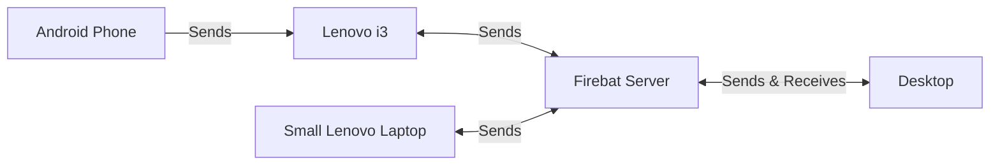

## The FIREBAT AK2 PLUS MiniPC

* Intel N100 (4 cores) 8GB@2600mhz 256GB

> Great accesibility to add an additional 2.5" drive!


---

| Device | CPU Benchmark (4 threads) | CPU Benchmark (8 threads) |
| :-- | :-- | :-- |
| Raspberry Pi 4 2GB | ~1.7k events | - |
| Raspberry Pi 4 4GB | ~28k events | - |
| Orange Pi 5 | ~38k events | ~50k events |
| FireBat | ~35k events | - |

> 22k events if power saving mode is enabled in Linux

```sh
sysbench --test=cpu --cpu-max-prime=20000 --num-threads=4 run
7z b -mmt4
```

| Device | Tot (4 threads) |
| :-- | :-- |
| Raspberry Pi 4 2GB | 1622/6311 | 
| Raspberry Pi 4 4GB | 1442/5508 | 
| Raspberry Pi 5 8GB | 2.7k/10k | 
| Orange Pi 5 |  2.7k/11.8k | 
| FireBat | ~1.8k/6.4 events |


```sh
git clone https://github.com/JAlcocerT/Py_Trip_Planner/
cd Py_Trip_Planner

sudo bash -c 'time docker pull python:3.8' #let's remove the time of downloading the Python base image from the equation, it was ~1 min!

#docker build -t pytripplanner .
sudo bash -c 'time docker build --no-cache -t pytripplanner .'
#sudo bash -c 'time podman build -t pytripplanner .'
```

```sh
apt install cargo
#cargo install --git https://github.com/astral-sh/rye rye
time cargo install --git https://github.com/astral-sh/rye rye
```


| Device                     | Raspberry Pi 4 2GB | Raspberry Pi 4 4GB | Orange Pi 5 | BMAX B4 N95 | Firebat AK2 Plus N100 | AMD 5600G |
|----------------------------|--------------------|--------------------|-------------|-------------|------------------------|-----------|
| Docker Build      | ~3672s             | ~3480s             | ~1777s      | ~45s        | ~47s                   | -         |


| Platform | opi    | rpi4b 2gb | RPi 5 8GB | Hetzner  | FireBat |
|----------|--------|-----------|-----------|----------|----------|
| Build Astral| 5min 20s | 10min 7s  | 4min 30s  | 6min 15s | 2min 45s|


## Using a MiniPC as Home Cloud


This is the architecture:



* Router: `http://192.168.1.1/`
* FireBat: `http://192.168.1.103/`




* Start with the [SelfHosting script](https://jalcocert.github.io/Linux/docs/linux__cloud/selfhosting/)

```sh
sudo apt update
sudo apt install openssh-server
#systemctl status ssh

sudo ufw allow ssh

#ssh username@<local_minipc_server_ip>
```

> With `ifconfig` you can see the local ip address and also the tailscale one






There was some installation on other PC and we had to restart it...

```sh
sudo docker stop portainer
sudo docker rm portainer

sudo docker run -d -p 8000:8000 -p 9000:9000 --name=portainer --restart=always \
-v /var/run/docker.sock:/var/run/docker.sock -v portainer_data:/data \
-e "ADMIN_PASSWORD=<your_hashed_password>" portainer/portainer-ce
```






```sh
sudo nano /etc/resolv.conf
```

Add the following if you want to use quad9 DNS:
`nameserver 9.9.9.9`
`nameserver 149.112.112.112`

```sh
nslookup google.com #see that now you are using quad9 DNS
```







Connect with ssh as:

```sh
ssh casa@192.168.1.103
df -h #its /dev/sda1 and its already mounted at /media/casa/Datos_Copia_2
```







```yml
---
version: "2.1"
services:
  syncthing:
    image: syncthing/syncthing #ghcr.io/linuxserver/syncthing
    container_name: syncthing
    environment:
      - PUID=1000
      - PGID=1000
      - TZ=Europe/Rome
    volumes:
      - /home/Docker/Syncthing/config:/config
      - /media/casa/Datos_Copia_2/Datos_Servidor:/data1 #same as filebrowser
    ports:
      - 8384:8384 
      - 22000:22000/tcp
      - 22000:22000/udp
      - 21027:21027/udp
    restart: unless-stopped

  filebrowser:
    image: filebrowser/filebrowser
    container_name: filebrowser
    ports:
      - 8080:80
    volumes:
      - /home/Docker/FileBrowser/data:/config
      - /media/casa/Datos_Copia_2/Datos_Servidor:/srv #same as Syncthing!
    restart: unless-stopped    
```

> Access the FileBrowser admin UI with: `admin/admin` at port `8384`

You could also try [NextCloud](https://jalcocert.github.io/RPi/posts/selfhosting-nextcloud/):

```yml
version: '2'

volumes:
  nextcloud:
  db:

services:
  db:
    image: linuxserver/mariadb
    restart: always
    container_name: nextclouddb
    volumes:
      - /home/Docker/nextcloud/db:/var/lib/mysql
    environment:
      - MYSQL_INITDB_SKIP_TZINFO=1
      - MYSQL_ROOT_PASSWORD=rootpass
      - MYSQL_PASSWORD=ncpass
      - MYSQL_DATABASE=nextcloud
      - MYSQL_USER=nextcloud
#    networks: ["nginx_nginx_network"] #optional 

  app:
    image: nextcloud #latest
    container_name: nextcloud
    restart: always
    ports:
      - 8080:80
    links:
      - db
    volumes:
      - /home/Docker/nextcloud/html:/var/www/html
    environment:
      - MYSQL_PASSWORD=ncpass
      - MYSQL_DATABASE=nextcloud
      - MYSQL_USER=nextcloud
      - MYSQL_HOST=db
      - NEXTCLOUD_TRUSTED_DOMAINS=http://0.0.0.0:8080 #https://nextcloud.yourduckdnsubdomain.duckdns.org/
#    networks: ["nginx_nginx_network"] #optional 
 
# networks: #optional
#   nginx_nginx_network: #optional
#     external: true #optional
```




## FireBat MiniPC as Media Server

```sh
flatpak install flathub com.brave.Browser
```


## FAQ

Enter the FireBat MiniPC bios by pressing ESC.

* Find more interesting apps at:
    * https://flathub.org/
    * https://snapcraft.io/

### How to Benchmark the Firebat MiniPC


{}

Check CPU cores and test with sysbench:

```sh
#cat /proc/cpuinfo
#uname -a
#nproc
sudo apt install sysbench -y
sysbench --test=cpu --cpu-max-prime=20000 --num-threads=4 run
```

* Benchmark with 7zip:

```sh
sudo apt-get install p7zip-full
7z b -mmt
7z b -mmt4
7z b
```

and with 7zr:

```sh
7zr b -mmt1
```

* [Trip Planner](https://github.com/JAlcocerT/Py_Trip_Planner/) docker build time:

```sh
git clone https://github.com/JAlcocerT/Py_Trip_Planner/
cd Py_Trip_Planner

sudo bash -c 'time docker pull python:3.8' #let's remove the time of downloading the Python base image from the equation, it was ~1 min!

#docker build -t pytripplanner .
sudo bash -c 'time docker build --no-cache -t pytripplanner .'
#sudo bash -c 'time podman build -t pytripplanner .'
```

* Astral-sh Python Dependency Manager:

```sh
apt install cargo
#cargo install --git https://github.com/astral-sh/rye rye
time cargo install --git https://github.com/astral-sh/rye rye
```

* Just simple stress test:

```sh
sudo apt-get install stress-ng

sudo stress --cpu  8 --timeout 120
```


{}


{}

```sh
ip addr show
hostname -I

#sudo apt-get install net-tools
#ifconfig

ping -c 4 192.168.3.1 #gateway
ping 9.9.9.9 #quad9
```

```sh
sudo apt-get install dnsutils -y #dns resolution
nslookup github.com 
dig google.com
```

```sh
sudo apt-get install speedtest-cli
speedtest-cli #speedtest-cli --simple
```


```sh
curl -sS https://ipinfo.io/json #the command to use
curl -sS http://ip-api.com/json/ #provides info about country, ISP, ...
curl -6 ifconfig.me #ipv6 info 
```

{}


### How to use a RPi - Without a RPi

A raspberry Pi inside a container - https://github.com/ptrsr/pi-ci

> A Raspberry **Pi emulator in a Docker image** that lets developers easily prepare and flash RPi configurations.


### How I Created the diagrams

* Using **MermaidJS** with mermaid.live as per [this guide](https://fossengineer.com/free-diagram-tools/#mermaidjs)