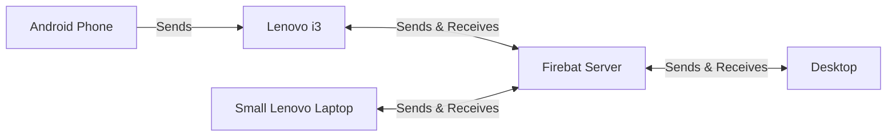

## The FIREBAT AK2 PLUS MiniPC

A very interesting **Small Factor PC** with

* Intel N100 (4 cores) 8GB@2600mhz 256GB (M.2 2280 SSD)
* Dimensions: 13x13x4,5cm = 0,76L
* Cost: ~75$


* It comes with W11 pre-installed, but I could not resist to [try Linux with it](https://jalcocert.github.io/Linux/docs/linux__cloud/selfhosting/).

* I went with [Zorin OS](https://zorin.com/os/), a [Linux focused on simplicity](#faq).



<!-- 

 -->

<!--  -->


<!--  -->


> Value for money, Great accesibility to add an additional 2.5" drive!

* As you can see, the **RAM is not soldered**:


* For convenience, you can mount the additional 2,5 drive outside and then mount it again with 3 screws:


> All screws are provided as well

How does Firebat MiniPC compares to [other MiniPC's and SBC's?](https://jalcocert.github.io/JAlcocerT/cloud-vs-single-board-computers/) Lets find out:

### Firebat AK2 Benchmarks

Running some **synthetic tests on the Firebat MiniPC** and comparing it with SBC's and more:

| Device             | Sysbench (4 threads) | Tot (4 threads) 7 zip  |
|--------------------|---------------------------|------------------------|
| Raspberry Pi 4 2GB | ~1.7k events              | 1622/6311              |
| Raspberry Pi 4 4GB | ~28k events               | 1442/5508              |
| Orange Pi 5        | ~38k events               | 2.7k/11.8k             |
| Raspberry Pi 5 8GB | -                         | 2.7k/10k               |
| AMD 2200g          | ~26.9k events             | ~4.2k/15.34k events    |
| **FireBat AK2 Plus**  | ~35k events               | ~1.8k/6.4k events      |


```sh
sysbench --test=cpu --cpu-max-prime=20000 --num-threads=4 run #4 cores
7z b -mmt4
```

> Firebat results go down to 22k events if power saving mode is enabled in Linux

And now the real benchmarks:

```sh
git clone https://github.com/JAlcocerT/Py_Trip_Planner/
cd Py_Trip_Planner

sudo bash -c 'time docker pull python:3.8' #let's remove the time of downloading the Python base image from the equation, it was ~1 min!

#docker build -t pytripplanner .
sudo bash -c 'time docker build --no-cache -t pytripplanner .'
#sudo bash -c 'time podman build -t pytripplanner .'
```

```sh
apt install cargo
#cargo install --git https://github.com/astral-sh/rye rye
time cargo install --git https://github.com/astral-sh/rye rye
```


| Device                     | Docker Build       | Build Astral       |
|----------------------------|--------------------|--------------------|
| Raspberry Pi 4 2GB          | ~3672s             | 10min 7s           |
| Raspberry Pi 4 4GB          | ~3480s             | -                  |
| Orange Pi 5                 | ~1777s             | 5min 20s           |
| BMAX B4 N95                 | ~45s               | -                  |
| **Firebat AK2 Plus N100**   | ~47s               | 2min 45s           |
| AMD 5600G                   | -                  | -                  |
| RPi 5 8GB                   | -                  | 4min 30s           |
| Hetzner                     | -                  | 6min 15s           |


  
  


> N95 was 5% faster when building [the Docker Image](https://github.com/JAlcocerT/Py_Trip_Planner/)

Energy costs ~0.25Eur/Kwh

### Firebat - Computing vs Volume
| Device                     | CPU                                                | Volume | Docker Build (s*L) | CPU Benchmark (4 threads) (events/L) | Tot (4 threads) 7 zip (events/L) |
|----------------------------|----------------------------------------------------|--------|---------------------|----------------------------------------|-----------------------------------|
| Raspberry Pi 4 2GB         | Broadcom BCM2711 Quad-core (4x ARM Cortex-A72)   | 0.082L | 301.824             | 20732                                  | 19878                             |
| Raspberry Pi 4 4GB         | Broadcom BCM2711 Quad-core (4x ARM Cortex-A72)   | 0.082L | 285.36              | 34146                                  | 17627                             |
| BMAX B4 (16 GB)           | Intel N95 (x4 cores Alder-Lake)                   | 0.608L | **27.36**           | 44225                                  | 6890.79                           |
| **FireBat AK2 Plus (8 GB)**| Intel N100 (x4 cores Alder-Lake)                  | 0.76L  | **35.72**           | 46052.63                               | 2368.42                           |
| Orange Pi 5 (8 GB)        | Rockchip RK3588S (4x Cortex-A76 + 4x Cortex-A55) | 0.112L | 198.624             | **339285.71**                          | **24107.14**                      |


* For docker builds, it seems that the ARM architecture lags compared to x86 (lower is better)
  * During docker builds with ARM i observe that only 1 core is used
* The OrangePi5 is a great rival when having into consideration the performance and volume

### FireBat - Computing vs Price
| Device                     | CPU                                                | Price | Docker Build (s/Price) | CPU Benchmark (4 threads) (events/Price) | Tot (4 threads) 7 zip (events/Price) |
|----------------------------|----------------------------------------------------|-------|-------------------------|--------------------------------------------|---------------------------------------|
| Raspberry Pi 4 2GB         | Broadcom BCM2711 Quad-core (4x ARM Cortex-A72)   | $35   | 128520                  | 48.57                                      | 46.34                                 |
| Raspberry Pi 4 4GB         | Broadcom BCM2711 Quad-core (4x ARM Cortex-A72)   | $55   | 191400                  | 509.09                                     | 26.49                                 |
| BMAX B4 (16 GB)           | Intel N95 (x4 cores Alder-Lake)                   | $150  | 6750                    | 179.33                                     | 28.00                                 |
| **FireBat AK2 Plus (8 GB)**| Intel N100 (x4 cores Alder-Lake)                  | $75   | **3525**                | 466.67                                     | 24.00                                 |
| Orange Pi 5 (8 GB)        | Rockchip RK3588S (4x Cortex-A76 + 4x Cortex-A55) | $150  | 266550                  | 253.33                                     | 18.00                                 |


* The firebat is the most competitive of my list in building docker images versus price (lower is better)
* The Pi's 4 win the Sysbench and 7zip versus price due to their lower price ratio



 









## Cool Stuff with FireBat MiniPC

Some ideas that you can do with your MiniPC:

1. Setup a Home Cloud
2. Use the MiniPC as media server
3. Use it to plan your trips as per weather conditions


  
  



    

 
I have collected many container's configurations [here](https://github.com/JAlcocerT/Docker)


### Using a MiniPC as Home Cloud

This is the architecture:



* Devices:
  * Router: `http://192.168.1.1/`
  * FireBat: `http://192.168.1.103/`
  * Lenovo i3: `http://192.168.1.105/`  
* Ports that will be used:
  * 9000 for portainer
  * 8080 for filebrowser - Lenovo i3 will have the filebrowser UI at `http://192.168.1.105:8080` 
  * 8384 for syncthing UI - FireBat syncthing is configured at `http://192.168.1.103:8384`
* To setup HTTPs you can [use DuckDNS with NGINX](#faq)




* Start with the [SelfHosting script](https://jalcocert.github.io/Linux/docs/linux__cloud/selfhosting/)

```sh
sudo apt update
sudo apt install openssh-server
#systemctl status ssh

sudo ufw allow ssh

#ssh username@<local_minipc_server_ip>
```

> With `ifconfig` you can see the local ip address and also the tailscale one



You can use Tailscale DNS to make it easier to remember who is who:



TBD





There was some installation on other PC and we had to restart it...

```sh
sudo docker stop portainer
sudo docker rm portainer

sudo docker run -d -p 8000:8000 -p 9000:9000 --name=portainer --restart=always \
-v /var/run/docker.sock:/var/run/docker.sock -v portainer_data:/data \
-e "ADMIN_PASSWORD=<your_hashed_password>" portainer/portainer-ce
```






```sh
sudo nano /etc/resolv.conf
```

Add the following if you want to use quad9 DNS:
`nameserver 9.9.9.9`
`nameserver 149.112.112.112`

```sh
nslookup google.com #see that now you are using quad9 DNS
```







Connect with ssh as:

```sh
ssh casa@192.168.1.103 #ssh casa@100.... with tailscale VPN IP
df -h #its /dev/sda1 and its already mounted at /media/casa/Datos_Copia_2
```

> Yes, the **user is casa**








```sh
mount | grep sda1 #show nothing at first
sudo file -s /dev/sda1
sudo blkid /dev/sda1
sudo nano /etc/fstab
UUID=your-disk-u-u-id  /media/casa/Datos_copia_2  ext4  defaults  0  2
sudo mount -a
df -h #ahora todo ok

#sudo du -ah / | sort -rh | head -n 30
```






The external HD needs to be mounted at: `/media/casa/Datos_copia_2` so that all Media services will work




```yml
---
version: "2.1"
services:
  syncthing:
    image: syncthing/syncthing #ghcr.io/linuxserver/syncthing
    container_name: syncthing
    environment:
      - PUID=1000
      - PGID=1000
      - TZ=Europe/Rome
    volumes:
      - /home/Docker/Syncthing/config:/config
      - /media/casa/Datos_Copia_2/Datos_Servidor:/data1 #same as filebrowser
    ports:
      - 8384:8384 
      - 22000:22000/tcp
      - 22000:22000/udp
      - 21027:21027/udp
    restart: unless-stopped

  filebrowser:
    image: filebrowser/filebrowser
    container_name: filebrowser
    ports:
      - 8080:80
    volumes:
      - /home/Docker/FileBrowser/data:/config
      - /media/casa/Datos_Copia_2/Datos_Servidor:/srv #same as Syncthing!
    restart: unless-stopped    
```

> Access the FileBrowser admin UI with: `admin/admin` at port `8384`






You could also try [NextCloud](https://jalcocert.github.io/RPi/posts/selfhosting-nextcloud/):


```yml
version: '2'

volumes:
  nextcloud:
  db:

services:
  db:
    image: linuxserver/mariadb #:10.11.8
    restart: always
    container_name: nextclouddb #https://hub.docker.com/_/mariadb/tags 
    volumes:
      - /home/Docker/nextcloud/db:/var/lib/mysql
    environment:
      - MYSQL_INITDB_SKIP_TZINFO=1
      - MYSQL_ROOT_PASSWORD=rootpass
      - MYSQL_PASSWORD=ncpass
      - MYSQL_DATABASE=nextcloud
      - MYSQL_USER=nextcloud
#    networks: ["nginx_nginx_network"] #optional 

  app:
    image: nextcloud #latest #right now im using :30.0.0
    container_name: nextcloud #https://hub.docker.com/_/nextcloud/
    restart: always
    ports:
      - 8080:80
    links:
      - db
    volumes:
      - /home/Docker/nextcloud/html:/var/www/html #This is where the data will be stored (under ./data/yourselecteduser/files)
    environment:
      - MYSQL_PASSWORD=ncpass
      - MYSQL_DATABASE=nextcloud
      - MYSQL_USER=nextcloud
      - MYSQL_HOST=db
      - NEXTCLOUD_TRUSTED_DOMAINS=http://0.0.0.0:8080 #https://nc.yoursubdom.duckdns.org/ #http://opi5.abcdef.ts.net:8080
#    networks: ["nginx_nginx_network"] #optional 
 
# networks: #optional
#   nginx_nginx_network: #optional
#     external: true #optional
```

> Make sure to add your private ip of the server to be able to **access it in trusted domains**: `http://0.0.0.0:8080`

* You can use [NC as WebDav like so](https://jalcocert.github.io/RPi/posts/selfhosting-nextcloud/#faq): `dav://opi5.abcdef..ts.net:8080/remote.php/dav/files/YOUR_USERNAME/`

And if you havent done it in a while, make some clean up:

```sh
docker builder prune
#docker system prune -a
docker volume prune
docker image prune -a
```




  Remember the 3-2-1 backup rule





The 3-2-1 backup rule is a widely recommended strategy for ensuring data safety and recovery in case of failure or disaster. The rule suggests that you should:

* Keep 3 copies of your data: This includes the original data and two backups. Having multiple copies helps prevent total data loss.

* Store the backups on 2 different media types: This could include external hard drives, cloud storage, or USB drives. Using different media types reduces the risk of failure, as different storage media are less likely to fail at the same time.

* Keep 1 copy offsite: One of the backup copies should be stored offsite (e.g., cloud storage or a remote location) to protect against local disasters such as fires, floods, or theft.

By following the 3-2-1 rule, you significantly **minimize the risk of losing important data**.



### FireBat MiniPC as Media Server

You can also install regular apps in your server, like **Brave browser**:

```sh
flatpak install flathub com.brave.Browser
```

Explore more apps:


  


  
  



### FireBat Trip Planner




```yml
version: "2"
services:
  tripplanner:
    image: ghcr.io/jalcocert/py_trip_planner #https://github.com/JAlcocerT/Py_Trip_Planner/pkgs/container/py_trip_planner
    container_name: tripplanner
    ports:
      - 8051:8050
    restart: unless-stopped
```



---

## FAQ

* Enter the FireBat AK2 Plus MiniPC **bios by pressing ESC**.




* Whonix / Tails  - Debian based
* Qubes - Fedora based











* Get Steam running

And then...






```sh
cmd
diskpart
list disk
select disk 1
clean
create partition primary
exit
```




Sure! Here's the list of applications and tools formatted in Markdown, organized into categories for better readability:

### Virtualization and Remote Access
- Tailscale
- Oracle Virtual Box
- VMware (Freemium)

### VPN Services
- Proton VPN
- NordVPN
- Windscribe (Freemium)

### Development and Programming Tools
- RStudio
- Matlab
- Octave
- Python Anaconda Spider
- OpenScad (FOSS)
- Ansys (Mechanics)
- MicroCap (Electronics)
- CODESYS (Control Systems)

### Password Managers and Security Tools
- Bitwarden (Password Manager)
- Authy (2FA)
- ESET Online Scanner
- AdwCleaner

### Cloud Storage and Synchronization
- Mega
- Syncthing
- OneDrive
- Google Drive
- ODrive
- Nextcloud

### Media and Entertainment
- Spotify
- VLC
- Daemons Tools

### Browsers and Online Tools
- Mozilla
- Brave
- Chrome

### Office and Productivity Software
- WPS Office
- Adobe Acrobat (PDF Reader)
- Microsoft OneNote
- Thunderbird
- Photoscape
- Nero
- FrameFun (Photo Frames)

### Android Emulation
- Nox (Android Emulator)

### System Monitoring and Optimization
- OpenHardwareMonitor (System Temperature)
- HWMonitor (System Temperature)
- CPU-Z (System Information)
- MSI Afterburner
- GPU-Z
- Ryzen Master

### Communication and Collaboration
- Discord
- Raindrop

### Graphic Design and 3D Modeling
- FreeCAD
- Ultimaker Cura
- Inkscape
- Photoshop

### Miscellaneous
- Proton (Miscellaneous)
- F.lux (Night Light Reduction)
- qBittorrent
- Dreamweaver (Web Pages)
- HP Deskjet 1510 Series (Printer Software)

This Markdown list organizes the applications into categories, making it easier to understand the purpose and usage context of each app or tool.

**FOR LINUX**

### Virtualization Software
- Oracle VM Virtual Box
- VMware
- vboxlinuxadditions.run

### Development Tools
- RStudio
- Visual Studio Code
- Octave
- Python

### Package Managers and Software Centers
- Synaptic Package Manager
- Flatpak
- [Snapcraft](https://snapcraft.io/)

### Gaming Platforms
- Steam
- Epic Games

### Linux Distributions and Desktop Enhancements
- Ubuntu - Gnome Extensions
  - AppFolders Management Extension
  - OpenWeather
  - Gnome Tweaks Tool
- Lubuntu
  - Cairo Dock
- Elementary
  - Minimize Button
  - Show Desktop
  - Gnome Tweaks

### System Tools and Utilities
- Authy
- Psensor
- GtkStressTesting





 











* Point your DNS to your server:


> I like to have the internal IP and other for the device tailscale VPN IP

* You will need to add the: container_name and the container port


<!-- 
{{ $image := resources.Get "blog_img/mini_pc/nginx_posteio.png" }}
{{ $resized := $image.Resize "600x" }}


{{ $image := resources.Get "/blog_img/mini_pc/nginx_posteio.png" }}
{{ $resized := $image.Resize "600x" }}


{{ $image := resources.Get "/blog_img/mini_pc/nginx_posteio.png" }}
{{ $resized := $image.Resize "600x" }}
<div style="text-align: center;">
  
  <p style="font-size: 14px; color: gray;">FireBat NextCloud - Example Caption</p>
</div>
 -->

* In the SSL tab, you will need to Add a **DNS Challenge**, for Cloudflare would be:


* With Cloudflare, you will need their [API Token from here](https://dash.cloudflare.com/profile/api-tokens)
  * Go to **Edit zone DNS**. Zone Resources -> Include all zones (or a specific domain only) and create it. Add it as `dns_cloudflare_api_token=`
* In NginX UI, you will add the: **container name and port** of the services







* Used ones:
  * Dell 3050 SFF Core i5 6th gen 16GB ~120$
  * Lenovo M75q Tiny Ryzen 3200GE 8GB ~115$
  * Lenovo M720q Tiny i3 8 gen. 8GB ~100$
  * Make sure that these have HDMI

* New mini pcs: similar to the BMAX B4
  *  Intel N95 16+512G GK3 PLUS ~115$



### How to Benchmark the Firebat MiniPC

{}

Check CPU cores and test with sysbench:

```sh
#cat /proc/cpuinfo
#uname -a
#nproc
sudo apt install sysbench -y
sysbench --test=cpu --cpu-max-prime=20000 --num-threads=4 run
```

* Benchmark with 7zip:

```sh
sudo apt-get install p7zip-full
7z b -mmt
7z b -mmt4
7z b
```

and with 7zr:

```sh
7zr b -mmt1
```

* [Trip Planner](https://github.com/JAlcocerT/Py_Trip_Planner/) docker build time:

```sh
git clone https://github.com/JAlcocerT/Py_Trip_Planner/
cd Py_Trip_Planner

sudo bash -c 'time docker pull python:3.8' #let's remove the time of downloading the Python base image from the equation, it was ~1 min!

#docker build -t pytripplanner .
sudo bash -c 'time docker build --no-cache -t pytripplanner .'
#sudo bash -c 'time podman build -t pytripplanner .'
```

* Astral-sh Python Dependency Manager:

```sh
apt install cargo
#cargo install --git https://github.com/astral-sh/rye rye
time cargo install --git https://github.com/astral-sh/rye rye
```

* Just simple stress test:

```sh
sudo apt-get install stress-ng

sudo stress --cpu  8 --timeout 120
```


{}


{}

* https://www.speedtest.pl/

```sh
ip addr show
hostname -I

#sudo apt-get install net-tools
#ifconfig

ping -c 4 192.168.3.1 #gateway
ping 9.9.9.9 #quad9
```

```sh
sudo apt-get install dnsutils -y #dns resolution
nslookup github.com 
dig google.com
```

```sh
sudo apt-get install speedtest-cli
speedtest-cli #speedtest-cli --simple
```


```sh
curl -sS https://ipinfo.io/json #the command to use
curl -sS http://ip-api.com/json/ #provides info about country, ISP, ...
curl -6 ifconfig.me #ipv6 info 
```

{}


### How to use a RPi - Without a RPi

[A raspberry Pi](https://jalcocert.github.io/RPi/) inside a container - https://github.com/ptrsr/pi-ci

> A Raspberry **Pi emulator in a Docker image** that lets developers easily prepare and flash RPi configurations.


### How I Created the diagrams

* Using **MermaidJS** with mermaid.live as per [this guide](https://fossengineer.com/free-diagram-tools/#mermaidjs)

## ThrowBack on Hardware

its crazy to see how much PCs have evolved in few decades.




Here's the provided information summarized and organized in a Markdown format, categorizing the details about each PC and laptop by its specifications and timeline:

### Desktop PCs

#### 1. Primer PC Casa
- **Date Purchased**: November 2001
- **CPU**: Intel Celeron Coppermine 958 MHz
- **Motherboard**: Gigabyte GA-6VXC7-4x(p), Chipset VIA VT82C694x Apollo Pro B3A
- **RAM**: 256 MB PC133 SDRAM
- **Graphics**: Nvidia Riva TNT2 M64 32 MB
- **Monitor**: Nec Multisync 75F 17"
- **Sound Card**: Creative SB PCI 128 (Ensoniq ES5880)
- **Optical Drive**: LG CD-ROM CRD-8521B (52x)
* Updated in 2007 to: AMD Athlon64 3600x2, 2x1GB GSkill DDR2 667mhz, later ATI hd5670 1gb

#### 2. Mi Primer PC
- **Date Purchased**: November 2005
- **Update**: October 2009
- **CPU**: AMD Athlon 64 3200+ (90nm)
- **Motherboard**: Gigabyte GA-K8NF9
- **RAM**: 2x512 MB Kingston DDR 400 MHz
- **Graphics**: Nvidia 6200 TurboCache
- **Monitor**: LG1717s, 
* Updated to: AMD Athlon 5600x2,gigabyte ga-ma770-ds3, 2x1GB DDR2 667mhz, NVIDIA Gigabyte 8600GT, gigabyte ga-ma770-ds3

#### 3. Mi Segundo PC
- **Date Purchased**: May 2014
- **CPU**: AMD Athlon 'x4' 750k (28nm)
- **Motherboard**: gigabyte F2A55M-DS2   FM2 A55 micro atx
- **RAM**: 2x1 GB Kingston DDR2 667 MHz
- **Graphics**: Nvidia Gigabyte 8600 GT
- **Storage**: Adata SU800 512 GB - OS

### Laptops

#### 1. Portatil Corporation
- **CPU**: Intel i5 8250U x4 (14nm)
- **RAM**: 4 GB 1600 MHz DDR3
- **Storage**: 512 GB HDD
- **Graphics**: Intel HD Graphics 5500

#### 2. Lenovo Ideapad 100
- **Date Purchased**: July 2016
- **CPU**: Intel i3 5005U x2 (14 nm)
- **RAM**: 4 GB 1600 MHz DDR3
- **Storage**: HD 250 GB

#### 3. Dell Inspiron Mini 1018
- **Date Purchased**: 2012
- **CPU**: Intel Atom N455 1.67 GHz
- **RAM**: 1 GB
- **Storage**: 320 GB HDD

#### 4. Portatil Peq Lenovo Blanco
- **Date Purchased**: September 2019
- **CPU**: Celeron N3060
- **RAM**: 4 GB
- **Storage**: 500 GB HDD

#### Portatil US - HP ProBook 5420s
- **CPU**: Intel Celeron x2 P4500 (32nm)
- **RAM**: 3 GB DDR3

#### Custom Build in Aerocool CS105BK Case
- **Case**: CAJA SEMITORRE AEROCOOL CS105BK
  - **Dimensions**: 187 x 361 x 355 mm
  - **GPU Clearance**: Up to 320 mm
  - **CPU Cooler Clearance**: Up to 148 mm
- **Motherboard**: Gigabyte B450M S2H (BIOS F41)
- **CPU**: Ryzen 2200G
- **RAM**: 8 GB x 1 3200 MHz G Skill, later 2x8GB
- **Storage**:
  - **SSD**: Crucial MX500 500 GB
  - **HDD**: WD 1 TB - Data
- **Power Supply**: Thermaltake Litepower II Black 450W
- **Monitor**: LG Flatron W1946


