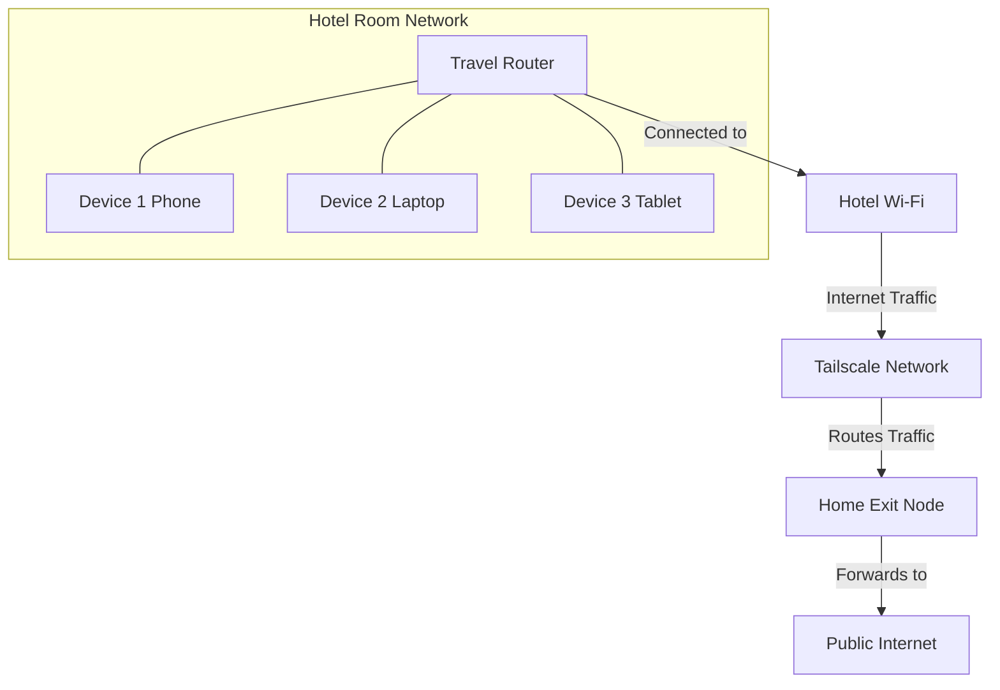
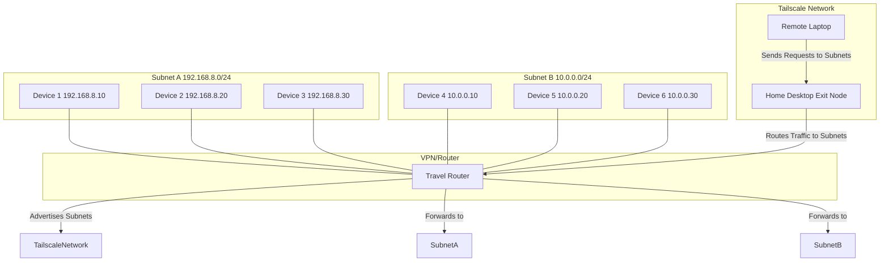
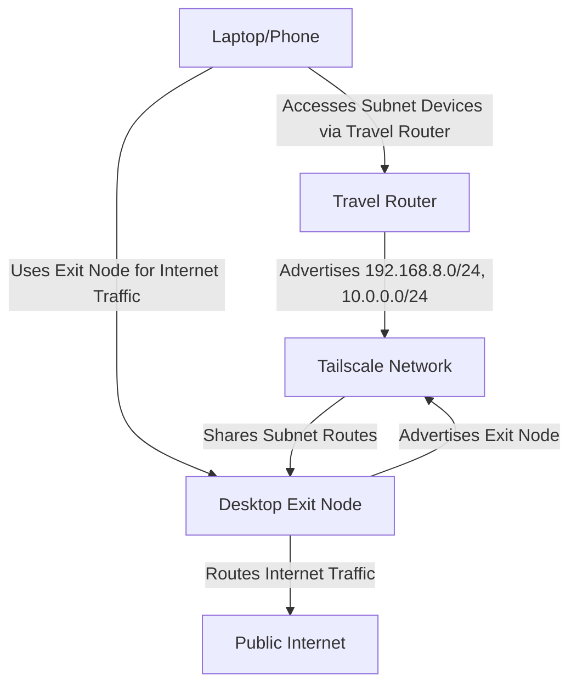

The last years I have been interested to improve my **networking knowledge**.

Being involved in [**Telecom** projects](https://jalcocert.github.io/JAlcocerT/telecom-concepts-101/) was a great motivation.

But its something that goes even behind in time with the [Raspberry Pi](https://jalcocert.github.io/RPi/posts/rpi-wifi-ethernet-bridge/).

Which I tried to summarize [here with 3rd party VPNs](https://jalcocert.github.io/JAlcocerT/raspberry-pi-networking/) and recently using [VPS+Wifi2Ethernet](https://jalcocert.github.io/JAlcocerT/how-to-use-wg-easy-with-a-vps/)

And VPNs are helpful of course to make sure that relevant content will be available, like [Linux OS images that we want to keep](https://jalcocert.github.io/JAlcocerT/how-to-torrent-with-a-raspberry/).

But they are also useful to connect to our home server when we are far from home.

And if for some reason you are no table to do **port forwarding** with your home router...

...you will have come across already with **TailScale**

> This is why I got a GL-MT3000 Router, to combine it with [Tailscale VPN](#tailscale-and-gl-mt3000)

## GL-MT3000 Travel Router


The [GL.iNet](https://www.gl-inet.com/community/) GL-MT3000 has been a very interestin surprise this year.

* It uses OpenWRT as firmware and has AX3000 Wifi6 capabilities
* Currently using it with 



An alternative to the [Raspberry Pi as Travel Router](https://jalcocert.github.io/RPi/posts/rpi-wifi-ethernet-bridge/)


## Setup GL-MT3000 Router

1. Connect to the router
* Via WIFI signal, you will see the default SSID as `GL-MT3000`
* Or connect simply via Ethernet at the LAN port
2. Connect to the router admin panel via the default `http://192.168.8.1/#/login`
3. Change the master password (to login to admin UI) & select the language


Once inside of the admin Panel, you can configure on which mode the router will work.

For me it was very interesting to keep it as router.

And combine it with VPNs flavuours.

### VPN Connectivity with GL-MT3000

This travel router allow us to use OpenVPN and Wireguard VPN connections.

We can just upload the `.conf` file and have our devices passed through that VPN.


#### Wireguard and the GL-MT3000

Recently I was tinkering with VPS's and they can actually be used together with the GL-MT3000.


 There is a quick way to [Setup a VPN on any VPS with wireguad](https://jalcocert.github.io/JAlcocerT/how-to-use-wg-easy-with-a-vps/)



#### Tailscale and GL-MT3000

The cool thing with Tailscale is that **you wont need to Port Forward with your router.**

This is the general idea:



Just connect the GL-MT3000 to a hotel internet and then all the devices at your room will be connected to your home server.

And even get home address internet. Thanks to Tailscale.


Thanks to the router Forum that helpled me with the subnet routes.




You can do this on a VPS, but also at any home device.

For [selfhosting](https://jalcocert.github.io/Linux/docs/linux__cloud/selfhosting/), I like to setup Tailscale.

And you can use Tailscale as exit node, so that you get a home VPN so that your traffic is router to home.

I was covering how to all your traffic through a home device [here](https://jalcocert.github.io/Linux/docs/debian/linux_vpn_setup/#tailscale).

But in a nutshell, once tailscale is installed...


**This will make any device at home your (potential) exit node**:

```sh
#tailscale status
echo 'net.ipv4.ip_forward = 1' | sudo tee -a /etc/sysctl.conf &&
echo 'net.ipv6.conf.all.forwarding = 1' | sudo tee -a /etc/sysctl.conf &&
sudo sysctl -p /etc/sysctl.conf &&
sudo tailscale down

sudo tailscale up --advertise-exit-node
```

Dont forget to go to the Tailscale admin UI and select: `Route settings` -> `use as exit node`

Then, other devices will be able to route their traffic through that device you leave at home.

Like what? Any laptop, miniPC or SBC will do the trick.

And ofc this can also be applied to any [VPS, same as wireguard](https://jalcocert.github.io/JAlcocerT/how-to-use-wg-easy-with-a-vps/).




Then, you need to **Setup Tailscale on the MT-3000**: you will be asked to accept the device in Tailscale admin UI with a hyperlink.

When you activate the option to use an exit node (like the one we have just configured), you will see a warning message.




Subnet routes are like "maps" that tell a network how to reach specific groups of devices (subnets).

---
 **Analogy: A Neighborhood Map**
Imagine your home network is like a neighborhood with many houses (devices). Each street in the neighborhood represents a subnet (a group of devices sharing a common range of IP addresses).

- **Subnet**: A street with houses numbered in a specific range, e.g., "192.168.8.0 to 192.168.8.255."
- **Subnet Route**: A map that says, "To reach houses on this street (subnet), take this specific path."

---
 **What Are Subnet Routes in Networking?**
1. **Subnets**:
   - Subnets group IP addresses to organize devices in a network (e.g., your home Wi-Fi or office network).
   - Example: 
     - `192.168.8.0/24` means a group of IP addresses from `192.168.8.0` to `192.168.8.255`.

2. **Routes**:
   - A route tells devices how to send traffic to a specific subnet. Without a route, devices won't know how to communicate with others outside their immediate network.

3. **Subnet Routes**:
   - These are instructions added to a device or network (like Tailscale) to enable it to connect to devices in a specific subnet.

---
 **Why Are Subnet Routes Important?**
Without subnet routes:
- Devices wouldn't know how to reach other devices in different subnets.
- For example, your phone (connected to a VPN) couldn’t access your printer or IoT devices in your home network.

With subnet routes:
- Traffic destined for a specific subnet (e.g., your home devices) knows where to go.
- A router or VPN (like Tailscale) can act as a "bridge" between networks, enabling access to those devices.

---
 **Tailscale Example:**
- **Advertise Routes**: A device (like a travel router) tells Tailscale about its subnets (e.g., `192.168.8.0/24`).
- **Accept Routes**: Another device (e.g., your laptop) accepts these routes and knows how to reach the subnet through the travel router.

This setup enables seamless access to all devices in your subnet, even when you're remote!







**Travel Router Configuration**

On your travel router (the Gl-MT3000):

1. Advertise the local subnets that the router controls (e.g., `192.168.8.0/24` and `10.0.0.0/24`) to the Tailscale network.

   Run the following command on the travel router:

```bash
sudo tailscale set --advertise-routes=192.168.8.0/24,10.0.0.0/24
# sudo tailscale down
# sudo tailscale up --advertise-routes=192.168.8.0/24

```

- This tells Tailscale that your travel router can route traffic to these subnets.
- Other devices in your Tailscale network will be able to reach the devices on these subnets through the travel router.


Once you do this at the **GL-MT3000 SSH terminal**, go to tailscale admin panel and for the router **activate the subnet route**




```sh
ssh root@192.168.8.1 #the password es the same you set to login to the router ADMIN PANEL
```



---

**Desktop Configuration**
On your desktop (the device acting as the exit node):

1. Configure it to:
   - Accept routes advertised by other devices (like your travel router).
   - Advertise itself as an **exit node** to handle internet traffic for other devices in the Tailscale network.

   Run the following command on the desktop (the device you will user as exit node at home):

   ```bash
   sudo tailscale up --reset --accept-routes --advertise-exit-node
   ```

   - **`--accept-routes`**: Allows the desktop to accept routes advertised by the travel router.
   - **`--advertise-exit-node`**: Makes the desktop an exit node for internet-bound traffic from other Tailscale devices.


Once you do this at make sure that in the Tailscale Admin UI the home device is **selected as exit node**.


---

**Traffic Flow**

1. **Subnet Traffic (Travel Router to Desktop)**:
   - The travel router advertises its local subnets (`192.168.8.0/24`, `10.0.0.0/24`) to the Tailscale network.
   - The desktop, configured to accept routes, can now route traffic to these subnets through the travel router.

2. **Internet Traffic (Other Devices to Desktop)**:
   - Other Tailscale devices (like your laptop or phone) can configure the desktop as their exit node.
   - These devices' internet traffic will be routed through the desktop's public IP, providing privacy or access to geo-specific content.

---

**How to Use This Configuration**

**Test the Setup**
- Check if you can reach the devices in the travel router's subnets (`192.168.8.0/24` and `10.0.0.0/24`).
- Verify your public IP address (e.g., by visiting [https://whatismyipaddress.com/](https://whatismyipaddress.com/)) to confirm internet traffic is routed through the desktop.




## Closing Thoughts

We can also use [Wireguard and OpenVPN](#interesting-vpns-solutions) with the ML3000.

---

## FAQ

### Interesting VPNs Solutions

* Tailscale
* HeadScale
* ZeroTier
* Wireguard - Requires Port Forwarding at home (with a VPS/Cloud Server you dont need it)
    * WGEasy

* Wireguard Linux Clients
    * https://github.com/TunSafe/TunSafe?tab=readme-ov-file#readme
    * https://github.com/UnnoTed/wireguird