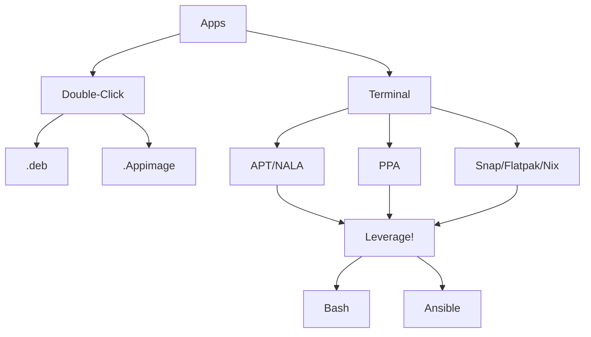

**Everyone told you that you are crazy to use Linux**.

That you will never pass the stage of installing a single App.

But they havent discovered this guide and **now you can prove them wrong**.

## How to Install Apps in Debian

Ever wondered about using linux as a regular OS, but afraid of making tedious installations of all your favorite programs, even games?

Those time consuming tasks can be avoided simply with the use of [CLI commands, like these](https://github.com/JAlcocerT/Linux/blob/main/Z_Linux_Installations_101/Ubuntu_installations_bash) or the ones in this [Gist](https://gist.github.com/JAlcocerT/197667ec5ec0da53e78eb58c4253a73f).

But we are not there yet, right? Let me show you some options to install your Apps in Debian:





  You may have not discovered what the terminal can do for you, yet. 
  
  But that's fine.

  In Debian based distribution you can have the double click into the file to install to any **.deb Package**
  
  Also, whenever you see **AppImages**, a format for distributing portable software on Linux without the need for superuser permissions to install the application - You can also **have your double click install** 😜.  

  

  
  
  Now we are talking.

  For starters, you can open your terminal anytime with: CTRL+ ALT + T

  Then, the easiest way to install something is to find it in as [snapcraft](https://snapcraft.io/) package or [FlatHub](https://flathub.org/) and make your one liner (you can copy paste it), to have your first APP installed with CLI.
  
  This is how they will look:

  ```sh
  sudo snap install firefox
  flatpak install flathub org.mozilla.firefox

  #flatpak list
  #flatpak uninstall org.mozilla.firefox
  ```

  Sounds reasonable, right? Well, this can be further leverage (if you want, check next tabs).

  
  Ansible is what the Pros are using to deploy crazy stuff at the cloud.
  And since the tool is open source, we can also use it.

  I have created a couple of [how to use Ansible here](https://jalcocert.github.io/Linux/docs/linux__cloud.md/ansible/).
  
  **Make your life easier and write the CLI commands once, re-use forever** 
  
Some examples of what it can look like:

  Option 1:

```sh
#wget  -cO - https://raw.githubusercontent.com/jalcocert/Linux/main/Ubuntu%20installations%20bash > apps-install-bash.#sh && chmod 775 apps-install-bash.sh && sudo ./apps-install-bash.sh
```

Option 2:

If you are interested only in a partial installation of all the apps contained in the mentioned script, you can download it and delete the undesired parts before executing it with the following commands:

```sh
wget  -cO - https://raw.githubusercontent.com/jalcocert/Linux/main/Ubuntu%20installations%20bash > apps-install-bash.sh
```

Edit the file and **choose which one you want**, if desired through the command line with:

```sh
sudo nano apps-install-bash.sh
```

For each category, I have been ranking in the top the **Free Open Source Software Apps**some propietary popular apps, like vscode, are also included. 



  



<!-- Option 1:

```sh
wget  -cO - https://raw.githubusercontent.com/jalcocert/Linux/main/Ubuntu%20installations%20bash > apps-install-bash.sh && chmod 775 apps-install-bash.sh && sudo ./apps-install-bash.sh
```

Option 2:

If you are interested only in a partial installation of all the apps contained in the mentioned script, you can download it and delete the undesired parts before executing it with the following commands:

```sh
wget  -cO - https://raw.githubusercontent.com/jalcocert/Linux/main/Ubuntu%20installations%20bash > apps-install-bash.sh
```

edit the file, if desired through the command line with:

```sh
sudo nano apps-install-bash.sh
```

For each category, I have been ranking in the top the **Free Open Source Software Apps**some propietary popular apps, like vscode, are also included. 

 -->


## Package Management

At some point, you will see that some software can be installed directly from its 

### With CLI

#### APT

APT is a powerful and widely-used package management system for Debian-based Linux distributions.

APT is a tool for managing packages **from repositories defined in your system's sources list**. These repositories can be official Ubuntu repositories, third-party repositories, or PPAs.


  [PPA is a type of repository](https://jalcocert.github.io/Linux/docs/debian/linux_installing_apps/#how-to-use-ppas) that **you can be add to your sources list**, from which you can install and update packages using APT.


It simplifies the process of managing software by automating the installation, upgrade, and removal of packages along with their dependencies. APT accesses a network of repositories to find the software you need and ensures that all dependencies are satisfied, making it much easier to maintain a system with up-to-date and functional software.

It's known for its robustness and efficiency in handling complex package management tasks.

Look for packages to uninstall:


* With GUI - Use Synaptic Package Manager.
* With CLI:

```sh
apt list --installed
```

Filter by keyword:

```sh
apt list --installed | grep proton
#sudo apt remove protonmail-bridge #example
```

You can have a look to the available packages at:

* <https://www.debian.org/distrib/packages>
* <https://packages.ubuntu.com/>


#### NALA

[Nala](https://github.com/volitank/nala) is a front-end interface for the APT package manager, designed to enhance the user experience with more readable output and simpler command structure.

It **wraps around the traditional APT commands**, offering improvements like cleaner and more informative displays, faster download speeds through parallel downloads, and a more intuitive command syntax.

Nala aims to **make package management more accessible** and less daunting, especially for those who are new to using Linux and its command-line environment.

{}

The project is great and it has a good wiki on [how to get started with Nala](https://gitlab.com/volian/nala/-/wikis/Installation)

```sh
sudo apt install git python3-apt python3-debian pandoc -y

git clone https://gitlab.com/volian/nala.git
#git clone --branch=v0.12.1 https://gitlab.com/volian/nala.git


cd nala/
```

Then just install from the clonned Gitlab repository:


```sh
sudo make install
```

Once install, you can just use:

```sh
nala update
nala upgrade 

#nala install [package name]
```


{}


### Package Management  GUI



  
  
  ```sh
sudo apt-get install synaptic
```

apt-get is an older tool, part of the Advanced Packaging Tool (APT) suite.

It's known for its stability and is heavily used in scripts and automation due to its predictable behavior.

  
  
  
  It can also look for PPA's for you!
  ```sh
  sudo add-apt-repository ppa:webupd8team/y-ppa-manager
sudo apt update 
sudo apt install y-ppa-manager
  ```
  
  




---

## FAQ

### What it is a PPA?

Think of a **PPA**, or Personal Package Archive, in Ubuntu as **a special store for software**.

Ubuntu already comes with a big collection of software, like a standard store where you can find most things you need. However, sometimes you might want a specific software or a newer version of a program that the standard store doesn’t have.

This is where PPAs come in: **PPA's allows any person** to create their own repositories **to distribute software**. They are like smaller, specialized stores run by developers or Linux enthusiasts.

You can add these PPAs to your Ubuntu, and it's like getting access to an exclusive store where you can download and install these special or newer software programs.

PPAs are great for getting the latest features or programs that are not yet available in the main collection of Ubuntu software.

* Examples:
    * Graphics Drivers PPA: This PPA provides the latest graphics drivers for NVIDIA, AMD, and Intel GPUs. It's essential for gamers, graphic designers, and other users who need the latest drivers for optimal performance and features.
    * LibreOffice PPA: LibreOffice is a popular open-source office suite. This PPA offers the latest versions of LibreOffice, which can include new features and improvements not yet available in the version included with Ubuntu.

#### Ubuntu Official Repos

Every [Ubuntu version](http://archive.ubuntu.com/ubuntu/dists/) has its official set of 4 repos:

* Main – Canonical-supported free and open-source software.
* Universe – Community-maintained free and open-source software.
* Restricted – Proprietary drivers for devices.
* Multiverse – Software restricted by copyright or legal issues.

When we use APT (or [NALA](https://jalcocert.github.io/Linux/docs/debian/linux_installing_apps/#nala)), we are checking these repositories for newer version of the software.

#### How about PPA's for other Distros?

PPAs, or Personal Package Archives, are **specific to Debian and its derivatives** like Ubuntu or Linux Mint. They are not directly applicable to other Linux distributions.

However, many **other distributions have their own ways* of handling additional software repositories.

For instance, Fedora uses COPR (Cool Other Package Repo), Arch Linux has the [Arch User Repository](https://jalcocert.github.io/Linux/docs/arch/garuda/#useful-repositories) (AUR), and openSUSE has OBS (Open Build Service).

These are similar in concept to Ubuntu's PPAs in that they allow users to access software that's not in the main repositories, but they work differently and are specific to their respective distributions.

#### How to use PPA's?

We just need 3 very simples steps:

* Add the PPA to your system: You need to add the PPA repository to your list of sources.

```sh
add-apt-repository ppa:name-of-ppa
#add-apt-repository ppa:libreoffice/ppa 

#sudo add-apt-repository --remove ppa:name-of-ppa
```

Replace name-of-ppa with the actual PPA's name.

* Update your package list: After adding the PPA, update your package list to include the new software from the PPA:

```sh
apt update
```

* Install the software: Finally, install the software you want from the PPA using:

```sh
apt install name-of-package
#apt-get install libreoffice

#apt-get remove name-of-package
```

Remember, **it's important to trust the PPAs you add**, as they can potentially contain unvetted or harmful software. **Only use PPAs from known and trusted sources.**

### Other Ways to Install Apps in Debian

#### Deb Packages

We can install through the UI and double click, thanks to **.deb packages**.

* .deb packages are **individual software packages** that can be installed directly on your computer, similar to installing software from a CD or a downloaded file.

* PPAs, on the other hand, are like online repositories that can contain multiple .deb packages. 

{}

```sh
wget https://updates.safing.io/latest/linux_amd64/packages/portmaster-installer.deb
sudo dpkg -i portmaster-installer.deb

#sudo apt install -f #installs any missing dependencies automatically.

```
{} 

#### Tar GZ

A .tar.gz file is an archive format commonly used in Linux and Unix-like operating systems. It's a combination of two compression methods: tar (tape archive) and gzip (GNU zip).

```sh
tar -czvf archive.tar.gz /path/to/directory #wget https://github.com/safing/portmaster/archive/refs/tags/v1.6.5.tar.gz
tar -xzvf archive.tar.gz #tar -zxvf v1.6.5.tar.gz #extract

# cd portmaster-1.6.5

# make
# sudo make install

```

#### AppImages

You can also try with the portable **.Appimage** - For devs the idea is simple - One package, run everywhere.

If you need to make it executable:

```sh
chmod +x your-appimage-name.AppImage
```

An AppImage is self-contained, it does not modify the host system. Its impact is limited to the user's home directory by default.

These are designed to be compatible with a wide range of Linux distributions. This includes non Debian distros, like [Arch Linux](https://jalcocert.github.io/Linux/docs/arch/), among others.

> Some AppImages even come with update information embedded and can be updated with tools like AppImageUpdate.

#### Snap

**Snap packages** are primarily associated with Canonical, the company behind Ubuntu. However, they are not limited to Ubuntu and can be used on various Linux distributions.

* Automatic Updates: Snap packages are designed to automatically update themselves in the background, ensuring that users have access to the latest versions of applications without manual intervention.

* Centralized Store: Snap packages are distributed through the [Snap Store](https://snapcraft.io/store), a centralized repository where users can find and install a wide range of software applications.

> Snap Packages together with Ubuntu are a great entry point if you are starting your Linux journey.

#### Flatpak

Flatpak is designed to be a **cross-distribution packaging format**. It aims to work on multiple Linux distributions, making it more distribution-agnostic compared to Snap packages.

* Sandboxing: Like Snap, Flatpak uses sandboxing to isolate applications from the host system, improving security and reducing potential conflicts with system libraries.

* Multiple Repositories: Flatpak supports multiple software repositories, allowing users to access applications from various sources, including the [FlatHub repository](https://flathub.org/), which is a popular repository for Flatpak packages.

* Manual Updates: While Flatpak does support updates, it typically requires manual intervention or the use of package manager tools to update applications.

### What did I Installed?

```sh
dpkg --list
#dpkg --list | grep -E 'python'


#apt list --installed
#apt list --installed | grep -E 'python'
```

### Installing with Ansible

Ansible is an Automation tool that we can use to install apps / spin docker containers and virtually any tasks.

You can use Ansible to [install Apps like a pro dev-ops as shown here](https://jalcocert.github.io/Linux/docs/linux__cloud/ansible/#using-ansible)