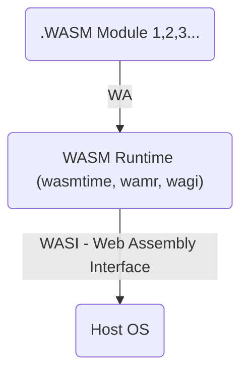

You can do it with a Raspberry Pi, with and old laptop, in the cloud...

But you can even do it in the very same computer you are reading this.

1. Get Docker/Podman installed
2. Get the Docker-Compose ready
3. Deploy!

{}

```sh
sudo apt update
sudo apt install openssh-server
#systemctl status ssh

sudo ufw allow ssh

#ssh username@<local_minipc_server_ip>
```

Check processes with:

```sh
#systemctl status
htop

#systemctl list-units --type=service
systemctl list-units --type=service --state=running
```

And the ports used:

```sh
sudo lsof -i -P -n
```

Follow the steps of this [SelfHosting-101 script](https://github.com/JAlcocerT/Linux/blob/main/Z_Linux_Installations_101/Selfhosting_101.sh):

```sh
curl -O https://raw.githubusercontent.com/JAlcocerT/Linux/main/Z_Linux_Installations_101/Selfhosting_101.sh
#nano Selfhosting_101.sh #MAKE SURE YOU UNDERSTAND WHAT YOU WILL BE RUNNING

chmod +x Selfhosting_101.sh
sudo ./Selfhosting_101.sh
```

> Remember to go to your Portainer instance and setup the user/pass: `localhost:9000`

If you forget, you will need to restart Portainer:

```sh
docker restart portainer
```

{}




## Analytical Tools

* https://github.com/knime/knime-core
* https://hub.docker.com/r/apache/superset


## GenAI



  **Dockerfile**: 
  
```Dockerfile
FROM python:3.11-slim

# Copy local code to the container image.
ENV APP_HOME /app
WORKDIR $APP_HOME

RUN apt-get update && apt-get install -y \
    git \
    build-essential

# Clone the private repository
RUN git clone https://github.com/lllyasviel/Fooocus

WORKDIR /app/Fooocus
RUN pip install -r requirements_versions.txt

#python entry_with_update.py

```

  
  **requirements**:
  
```txt
#Not needed here, provicded by repo.
```
  
  **Config**:
Make sure to build the image first with:

```sh
docker build -t fooocus .
#docker-compose up -d
```
Then, use this to spin up the container:

```yml
version: '3'

services:
  sd-fooocus:
    image: fooocus #python:3.11-slim
    container_name: fooocus
    command: tail -f /dev/null
    volumes:
      - ai_fooocus:/app
    working_dir: /app  # Set the working directory to /app
    ports:
      - "7865:7865"

volumes:
  ai_fooocus:
```
  



You can also try with

```sh
python -m venv your-env #(create a virtual environment)
source your-env/bin/activate #(or on Windows your-env\Scripts\activate) (activatea the venv)
#deactivate
```

```sh
conda create -n yourcondaenvironment python=3.11
conda activate yourcondaenvironment
conda deactivate
```

### LLMs

* Ollama


The [ML Compilation for LLMs](https://github.com/mlc-ai/mlc-llm) project aims to spread the development and deployment of AI Models.


* Home LLM + Home Assistant - https://www.youtube.com/watch?v=kJfIM9siD00
  * https://github.com/acon96/home-llm

```sh
https://flathub.org/apps/com.cassidyjames.butler #HA visualizer
```

> This repo contains interesting projects (𝗟𝗟𝗠𝘀, 𝗟𝗟𝗠𝗢𝗽𝘀, and 𝘃𝗲𝗰𝘁𝗼𝗿 𝗗𝗕𝘀) to have a look: https://github.com/iusztinpaul/hands-on-llms

### Text-to-Image

* Automatic111
* Fooocus

### Voice to Text

* [Piper](https://github.com/rhasspy/piper) - Also works [Text to Voice](https://www.youtube.com/watch?v=SzRF50UwzYk)
  * [Voices at HF](https://huggingface.co/rhasspy/piper-voices/tree/main)

### Affordable Local Gen AI with iGPU's


<iframe width="560" height="315" src="https://www.youtube.com/embed/xsvTEzTirlQ" frameborder="0" allowfullscreen></iframe>

Thanks to to [Tech-Practice](https://www.youtube.com/watch?v=HPO7fu7Vyw4&t=445s) for inspiration.


## Productivity

* [Cal](https://github.com/calcom/cal.com)
  * Together with a caldav / [Stripe](https://cal.com/docs/how-to-guides/how-to-set-up-an-event-type-to-receive-payments) / Signal / Matrix / Web Analytics / ...
  * It admits [webhooks](https://cal.com/docs/core-features/webhooks)
* [Chatwoot](https://fossengineer.com/selfhosting-chatwoot)
  * Also allows webhooks

* Only Office Server

---

## Communication

* Matrix Server: https://fossengineer.com/selfhosting-matrix-synapse-docker/

You can connect to Matrix with Thunderbird as well.

* [Cabal](https://github.com/cabal-club/cabal-desktop)

---

## Media

Quick seedbox: Torrents + Mullvad -> Syncthing/Filebrowser

### Decentralized Storage

* Centralization -> Simplicity and Single Point of Failure

* Some alternatives:
  * [IPFS](https://ipfs.tech/) -  an open system to manage data without a central server
  * [Filecoin](https://filecoin.io/) - an open-source cloud storage marketplace, protocol, and incentive layer.

> Great intro video from [Naomi on Decentralized Storage](https://www.youtube.com/watch?v=rOtMGJVp2MU)

Metube + JDownloader + Navidrome

### How to Back Up my Server?

Duplicati to other location (HD / Mega, One drive, s3...)

## Windows inside Docker

Thanks to the [Dockur Project](https://github.com/dockur/windows) and by using the [Image](https://hub.docker.com/r/dockurr/windows#!)

{}

```yml
version: '3.3'

services:
  windows:
    image: dockurr/windows
    container_name: windows
    devices:
      - /dev/kvm
    cap_add:
      - NET_ADMIN
    ports:
      - "8006:8006" #UI
      - "3389:3389/tcp"
      - "3389:3389/udp"
    stop_grace_period: 2m
    restart: on-failure
    volumes:
      - ./data:/storage
    environment:
      RAM_SIZE: 8GB
      CPU_CORES: 3
      DISK_SIZE: 75GB
      VERSION: "win10"
```

{}

---

## FAQ

### Where to Learn More about SelfHosting?

* <https://awweso.me/>
* <https://github.com/pluja/awesome-privacy>
* <https://jalcocert.github.io/RPi/about/#where-can-i-learn-more-about-rpi>
* <https://fossengineer.com/tags/self-hosting/>
* <https://github.com/anderspitman/awesome-tunneling>
* <https://github.com/awesome-selfhosted/awesome-selfhosted>
    * <https://awesome-selfhosted.net/>

### How to Secure my Services?

* [NGINX](https://fossengineer.com/selfhosting-nginx-proxy-manager-docker/)
* [Cloudflare](https://fossengineer.com/selfhosting-cloudflared-tunnel-docker/)
* Authelia / Zitadel / Authentik

### What about Web Assembly?

With WASM we can run Apps coded in other language (other than web language like js) in our browsers.

WASM allow us to compiled code and run it in various environments (for example browsers) - Regardless of OS and even architecture ARM/X86/RISC-V...

With Docker we have (generally) bigger Images than WASM. Wasm follows both OCI and w3c standards.

* You can get more ideas at [awesome-WASM](https://github.com/mbasso/awesome-wasm)



> Thanks to [DevOps Toolkit](https://www.youtube.com/watch?v=uZ8xI26sno8)

{}

Install emcc: 

```sh
git clone https://github.com/emscripten-core/emsdk.git
cd emsdk
./emsdk install latest

./emsdk activate latest
source ./emsdk_env.sh
```

This compiles the C to ---> html, js, wasm (this is our WASM Module)
```sh
#emcc helloworld.c -o helloworld.html
emcc -o hello.html hello.c
```

See what was created:

```sh
python3 -m http.server 8080 #choose any port
```

To run wasm inside docker: you need to enable it as Beta feature at this time of writing

```sh
sudo apt-get install ./docker-desktop-4.27.2-amd64.deb
#settings -> features in development -> Enable WASM
```

Now instead of compiling the html or js app, we will just compile the .wasm module:

```sh
emcc -o hello.wasm hello.c

#ll hello.wasm
#file hello.wasm
```

Create your DockerfileWasm

```Dockerfile
FROM scratch

COPY helloworld.wasm /helloworld.wasm
ENTRYPOINT [ "/helloworld.wasm" ]
```

Build your WASM Image
```sh
docker buildx build --platform wasi/wasm -t fossengineer/helloworld-wasm -f DockerfileWasm .
#docker image ls | head
```

Run WASM with Docker:

```sh
docker run --platform wasi/wasm --runtime io.containerd.wasmedge.v1 fossengineer/helloworld-wasm
```

Run an already created [WASM (as standalone)](https://wasmedge.org/docs/start/getting-started/quick_start_docker/#run-a-standalone-wasm-app) with docker:

```sh
docker run --rm --runtime=io.containerd.wasmedge.v1 --platform=wasi/wasm secondstate/rust-example-hello:latest
```


{}

### Interesting Services

#### PostHog

The F/OSS Amplitude Alternative.


#### Active Pieces

Automate like a pro - https://www.activepieces.com/

* [FlowiseAI](https://fossengineer.com/selfhosting-flowise-ai)


#### n8n

https://www.youtube.com/watch?v=SMnE_3-il9A