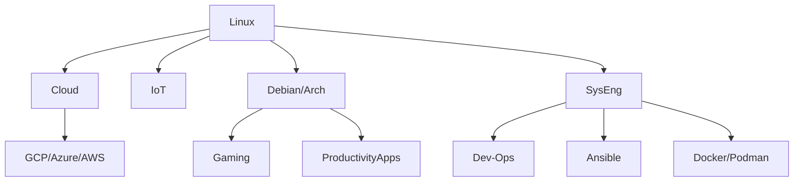

Welcome to the Docs! here you have an overview of what you can learn at **Linux Made Easy**.

<!-- This is a demo of the theme's documentation layout.

## Hello, World!

```go {filename="main.go"}
package main

import "fmt"

func main() {
    fmt.Println("Hello, World!")
}
``` -->




<!-- This is what you can expect in **the Linux journey**:

```mermaid
journey
    title Your User Journey as a New Linux User Adventure
    section Heard about Linux
        Excitement for Linux: 4: You
    section Getting Started
        Install Linux: 5: You
        Confusion sets in: 2: You
        Google for help: 3: You
    section The Valley of Despair
        Encounter Terminal: 2: You
        "What is sudo?": 2: You
        Stack Overflow Deep Dive: 3: You
    section Climbing the Learning Curve
        Find Linux Made Easy! (YOU are HERE): 4: You
        First successful script: 4: You
    section Triumph!
        Customized desktop: 4: You
        Proud Linux user: 5: You
        Feeling like a hacker: 3: You        
    section Next Steps
        Dreaming in code: 5: You
        Helping others with Linux: 5: You
``` -->

## How to Start my Linux Journey

{}

### Download Ubuntu

Ubuntu is a Debian based Linux. 

Quite user friendly. And you can [Download for free here](https://ubuntu.com/download).

<!-- <div class="mb-6">

</div> -->

### Try Ubuntu in a VM

Whatever happens to the Virtual Machine, it does not matter and wont affect your main OS.

So try things, install your favourite Apps!

### Ways Install your Apps

Yes, you can just do double click to .deb files.

Additionally, you can find awsome Apps here:

* Snap Store: <https://snapcraft.io/store>
* Flathub: <https://flathub.org/>

Plot twist - They are also Free.

### Forget about Hard Formats

That thing of the CLI must have some advantage, right?

Yes, once you know what you need - you can make your device work for you, instead of letting it be your master

Make your life easier from now on with:

* Some [script to install](https://jalcocert.github.io/Linux/docs/debian/linux_installing_apps/) the Apps for you
* [Get Docker](https://jalcocert.github.io/Linux/docs/debian/docker/) and [Start SelfHosting](https://fossengineer.com/tags/self-hosting/)
* Automating your [System Setup with Ansible](https://jalcocert.github.io/Linux/docs/linux__cloud.md/ansible/)



I list of your favourite Apps always helps, [here is mine for inspiration](https://jalcocert.github.io/Linux/docs/nix/fav-apps/)


{}




   
  Congrats, Android is also Linux - You are already a Linux User!

{}

### How to use Android from Linux?

#### KDE Connected

```sh
sudo apt update
sudo apt install kdeconnect
```

Then check devices with the UI or with CLI:

```sh
kdeconnect-cli --refresh
kdeconnect-cli --list-devices
```

You can get it from: <https://f-droid.org/packages/org.kde.kdeconnect_tp/>

Alternatively, you have GSConnect or scrcpy:

```sh
sudo apt install scrcpy
```

{}

  
  If you are wondering why should it be so painfull to install all your favourite Apps in Windows, you are in a good place.

Making clean install is really simple in Linux thanks to Tools like: Ansible, Docker (you can also use it) or scripts.

> Yes, you also can use **Chocolatey GUI** and avoid the scripting part.

{}


### Chocolatey What?

Ok - this is suposed to be Linux related only, but I discovered about this and if there is some Windows user reading this, probably will be wondering if formating and setup a Windows machine from scratch has to be so painful.

**Chocolatey is a F/OSS package manager** for Windows that enables users to **easily install**, manage, and update software applications from the command line or through a graphical interface.

**Package WHAT?**

When you want new tools or games, instead of roaming the internet, you tell the package manager what you desire. This *shopkeeper* knows where to find them, handles all the downloading and setup, and even keeps them updated so you don't have to worry about dusty shelves. 

### Installing Chocolatey 🚀

Get Chocolatey ready and forget about being afraid to format C your Windows ever again.

```sh
Set-ExecutionPolicy Bypass -Scope Process -Force; [System.Net.ServicePointManager]::SecurityProtocol = [System.Net.ServicePointManager]::SecurityProtocol -bor 3072; iex ((New-Object System.Net.WebClient).DownloadString('https://chocolatey.org/install.ps1'))
```

You can use it with Graphical User Interface:

```sh
choco install chocolateygui
#chocolateygui
```

#### Using Chocolatey

Navigate to **<https://community.chocolatey.org/packages>** and look for the packages that you are interested:

```sh
# Check if Chocolatey is installed
if (-not (Get-Command choco -ErrorAction SilentlyContinue)) {
    Write-Host "Chocolatey is not installed. Installing Chocolatey..."
    Set-ExecutionPolicy Bypass -Scope Process -Force; iex ((New-Object System.Net.WebClient).DownloadString('https://chocolatey.org/install.ps1'))
}

# Install Chrome
Write-Host "Installing Google Chrome..."
choco install googlechrome -y

# Install Steam
Write-Host "Installing Steam..."
choco install steam -y

# Install Visual Studio Code
Write-Host "Installing Visual Studio Code..."
choco install vscode -y

Write-Host "Installation completed."
```

Useful commands:

```sh
choco search packageName: Search for packages by name.
choco install packageName: Install a package.
choco list --local-only: List all installed packages.
choco uninstall packageName: Uninstall a package.
choco upgrade packageName: Upgrade a package to the latest version.
```

Create a list like [this one](https://gist.github.com/JAlcocerT/76f22ddf886277ef2653f82898c634d8) with your favourite Apps , then use it from the powershell.

> The logic here is Work Smart. Do once, re-use forever ♻️

<!-- <script src="https://gist.github.com/JAlcocerT/76f22ddf886277ef2653f82898c634d8#file-home-server-sh"></script>

 -->

{}


  
  Hello mac user 😛
  
   You can start your act different journey by [installing Docker](https://jalcocert.github.io/Linux/docs/debian/docker/) and spining up some F/OSS services. And running them without a 3rd party in between is called [SelfHosting](https://fossengineer.com/tags/self-hosting/).

   The Linux ecosystem is full of these kind of Apps that have aligned incentives with your interests.



<!-- 
## Im an Android User

Congrats, Android is also Linux - YOu are already a Linux User!

{}

### How to use Android from Linux?

#### KDE Connected

```sh
sudo apt update
sudo apt install kdeconnect
```

Then check devices with the UI or with CLI:

```sh
kdeconnect-cli --refresh
kdeconnect-cli --list-devices
```

You can get it from: <https://f-droid.org/packages/org.kde.kdeconnect_tp/>

Alternatively, you have GSConnect or scrcpy:

```sh
sudo apt install scrcpy
```

{}


## Im a Windows User (For Now)

You can start to try some Debian based Linux, like Ubuntu.

In the meantime, if you are wondering why should it be so painfull to install all your favourite Apps in Windows, you are in a good place.

Making clean install is really simple in Linux thanks to Tools like: Ansible, Docker (you can also use it) or scripts.

> Yes, you also can use **Chocolatey GUI** and avoid the scripting part.

{}


### Chocolatey What?

Ok - this is suposed to be Linux related only, but I discovered about this and if there is some Windows user reading this, probably will be wondering if formating and setup a Windows machine from scratch has to be so painful.

**Chocolatey is a package manager** for Windows that enables users to **easily install**, manage, and update software applications from the command line or through a graphical interface.

**Package WHAT?**

When you want new tools or games, instead of roaming the internet, you tell the package manager what you desire. This *shopkeeper* knows where to find them, handles all the downloading and setup, and even keeps them updated so you don't have to worry about dusty shelves. 

### Installing Chocolatey 🚀

Get Chocolatey ready and forget about being afraid to format C your Windows ever again.

```sh
Set-ExecutionPolicy Bypass -Scope Process -Force; [System.Net.ServicePointManager]::SecurityProtocol = [System.Net.ServicePointManager]::SecurityProtocol -bor 3072; iex ((New-Object System.Net.WebClient).DownloadString('https://chocolatey.org/install.ps1'))
```

You can use it with Graphical User Interface:

```sh
choco install chocolateygui
#chocolateygui
```

#### Using Chocolatey

Navigate to **<https://community.chocolatey.org/packages>** and look for the packages that you are interested:

```sh
# Check if Chocolatey is installed
if (-not (Get-Command choco -ErrorAction SilentlyContinue)) {
    Write-Host "Chocolatey is not installed. Installing Chocolatey..."
    Set-ExecutionPolicy Bypass -Scope Process -Force; iex ((New-Object System.Net.WebClient).DownloadString('https://chocolatey.org/install.ps1'))
}

# Install Chrome
Write-Host "Installing Google Chrome..."
choco install googlechrome -y

# Install Steam
Write-Host "Installing Steam..."
choco install steam -y

# Install Visual Studio Code
Write-Host "Installing Visual Studio Code..."
choco install vscode -y

Write-Host "Installation completed."
```

Create a list like this one with your favourite Apps , then use it from the powershell.

> The logic here is Work Smart. Do once, re-use forever ♻️

<script src="https://gist.github.com/JAlcocerT/76f22ddf886277ef2653f82898c634d8"></script>



{}
 -->

--- 

## FAQ

### What it is F-DROID?

It is an alternative Google App Store, full of Open Source [Android](https://jalcocert.github.io/Linux/docs/privacy/android/) APPs.

### What is the best Linux for Low Resources?


{}

* Peppermint OS: Peppermint OS is a lightweight Linux distribution based on Ubuntu LTS releases. It features a customized Xfce desktop environment and focuses on speed, efficiency, and cloud integration.

* Lubuntu: Lubuntu is an official Ubuntu flavor that uses the lightweight LXQt desktop environment (formerly LXDE). It's designed to be fast, energy-efficient, and suitable for older hardware.

* Xubuntu: Xubuntu is an official Ubuntu flavor that features the lightweight Xfce desktop environment. It offers a balance between performance and features, making it suitable for older hardware or systems with limited resources.

* MX Linux: MX Linux is a midweight Linux distribution based on Debian stable and featuring the Xfce desktop environment. It's known for its stability, performance, and user-friendly experience. MX Linux is designed to run well on older hardware.


{}


{}

* Xfce: Xfce is a lightweight desktop environment known for its resource efficiency and customization options. It provides a traditional desktop layout with a panel, menu, and desktop icons.

* LXQt: LXQt is a lightweight desktop environment that combines the LXDE and Razor-qt projects. It's designed to be fast, modular, and feature-rich while consuming minimal system resources.

* LXDE: LXDE (Lightweight X11 Desktop Environment) is a lightweight desktop environment that focuses on speed, simplicity, and ease of use. It's suitable for older hardware and systems with limited resources.
{}
